<!--
  Capítulo 4 · Patrones puntuales. Clase magistral de 90 min: 35 diapositivas de
  contenido a ~2,5 min. Reparto orientativo: ventana e intensidad 10 min · regímenes y
  CSR 12 · cuadrantes 12 · G, F y J 15 · K, L y g 18 · borde y envolventes 14 · cierre 5.
  Fuera quedan (y se nombran en las notas): el índice de dispersión de 25.90966 frente a
  15.22998 (módulo 2), el código en Python, las cuatro pestañas de los módulos 6 a 11 y el
  simulacro del quiz (módulo 13), que no se proyecta.

  REGLAS DE CONTENIDO de esta presentación:
  · Toda cifra sale de `cap4_datos.json` o `cap4_soluciones.json` (salidas de R del
    precálculo) y está cotejada en `registro_cifras_cap4.md`.
  · Todo ejemplo dice qué ilustra, de dónde sale y por qué importa.
  · Toda afirmación va como Dato, Interpretación o Criterio. Lo que no se pudo comprobar
    lleva la marca [SIN VERIFICAR].
-->

# Cómo leer esta clase {icono=fa-magnifying-glass}

> Cada cifra trae su fuente y cada afirmación, su etiqueta: dato, interpretación o criterio.

???
Dos minutos para fijar el pacto de lectura de toda la clase. Cuando aparezca una caja «Dato», lo que hay dentro es una cifra que se puede comprobar; en «Interpretación», la lectura que el capítulo hace de esa cifra, que se puede discutir; en «Criterio», una postura del autor. Pregunta al grupo qué diferencia hay entre decir «R vale 0.82371» y decir «las sedes se atraen».

## Cada cifra trae su fuente y cada afirmación, su etiqueta

::: tarjetas {columnas=3}
### Dato
Una cifra calculada. Va con su fuente: el módulo del capítulo y el archivo del precálculo.
### Interpretación
La lectura que el capítulo hace del dato. Se puede discutir.
### Criterio
Una postura o recomendación del autor: qué hacer, no qué se midió.
:::

::: warn [SIN VERIFICAR]
Una cifra con esta marca no se pudo comprobar contra su fuente: no se presenta como dato confirmado.
:::

<small>Fuentes: `datos` es `cap4_datos.json` y `soluciones` es `cap4_soluciones.json`, generados con R (spatstat 3.5.1) en `precalculo/salidas/`. El cotejo de cada cifra está en `fuentes/registro_cifras_cap4.md`.</small>

???
El pacto tiene una consecuencia práctica: todas las cifras de esta clase salen de dos archivos que genera R, no de la memoria del docente. Si un estudiante duda de una, la ruta exacta está en el registro de cifras. Las que no se pudieron comprobar aquí (los tiempos de cómputo del módulo 10) llevan la marca en la propia diapositiva.

## «¿Está agrupado?» no tiene respuesta hasta que fijamos ventana, escala, borde y referencia {.idea etiqueta="Tesis del capítulo"}

Cuadrantes, G, F, K, g y envolventes son herramientas distintas, y todas obligan a fijar esas cuatro cosas y a declararlas.

<small>Fuente: módulo 12 (texto del capítulo). Es una tesis del autor, no una cifra.</small>

???
Es el hilo de toda la sesión. Cada bloque de la clase añade una de las cuatro: la ventana (módulos 1 y 2), la escala (módulos 5 y 6), el borde (módulo 10) y la referencia simulada (módulo 11). Anúncialo ahora y vuelve sobre él en el cierre.

# La ventana forma parte del estimador {seccion=modulo-1}

> Tenemos 2 209 sedes educativas de Bogotá y una pregunta sencilla: ¿cuántas hay por kilómetro cuadrado? La respuesta depende de dónde miremos.

???
Abre con la pregunta, no con la definición. Deja que propongan: «dividir por el área de Bogotá». Y pregunta: ¿qué área? Ese es el módulo 1.

## En un patrón puntual lo aleatorio es el dónde, y la ventana forma parte del estimador

- **Antes** el dato traía su sitio y variaba el valor. **Ahora se invierte**: el dato es la posición.
- El `ppp` tiene dos partes inseparables: las **coordenadas** y la **ventana de observación**.
- La ventana afirma que, en ese recinto y solo en él, se habría visto un punto de haberlo.

::: ejemplo El ejemplo que nos acompaña: las sedes educativas de Bogotá
**Qué ilustra:** cómo cambia el resultado según la ventana. **De dónde sale:** 2 209 sedes georreferenciadas y el perímetro urbano (SED y SDP, vía Datos Abiertos Bogotá / IDECA, versión 12.25). **Por qué importa:** es el hilo colombiano de datos abiertos del curso; vuelve en el capítulo 5.
:::

<small>Fuente: módulo 1 · `datos › m1.sedes_total` · `FUENTES.md`, fuente 3.</small>

???
Las sedes son las mismas del capítulo 1, ahora usadas como lo que son: un patrón puntual. La ventana no es el marco del mapa: es «el sitio donde los puntos podrían haber estado», y se defiende con el mapa, no con el dato. Detalle en el módulo 1.

## Misma ciudad, mismo dato, dos ventanas: 5.69321 sedes/km² contra 1.35200 {columnas=1:1:2}

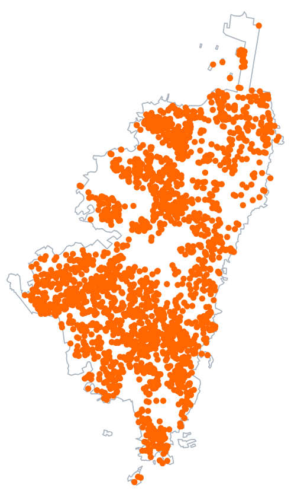{alto=440}

|||

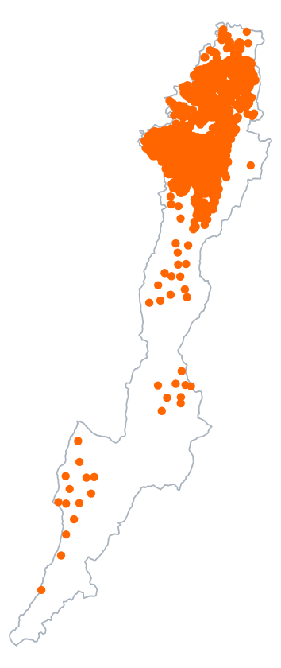{alto=440}

|||

::: info Dato
| Ventana | Sedes | Área (km²) | Sedes/km² |
|---|---|---|---|
| Perímetro urbano | 2 107 | 370.08982 | 5.69321 |
| Distrito Capital | 2 208 | 1633.14040 | 1.35200 |

Las dos intensidades se llevan un factor de **4.21097**.
:::

::: warn Criterio
Publicar una intensidad sin decir su ventana la deja incompleta: ni verdadera ni falsa.
:::

<small>Fuente: módulo 1 · `datos › m1`.</small>

???
Señala el cambio: el numerador sube apenas un 4.79355 %, porque el suelo rural del D.C. casi no tiene colegios, y el denominador se multiplica por 4.41282. Ninguna de las dos cifras es un error; lo sería publicar una sin decir cuál es la ventana. Además `ppp()` descarta en silencio los puntos de fuera: cambia n sin cambiar nada visible.

## Un informe dice «5,7 colegios por km²»: ¿qué le falta para estar completo? {.pregunta}

1. Decir que la intensidad es una propiedad del dato, no del recinto.
2. Decir cuál es la ventana de observación usada.
3. Decir cuántos colegios hay en total en la ciudad.
4. Expresarla en hectáreas, la unidad de la escala urbana.

::: respuesta La 2: decir la ventana
Con el perímetro urbano salen 5.6932 sedes/km²; con el Distrito Capital entero, 1.3520: mismo dato, factor 4.21. Dar el total no arregla nada: el recuento apenas sube un 4.8 % entre las dos ventanas y la intensidad se cuadruplica.
:::

<small>Fuente: módulo 6, autoevaluación `cap4-trampas` · `datos › m1` y `m2`.</small>

???
Pide que escriban la respuesta antes de revelar. El error típico es la 3: dar el total. Las otras tres opciones fallan así: la 1 es falsa porque la intensidad es n dividido por el área de la ventana, y la ventana la elige quien analiza; la 4 no cambia el problema, porque en hectáreas la misma cifra es 0.0569 y sigue dependiendo de la ventana.

## Con λ = 5.6932 sedes/km² no basta: ese número solo sirve si λ es constante {columnas=1:1}

$$\begin{aligned}\hat{\lambda} &= \frac{n}{|W|} = \frac{2\,107}{370.09\ \text{km}^2} \\ &= 5.6932\ \text{sedes/km}^2\end{aligned}$$

*n* es el número de sedes dentro de la ventana y *|W|*, su área.

|||

::: info Dato
Rejilla 10×10: **65** celdas «vivas» (con algo de área dentro de la ventana), 32.41538 sedes por celda de promedio; la más poblada tiene **96** y **9** están vacías.
:::

::: tip Interpretación
El reparto no se parece a nada uniforme: λ cambia de un sitio a otro. Una λ inhomogénea es el caso normal.
:::

<small>Fuente: módulo 2 · `datos › m2.urbana`.</small>

???
Es una sola cifra que se puede escribir en tres unidades: 5.6932 por km², 0.05693 por ha o 0.0000056932 por m². El CRS del capítulo mide en metros, así que R devuelve la tercera, la que parece un cero; el `* 1e6` del código es el paso a km². Sobre la rejilla: comprobarlo no necesita teoría, se cuentan los puntos por celda. Si sobra tiempo, el módulo 2 muestra además que el índice de dispersión (25.90966) no se compara con 1 sino con 15.22998, porque la ventana recorta las celdas; aquí no se proyecta.

# Tres regímenes y una referencia: CSR {seccion=modulo-3}

> Antes de medir hay que saber qué se busca. Y «aleatorio» no es una impresión visual: es un modelo con nombre.

???
Transición: ya sabemos que hay que declarar la ventana; ahora, ¿contra qué comparamos un patrón?

## Los tres regímenes canónicos de la literatura se distinguen a simple vista {columnas=1:1:1}

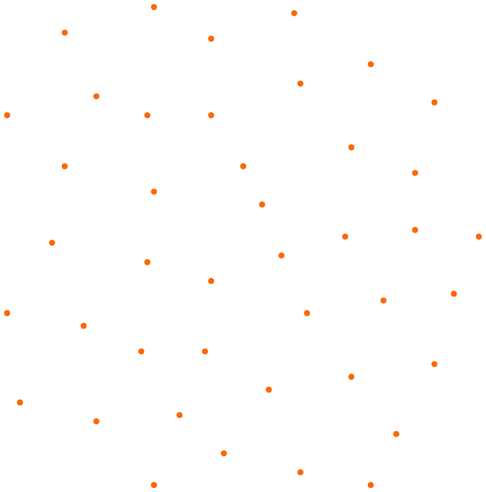{alto=230}

**Regular**

::: tip Interpretación
Los puntos se estorban: cada célula ocupa un sitio y empuja a las demás.
:::

|||

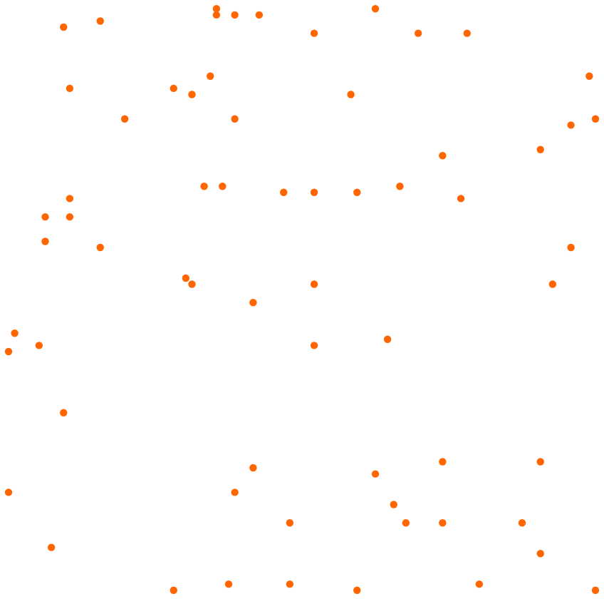{alto=230}

**Aleatorio**

::: tip Interpretación
Cada punto se coloca sin mirar dónde están los demás.
:::

|||

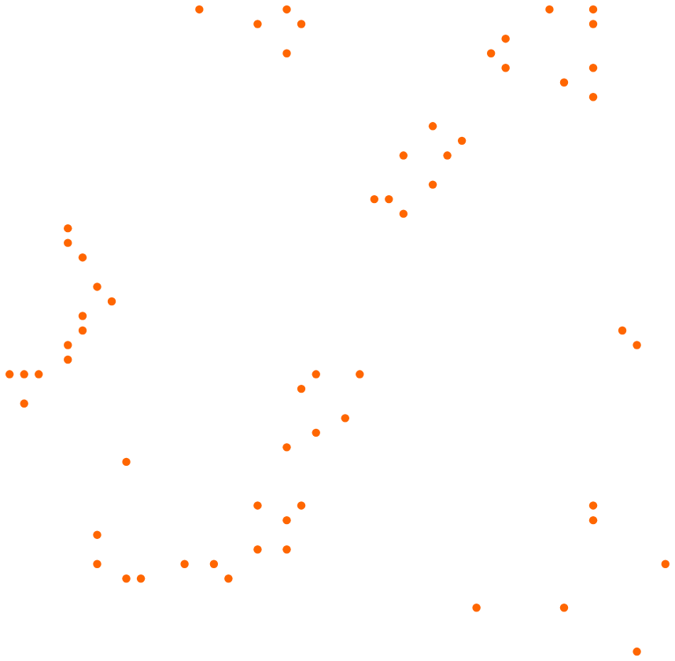{alto=230}

**Agregado**

::: tip Interpretación
Los puntos se atraen: las plántulas brotan cerca del árbol madre.
:::

<small>Fuente: módulo 3 · `datos › m3`.</small>

???
Contexto de los tres ejemplos. Qué ilustran: los tres regímenes, regular, aleatorio y agregado. De dónde salen: son conjuntos de `spatstat.data` (autores según la ficha del capítulo y la documentación del paquete: células registradas por Crick y Ripley; pinos japoneses de Numata, 1961; secuoyas de Strauss, 1975, en el subconjunto de Ripley, 1977). Por qué importan: son los que la literatura emplea para enseñar estos regímenes desde hace décadas, así que el estudiante puede contrastar las cifras del curso con las de los libros. Antes de dar ninguna cifra, pídeles que ordenen a ojo los tres. Los tres cuadrados tienen ventana unidad, así que su n y su patrón se comparan directamente.

## Clark-Evans: R < 1 indica agregación y R > 1, regularidad

**R** es la distancia media al vecino más próximo dividida por la que daría el azar, \(1/(2\sqrt{\lambda})\). **R < 1** agrega; **R ≈ 1**, aleatorio; **R > 1** regulariza.

::: info Dato · R sin corregir el borde
| Patrón | Origen | n | R | Régimen |
|---|---|---|---|---|
| Células | Crick y Ripley | 42 | **1.67168** | regular |
| Pinos suecos | Strand (1972) | 71 | **1.36008** | regular |
| Pinos japoneses | Numata (1961) | 65 | **1.06400** | aleatorio |
| Secuoyas | Strauss (1975) | 62 | **0.61865** | agregado |
| Sedes de Bogotá | SED, v. 12.25 | 2 107 | **0.82371** | agregado |
:::

::: tip Interpretación
Las sedes quedan agregadas, pero no sabemos a qué escala ni cuánto: son los módulos 7 a 9.
:::

<small>Fuente: módulo 3 · `datos › m3`.</small>

???
R es un cociente entre la distancia media al vecino más próximo y la que daría el azar, por eso no tiene unidades. Contexto de las dos filas nuevas. Pinos suecos (Strand, 1972; 71 árboles): entran como segundo patrón regular, para que «regular» no quede colgado de un solo ejemplo, y son el único de los cinco cuya ventana no es el cuadrado unidad: mide 9 600 unidades², de ahí que sus distancias estén en otra escala aunque su R sí sea comparable. Sedes de Bogotá: el caso real del hilo del curso, ventana urbana. Advertencia que se cobra en la diapositiva de CSR: esta R es la versión sin corregir el borde y no está centrada en 1. Detalle en el módulo 3.

## CSR es un modelo con dos propiedades, y la primera es la que siempre se olvida

::: definicion CSR: Poisson homogéneo
**(1) El número** de puntos en cualquier región A sigue una Poisson de media λ|A|.  
**(2) Las posiciones:** dado ese número, los puntos son uniformes e independientes.
:::

La primera propiedad dice que dos realizaciones del mismo proceso **no tienen el mismo n**. Quien solo recuerda la segunda espera patrones con siempre los mismos puntos y se sorprende de lo que ve.

<small>Fuente: módulo 4 (definición del capítulo).</small>

???
Pregunta: ¿cuántos puntos tiene una realización de CSR con λ = 65 en el cuadrado unidad? No hay una respuesta: hay una distribución. Es la puerta a la siguiente diapositiva.

## Dos mil realizaciones de CSR: n varía de 41 a 95, y media y varianza casi coinciden

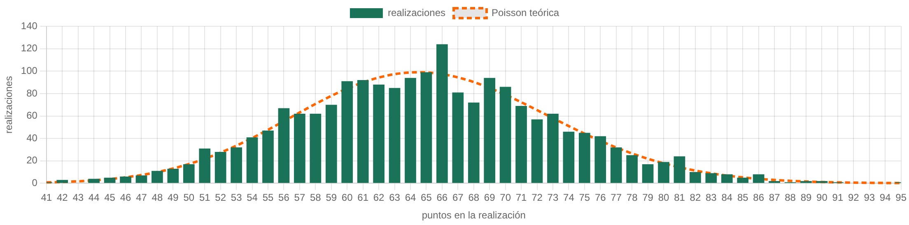{alto=215}

::: info Dato
Con λ = 65 en el cuadrado unidad: media **64.979**, varianza **67.673**, recorrido de 41 a 95 puntos.
:::

::: tip Interpretación
Media y varianza casi iguales a λ|W|: es la firma de Poisson (la binomial tiene la varianza por debajo; la binomial negativa, por encima).
:::

<small>Fuente: módulo 4 · `datos › m4`.</small>

???
Contexto del ejemplo. Qué ilustra: la propiedad (1) de CSR, que el número de puntos varía de una realización a otra. De dónde sale: 2 000 realizaciones simuladas con `rpoispp` de spatstat en R, semilla 4026, no es un dato observado. Por qué importa: es la base para saber cuánto se mueve el azar, que se cobra con las envolventes del módulo 11. La barra verde son las realizaciones y la línea naranja, la Poisson teórica. Con solo una realización no habría manera de ver que n cambia. Detalle en el módulo 4.

## Una R de 0.95 en una realización de CSR: ¿qué se concluye? {.pregunta}

1. Que la simulación falló, porque bajo CSR R debería dar 1.
2. Que la ventana es demasiado pequeña para que R sea informativo.
3. Que el patrón está agregado, porque R quedó por debajo de 1.
4. Que ese valor cae dentro de lo que el azar produce a menudo.

::: respuesta La 4: cae dentro de lo que el azar produce a menudo
En 2 000 realizaciones de azar puro, R recorrió de **0.83013** a **1.34170** (95 % central: 0.91306 a 1.20460) y **438** quedaron por debajo de 1. La media, 1.05843, no es 1: es sesgo de borde del estimador; corregido, los pinos japoneses bajan de 1.06400 a 1.00751.
:::

::: warn Criterio
Una R sola, sin saber cuánto se mueve el azar, no dice nada.
:::

<small>Fuente: módulo 4, `cap4-quiz` · `datos › m4.R_csr`, `m3.japanesepines`.</small>

???
El error de la opción 3 es exactamente el que desmonta el módulo 4: comparar R con 1 sin saber cuánto se mueve el azar. La media 1.05843 y los pinos japoneses (1.06400) casi coinciden: el «aleatorio» de libro no da 1 exacto. Esa es la razón de ser de las envolventes del módulo 11.

# Contar en cajas: el test de cuadrantes {seccion=modulo-5}

> Es el test más antiguo y el más fácil de explicar. También el que más se equivoca al decir qué contrasta.

???
Transición: ya tenemos una referencia, CSR. El primer test la compara con los conteos en celdas.

## El χ² de cuadrantes contrasta el Poisson homogéneo entero, no solo «λ constante» {columnas=1:1}

$$\chi^2 = \sum_{j=1}^{m} \frac{(O_j - E_j)^2}{E_j} \qquad E_j = \lambda\,|A_j|$$

*Oj* es lo observado en la celda *j*; *Ej*, lo esperado si la nula fuera cierta: la intensidad por el área de la celda ya recortada contra la ventana.

::: tip Interpretación
La nula son las **dos** propiedades de CSR juntas. Un rechazo dice que algo de ese paquete falla, no cuál: un patrón con λ constante cuyos puntos se agrupan rechaza igual.
:::

|||

::: info Dato
Sedes de Bogotá, rejilla 10×10: χ² = **456.12** con **64** grados de libertad y un p-valor del orden de 10-59.5. El test **rechaza**.

**12** de las 65 celdas vivas esperan menos de 5 puntos: el χ² se apoya en un supuesto que aquí no vale del todo.
:::

<small>Fuente: módulos 2 y 5 · `datos › m2.urbana` (`chi2`, `gl`, `p_log10`, `celdas_esperanza_baja`).</small>

???
Cuidado con cómo se dice: la hipótesis nula NO es «λ es constante». Es el Poisson homogéneo del módulo 4. La advertencia de las 12 celdas la cobra el módulo 6, dos diapositivas más adelante.

## Dos patrones con el mismo χ² hasta el último decimal: 64.612903 {columnas=1:1:2}

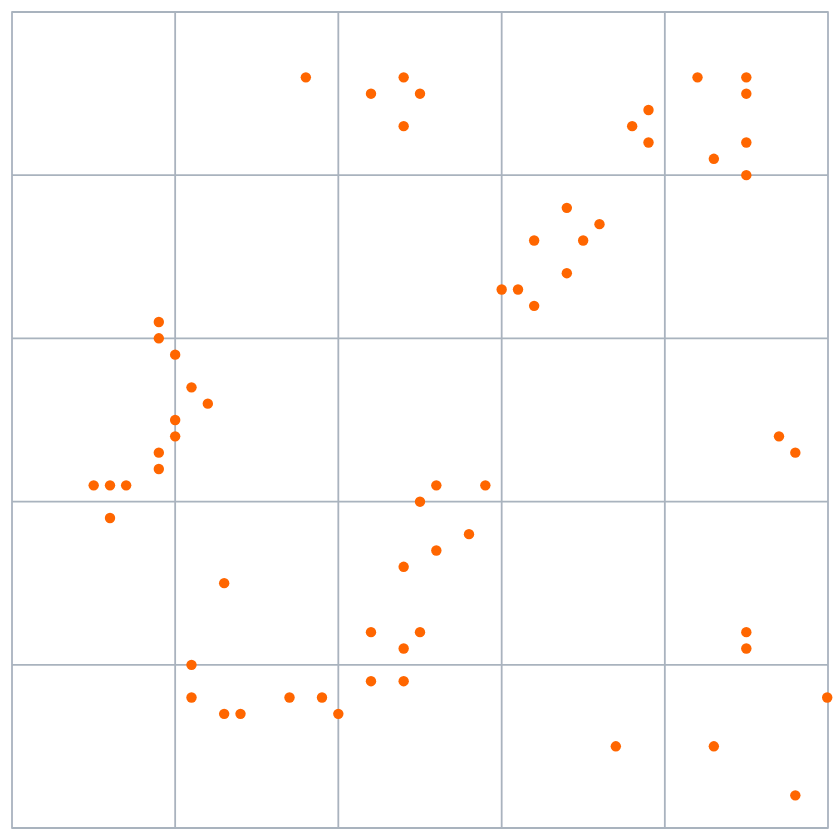{alto=330}

|||

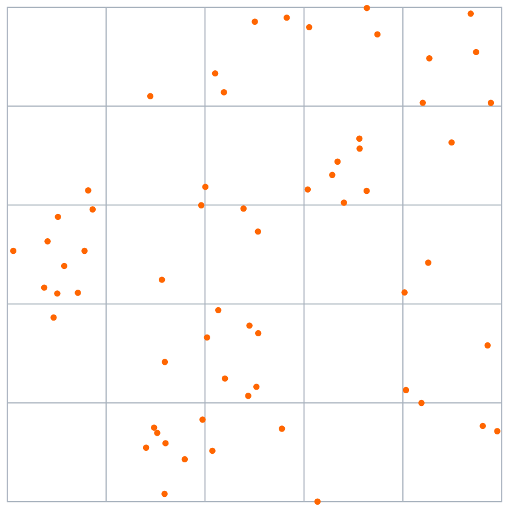{alto=330}

|||

::: info Dato
| | Original | Rebarajado |
|---|---|---|
| χ² (24 gl) | 64.612903 | 64.612903 |
| Distancia media al vecino | 0.03928 | 0.05755 |
| R de Clark-Evans | 0.61865 | 0.90622 |
:::

::: tip Interpretación
El χ² solo lee cuántos puntos hay en cada celda: es ciego a toda estructura de escala menor que el cuadrante.
:::

<small>Fuente: módulo 5 · `datos › m5`. Ejemplo construido: secuoyas rebarajadas dentro de cada celda 5×5.</small>

???
Contexto del ejemplo. Qué ilustra: la ceguera del χ² a la estructura de escala menor que la celda. De dónde sale: las secuoyas (Strauss, 1975; Ripley, 1977) con los conteos por celda de una rejilla 5×5 conservados y los puntos repartidos al azar dentro de su celda, semilla 4027: es un patrón construido a propósito, no observado. Por qué importa: es la forma más limpia de mostrar que dos patrones opuestos pueden dar el mismo χ². Es la demostración entera del módulo 5. Los conteos por celda son los mismos, uno a uno; luego el χ² es el mismo, por construcción. Y sin embargo la distancia al vecino se multiplica por 1.46484. Pasar el test de cuadrantes no certifica aleatoriedad: certifica que los conteos son compatibles con ella, que es mucho menos. Deja abierta la pregunta: ¿quién elige el tamaño de la celda?

## El veredicto cambia con el tamaño de la celda, pero solo cuando el patrón está en el filo

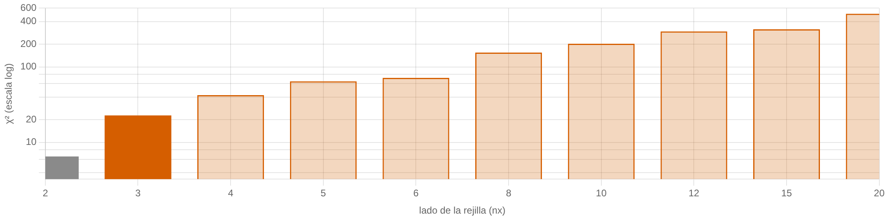{alto=250}

::: info Dato
Rejillas que rechazan, de 10 tamaños: secuoyas **9**, pinos japoneses **0**, sedes de Bogotá **10**.
:::

::: tip Interpretación
El que no rechaza en las secuoyas es el 2×2: con cuatro celdas no hay resolución para ver los grumos. Es el efecto de escala del MAUP (capítulo 3).
:::

<small>Fuente: módulo 6 · `datos › m6`; `soluciones › e3`.</small>

???
El veredicto depende de la celda cuando el patrón está en el filo; cuando es claramente aleatorio (pinos japoneses: 0 de 10) o claramente inhomogéneo (Bogotá: 10 de 10), la elección no lo mueve. Conecta con el capítulo 3: la escala no es un detalle de implementación, es parte del resultado.

## Afinar la rejilla rompe el supuesto del χ²: con 400 celdas el p-valor deja de mejorar

::: info Dato · secuoyas, cuatro de las 10 rejillas
| Rejilla | χ² | p-valor |
|---|---|---|
| 2×2 | 6.52 | 0.17806 |
| 5×5 | 64.61 | 0.00003 |
| 10×10 | 202.52 | 0.00000 |
| 20×20 | 505.74 | 0.00045 |
:::

Solo las dos rejillas más gruesas respetan **al menos 5 puntos esperados por celda**, y la única que lo respeta *y* rechaza es la de 3×3: una de diez.

::: tip Interpretación
Con 400 celdas y 62 plántulas cada esperanza es minúscula y el χ² deja de seguir la distribución de su p-valor.
:::

<small>Fuente: módulo 6 · `datos › m6.redwood`.</small>

???
Contexto del ejemplo. Qué ilustra: el supuesto roto del χ². De dónde sale: las secuoyas (Strauss, 1975; Ripley, 1977), 62 puntos en el cuadrado unidad. Por qué importa: con un patrón pequeño se ve el supuesto romperse en cuanto se afina la rejilla. El bloque de código del módulo 6 imprime exactamente estas cuatro líneas. La huella del supuesto roto está en la última: el p-valor empeora. Con Bogotá el supuesto se rompe a saltos, no siempre al afinar, porque la ventana recorta las celdas del borde; por eso se comprueba rejilla por rejilla.

## Sobre las secuoyas el test rechaza con 5×5 y no con 2×2: ¿qué se hace con eso? {.pregunta}

1. Quedarse con la rejilla fina, porque es la que mejor resuelve los grumos.
2. Declarar el tamaño de celda, que es parte del resultado y no del método.
3. Promediar los p-valores de los diez tamaños.
4. Fiarse de la rejilla gruesa, que es la que respeta la aproximación del χ².

::: respuesta La 2: declarar el tamaño de celda
La fina rompe el supuesto del χ²; promediar no tiene sentido porque los diez contrastes usan el mismo dato; y la gruesa respeta el supuesto pero no ve nada. Es el efecto de escala del MAUP con otro nombre.
:::

::: warn Criterio
Un test de cuadrantes sin su tamaño de celda en el pie está incompleto.
:::

<small>Fuente: módulo 6, autoevaluación `cap4-trampas`.</small>

???
Deja que discutan la opción 4: es la más tentadora, porque respeta el supuesto, pero con 2×2 no se rechaza un patrón claramente agregado. Cierre del bloque: hasta aquí se ha contado en cajas y siempre hubo que elegir la caja; lo que viene mide distancias.

# Medir distancias en vez de contar cajas: G, F y J {seccion=modulo-7}

> Las funciones de resumen resuelven el problema de la celda por la vía de no tener ninguna.

???
Este bloque es el más largo. Tres ideas: qué mira cada función, qué referencia tienen y qué no puede decir cada una.

## G mira desde los puntos y F desde los huecos, y se confunden constantemente

::: tarjetas {columnas=2}
### G(r) · vecino más próximo
Desde cada **punto del patrón**, hasta el *otro* punto más cercano. Ve lo cerca que tiene cada punto a su vecino.

$$\hat{G}(r) = \frac{1}{n}\sum_{i=1}^{n} \mathbf{1}\{d_i \leq r\}$$
### F(r) · espacio vacío
Desde **sitios cualesquiera** de la ventana, hasta el punto más cercano. Ve el tamaño de los huecos.

$$\hat{F}(r) = \frac{1}{m}\sum_{j=1}^{m} \mathbf{1}\{e_j \leq r\}$$
:::

*di* es la distancia del punto *i* a su vecino más próximo; *ej* es la del sitio *j* al punto más cercano.

<small>Fuente: módulo 7 (definiciones del capítulo).</small>

???
El vecino de G es el otro punto más cercano, porque cada punto está a distancia cero de sí mismo. F no mide desde puntos del patrón: mide desde sitios cualesquiera; lo que le falta hasta 1 es el hueco. Son las versiones sin corregir el borde; las corregidas cambian qué casos se cuentan, no qué distancia se mide.

## Bajo CSR G y F son la misma curva, y los regímenes las separan en direcciones opuestas

$$G_{\text{CSR}}(r) = F_{\text{CSR}}(r) = 1 - e^{-\lambda \pi r^2}$$

::: info Dato
| | G(r), vecino más próximo | F(r), espacio vacío |
|---|---|---|
| Patrón agregado | Sube antes que la de CSR | Sube después que la de CSR |
| Patrón regular | Arranca después y sube más empinada | Sube antes que la de CSR |
| Bajo CSR | 1 − e−λπr² | La misma |
:::

::: tip Interpretación
Un patrón agregado tiene vecinos cerca (G sube pronto) y deja huecos grandes (F sube tarde). Uno regular hace lo contrario.
:::

<small>Fuente: módulo 7 (teorema de Slivnyak, según el capítulo).</small>

???
Por qué son la misma: que un sitio no tenga ningún punto a distancia r es que el disco de radio r esté vacío, y por la primera propiedad de CSR esa probabilidad es e a la menos λπr². Para G el argumento es el mismo por la segunda propiedad. La tabla dice «arranca» y no «queda por debajo» a propósito: lo que se lee es cuándo despega cada curva.

## En los patrones de libro las medianas de G y F se separan de la de CSR como dice la teoría

::: info Dato · mediana: la r a la que la curva llega a 1/2
| Patrón | G | F | CSR |
|---|---|---|---|
| Células (regular) | 0.13036 | 0.05959 | 0.07248 |
| Pinos japoneses (aleatorio) | 0.06403 | 0.05964 | 0.05826 |
| Secuoyas (agregado) | 0.02828 | 0.07769 | 0.05965 |
:::

::: tip Interpretación
Regular: G llega tarde y F pronto. Agregado: al revés. Aleatorio: las tres casi coinciden.
:::

<small>Fuente: módulo 7 · `datos › m7`.</small>

???
Recorre en vivo los tres patrones en el simulador del módulo 7 (enlace del divisor). La figura es el estado inicial del simulador: las secuoyas, con la G sin corregir en gris punteado. Detalle: la G de las células arranca tarde pero, cuando arranca, sube tan empinada que acaba por encima de la de CSR, porque todas tienen su vecina a una distancia parecida. La CSR de cada patrón es distinta porque cada uno tiene su λ.

## En Bogotá G y F dicen «agregado», pero no dicen por qué {columnas=1:1}

::: info Dato · sedes de Bogotá, ventana urbana
Mediana de G: **145.52** m. Mediana de F: **222.83** m. Bajo CSR las dos serían **196.86** m.

F usa 160 000 sitios y solo **62 762** caen dentro de la ventana: solo esos valen.
:::

|||

::: tip Interpretación
Exceso de vecinos cercanos y de huecos respecto de CSR. Una λ que cambia de zona en zona deja esa misma huella.
:::

::: warn Criterio
Léelo como exceso de vecinos y de huecos, no como prueba de atracción. Un sitio fuera de la ventana no está vacío: está sin observar.
:::

<small>Fuente: módulo 7 · `datos › m7.bogota`.</small>

???
Es la lección del módulo 1 aplicada a los sitios de F: contar como hueco un sitio que cae fuera de la ventana hundiría la F. Y es la primera vez que aparece la cautela que se repetirá en K y en g: contra CSR, atracción y λ variable dejan la misma huella.

## La G sin corregir vale 0.037494 en r = 0: ¿cuántas sedes comparten coordenada con otra? {.pregunta}

Sedes de Bogotá, ventana urbana (2 107 sedes). En los tres patrones de libro la G sin corregir vale 0 en r = 0; aquí no.

::: respuesta 79 sedes
Es el **3.74941 %** de las sedes, y hay sitios con hasta **3** sedes. Son sedes distintas en un mismo edificio: la G tiene un átomo en r = 0.
:::

::: warn Criterio
Un patrón con puntos duplicados no es un proceso puntual simple. No se colapsaron —cambiaría n y con él la λ publicada—: se declara.
:::

<small>Fuente: módulo 7 · `datos › m7.duplicados` y `m7.bogota`.</small>

???
Pide que lo calculen a mano: la G sin corregir en r = 0 es exactamente la fracción de puntos con un vecino a distancia cero, así que 0.037494 por 2 107 da 79. Ojo, discrepancia en el material: el módulo 7 dice que las 79 sedes están «repartidas en 40 sitios». Recomputado con las coordenadas crudas de `cap4_bogota_urbana.csv`, son 39 sitios: 38 con dos sedes y 1 con tres. El 40 es 2 107 − 2 067, el número de sedes «sobrantes» (`repetidos` en el JSON), no el de sitios. Por eso la diapositiva no cita el número de sitios; conviene corregirlo en el capítulo. La G corregida (Kaplan-Meier) vale 0 ahí por convenio de spatstat, no por el dato; por eso el simulador dibuja las dos.

## J junta G y F en una curva con referencia plana, pero J = 1 no certifica CSR

$$J(r) = \frac{1 - G(r)}{1 - F(r)} \qquad J = 1\ \text{bajo CSR} \quad J<1\ \text{agregado} \quad J>1\ \text{regular}$$

::: info Dato
Pinos japoneses (aleatorios): J va de **0.29192** a **1.50037**. Bogotá: J queda por debajo de 1 en las **67** distancias.
:::

::: tip Interpretación
Con esa regla, J llamaría regular a un patrón aleatorio en unas distancias y agregado en otras: ninguna función se lee sola.
:::

::: warn Criterio
J = 1 no prueba CSR: Bedford y van den Berg (1997) construyeron, sobre la recta, procesos que no son de Poisson con J = 1.
:::

<small>Fuente: módulo 7 · `datos › m7`. J: van Lieshout y Baddeley (1996).</small>

???
Las dos referencias se cotejaron con sus fichas bibliográficas: van Lieshout y Baddeley (1996), Statistica Neerlandica 50(3), 344–361; Bedford y van den Berg (1997), Advances in Applied Probability 29, 19–25. J es un cociente, y cuando F se acerca a 1 el denominador es un resto pequeño y cualquier temblor se agranda: por eso se dibuja solo mientras F no pase de 0.9. En Bogotá J arranca en 0.962506, que es 1 menos la fracción de sedes coincidentes: la G de muestra reducida ve el átomo justo donde Kaplan-Meier marca cero.

# Todas las escalas a la vez: K, L y g {seccion=modulo-8}

> G y F miran una escala, la del vecino más próximo. K las mira todas, y por eso arrastra lo que encuentra.

???
Este es el corazón del capítulo. Cinco diapositivas para K, L y g, una de balance y una de síntesis.

## K cuenta vecinos en discos crecientes; bajo CSR vale πr², sea cual sea λ

$$K(r) = \frac{\mathbb{E}\left[\,N(r)\,\right]}{\lambda} \qquad K_{\text{CSR}}(r) = \frac{\lambda \pi r^2}{\lambda} = \pi r^2$$

*N(r)* es el número de *otros* puntos a distancia *r* o menos de un punto típico; al dividir por λ, K queda en unidades de **área**.

::: tip Interpretación
K(r) es el área del disco que, bajo CSR, tendría en promedio los vecinos que el patrón tiene de verdad. Si K(r) > πr², hay más vecinos de los que daría el azar.
:::

::: info Dato
La referencia no depende de la densidad: células (42 puntos), pinos japoneses (65) y secuoyas (62) comparten la misma curva teórica.
:::

<small>Fuente: módulo 8 · `datos › m3`, `m8`.</small>

???
Elige un punto del patrón sin mirar dónde está —el «punto típico»— y cuenta sus vecinos. Por el teorema de Slivnyak, alrededor de un punto de un patrón CSR los demás siguen repartidos al azar, y λ se cancela. Esa cancelación es lo que hace útil a K.

## A 1 km la sede típica tiene 25.87 vecinas y el azar le daría 17.88 {columnas=1:1}

$$\hat{K}(r) = \frac{|W|}{n(n-1)} \sum_{i \neq j} w_{ij}\, \mathbf{1}\{d_{ij} \leq r\}$$

*wij* es el peso de traslación de la pareja: corrige el borde.

::: tip Interpretación
A 1 km la sede típica tiene **1.45** veces las vecinas que daría el azar: el cociente entre K̂ y πr².
:::

|||

::: info Dato · sedes de Bogotá, r = 1 km
| Pieza | Valor |
|---|---|
| Parejas ordenadas a ≤ 1 km | 50 368 |
| Suma con sus pesos | 54 511 |
| Vecinas por sede | 25.87 |
| Vecinas bajo CSR | 17.88 |
| K̂(1 km) | 4.5464 km² |
| πr² | 3.1416 km² |
:::

<small>Fuente: módulo 8 · `datos › m8.piezas`.</small>

???
Es un punto de la curva; K lo da para cada r. La tabla del módulo 8 desmonta la fórmula pieza a pieza: r, d_ij, el indicador, el peso, la suma sobre parejas ordenadas (cada pareja entra dos veces), n, el área y el factor de delante. La corrección le devuelve a cada sede las vecinas que el borde le escondía: 23.91 sin pesos, 25.87 con ellos.

## L − r pone CSR en el eje: su signo dice hacia dónde se aparta, no si importa

**L(r) = √(K(r)/π)** deshace el cuadrado: bajo CSR, \(L(r) - r = 0\). Se dibuja L − r contra r.

::: info Dato · mayor desvío de L − r
| Patrón | Desvío |
|---|---|
| Células (regular) | −0.08463 |
| Pinos japoneses (aleatorio) | −0.01473 |
| Secuoyas (agregado) | +0.05581 |
| Sedes de Bogotá | +331.67 m, a 5105 m |
:::

::: tip Interpretación
Los pinos, aleatorios, tienen signo negativo como las células regulares: el signo da la dirección, no la significancia. Sobre los pinos el test global da p = 0.30000: nada que rechazar.
:::

<small>Fuente: módulos 8 y 11 · `datos › m8`, `m11.test_global`.</small>

???
La transformación de Besag deshace el cuadrado: comparar una curva contra una parábola es incómodo, contra el eje horizontal no. En Bogotá el máximo es 331.67 m; que esté por encima de cero en todo r no prueba que los colegios se atraigan, porque la λ variable deja la misma huella.

## K sigue por encima a 500 m aunque la agregación ocurre a 20 m: ¿por qué? {.pregunta}

1. Porque la intensidad del patrón crece con la distancia medida.
2. Porque el efecto de borde infla K a las distancias grandes.
3. Porque la ventana no es un rectángulo simple.
4. Porque K es acumulativa y arrastra los vecinos ya contados.

::: respuesta La 4: K es acumulativa
Los vecinos de 20 m siguen contados dentro del disco de 500 m. Lo arregla g(r), que mira solo el anillo de radio r: \(g(r) = \frac{1}{2\pi r}\frac{dK(r)}{dr}\), y bajo CSR vale 1. Además, el borde va en sentido contrario: sin corregir, K se queda por debajo.
:::

<small>Fuente: módulo 12, `cap4-quiz`. Las distancias de 20 m y 500 m son las del enunciado de la pregunta, no una medición.</small>

???
Las distancias son hipotéticas: el enunciado del cuestionario las pone para dar la situación. La opción 2 es la tentadora: el borde sí sesga K, pero hacia abajo.

## g mira solo el anillo: vuelve a 1 en r = 0.1450 mientras K sigue por encima

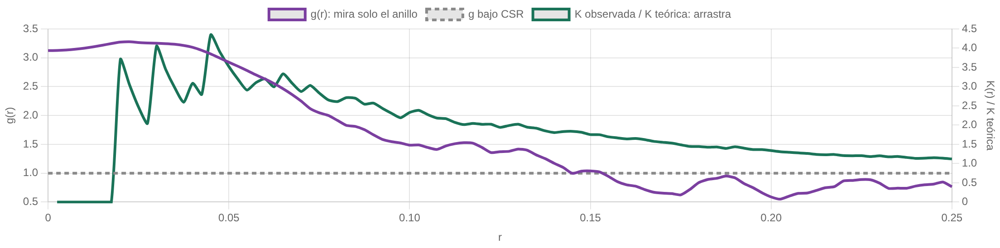{alto=250}

::: info Dato
Secuoyas: g alcanza **3.27862** en r = **0.02250** y vuelve a 1 en r = **0.1450**; K sigue por encima de su teórica y no vuelve.
:::

::: tip Interpretación
La distancia a la que g regresa es el tamaño de los grumos, y K no la sabe decir.
:::

<small>Fuente: módulo 9 · `datos › m9.redwood`.</small>

???
Bajo CSR g vale 1 en todo r. g es la derivada de K normalizada: mira solo el anillo, no el disco. La figura es el estado inicial del simulador del módulo 9 (secuoyas). En Bogotá, g no tiene pico: vale 1.60833 en el primer nodo, 59 m, y en el último, 5868 m, todavía vale 1.01105; no regresa a 1 en ningún punto del barrido. Ese máximo en el borde izquierdo no es una escala característica: es donde empieza a mirarse.

## K mira todas las escalas, pero acumula, supone λ constante y no mira lejos {columnas=1:1}

::: tip Lo que hace bien
- Mira más allá del vecino más próximo: ninguna sede tiene el suyo a más de 2495 m; K sigue hasta 5868 m.
- Una curva para todas las escalas, sin celda ni ancho de banda que elegir.
- Su referencia, πr², no depende de λ.
:::

|||

::: warn Lo que no
- Es acumulativa: no dice a qué distancia está la estructura.
- Supone λ constante e isotropía: una λ que cambia deja la huella de la atracción.
- No mira lejos: `Kest()` llega a un cuarto del lado corto de la ventana (5868 m en Bogotá).
- No identifica el proceso: Baddeley y Silverman (1984) construyeron uno que no es de Poisson y tiene K = πr².
:::

<small>Fuente: módulo 8 · `datos › m3.bogota`, `m8.bogota`.</small>

???
Referencia de la última desventaja: Baddeley y Silverman (1984), Biometrics 40, 1089–1094; construyeron un «cell process» que no es de Poisson y tiene la K de CSR. Casi todas tienen remedio: la acumulación, con g; lo que se mueve con r, con la L; el borde, con las correcciones del módulo 10; la pregunta del signo, con la envolvente del módulo 11; y la λ variable, con la K inhomogénea del capítulo 5. Dos no tienen remedio: el alcance lo pone la ventana, y ninguna función identifica por sí sola el proceso: un resultado se lee como compatible con un modelo, nunca como su prueba.

## Cinco resúmenes miran el vecino o las cajas, y en Bogotá los cinco caen del lado agregado

::: info Dato · sedes de Bogotá, ventana urbana
| Resumen | Qué cuenta | Resultado |
|---|---|---|
| Clark-Evans R | Distancia al vecino, sobre la del azar | R = 0.82371 |
| χ² de cuadrantes | Conteos por celda frente a los del azar | rechaza en las 10 rejillas |
| G(r) | Puntos con vecino a r o menos | mediana 145.52 m (CSR: 196.86 m) |
| F(r) | Sitios con un punto a r o menos: los huecos | mediana 222.83 m |
| J(r) | (1 − G) / (1 − F) | por debajo de 1 en 67 distancias |
:::

::: tip Interpretación
La agregación no mueve a todos hacia arriba: suben el χ² y G, que cuentan vecinos o desigualdad; bajan R, F y J, que miden distancias y huecos.
:::

<small>Fuente: módulos 3 a 7 · `datos › m3`, `m7`; `soluciones › e3`.</small>

???
Primera mitad de la síntesis de los módulos 3 a 9 (la tabla del módulo 9 pone los ocho resúmenes lado a lado). Antes de leer hacia dónde se va una curva hay que saber qué cuenta, por eso la columna «qué cuenta» va antes que el resultado. La segunda mitad, en la diapositiva siguiente, junta K, L − r y g, que miran todas las escalas.

## K, L − r y g también dicen «agregado»; ninguno dice por qué

::: info Dato · sedes de Bogotá, ventana urbana
| Resumen | Qué cuenta | Resultado |
|---|---|---|
| K(r) | Vecinos a r o menos, entre λ: el disco | 1.45 veces CSR a 1 km |
| L(r) − r | K en la escala de r | +331.67 m, a 5105 m |
| g(r) | Parejas por anillo | 1.01105 a 5868 m: no regresa a 1 |
:::

::: tip Interpretación
Ninguno de los ocho dice **por qué** se aparta el patrón: una λ que cambia deja la misma huella que la atracción.
:::

::: warn Criterio
Hasta el capítulo 5, «exceso de parejas», no «atracción»: tampoco dicen si el desvío supera al azar (módulo 11) ni cuánto pesa el borde (módulo 10).
:::

<small>Fuente: módulos 8 y 9 · `datos › m8`, `m9`.</small>

???
Cierra la síntesis de los módulos 3 a 9: los ocho resúmenes caen del mismo lado, el de la agregación. Las tres cosas que ninguno dice son el porqué, si el desvío es mayor que el del azar y cuánto les cambia el borde. Separar atracción de λ variable es trabajo del capítulo 5: hasta entonces, «exceso de parejas». En g, el 1.01105 del último nodo (5868 m) no es un cruce: g no regresa a 1 en ningún punto del barrido, y su máximo, 1.60833 a 59 m, cae en el borde izquierdo, donde empieza a mirarse, así que no es una escala característica.

# ¿Podemos creer la curva? Borde y envolventes {seccion=modulo-10}

> Todo lo anterior tiene una grieta: un punto pegado al borde tiene vecinos fuera de la ventana, y nadie los ha observado.

???
Última parte técnica. Dos preguntas: ¿cuánto sesga el borde? y ¿cuánto se mueve el azar?

## Ignorar el borde añade dirección: siempre hacia «más regular»

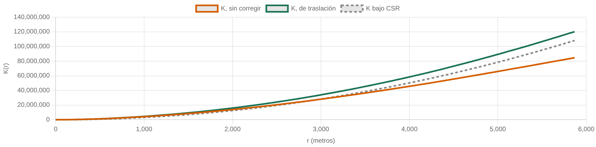{alto=210}

::: info Dato
La K sin corregir queda hasta un **29.6 %** por debajo de la corregida; el máximo, en r = **5868** m. La isotrópica cuesta **555** veces más que la de traslación [SIN VERIFICAR: tiempo medido por el autor].
:::

::: tip Interpretación
Faltan vecinos, nunca sobran: a r grande casi todos los discos tocan el borde.
:::

<small>Fuente: módulo 10 · `datos › m10`. Las envolventes usan la corrección de traslación, y se declara.</small>

???
Hay tres correcciones clásicas —de borde, de traslación e isotrópica—, y son tres maneras de elegir el peso w_ij. Sobre la ventana de Bogotá (22 piezas, 5 agujeros, 13 767 vértices) la isotrópica tiene que cortar, pareja a pareja, un círculo contra un contorno de 13 767 vértices: lo que se paga es el borde, no n. Los tiempos (0.22 s la de traslación y 122.66 s la isotrópica por estimación de K) dependen de la máquina: el capítulo los declara medidos en R 4.4.1 sobre un Mac de 12 núcleos y aquí no se pudieron reproducir, por eso la marca. El material da el sesgo como 29.60530 % en el módulo 10 (`m10.sesgo_max_pct`) y como 29.60510 % en la solución del ejercicio 5 (`e5`): la diferencia viene de la rejilla en que se mide, y las dos redondean a 29.6, que es lo que va en la diapositiva.

## Una banda al 95 % por punto no contrasta la curva: la mitad del azar puro se sale

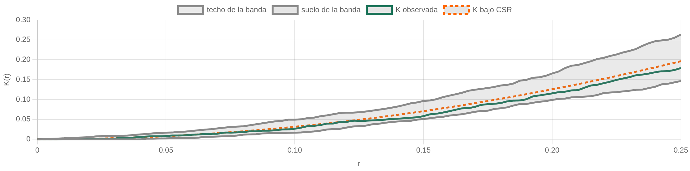{alto=200}

::: info Dato
De 999 simulaciones de CSR puro, se salen de su banda en algún r: **52.2523 %** en las sedes, **52.1522 %** en las secuoyas y **51.0511 %** en los pinos. En los pinos la observada no se sale en ningún r.
:::

::: tip Interpretación
La tasa la pone el procedimiento —513 distancias con una banda al 95 % en cada una—, no el dato.
:::

<small>Fuente: módulo 11 · `datos › m11`.</small>

???
El módulo 11 escribe estas tasas con cinco decimales (52.25230, 52.15220 y 51.05110), pero el JSON solo guarda cuatro y el valor exacto de la primera es 522/999 = 52.25225…: el cero final es relleno, así que aquí van con cuatro decimales. Tres patrones sin nada en común —62 plántulas y 65 pinos en un cuadrado, 2 107 sedes en una ventana de 22 piezas— y casi la misma tasa. Mirar la curva entera y decir «se sale en algún sitio, luego p < 0.05» es hacer un centenar de contrastes y quedarse con el peor.

## El test global resume la curva en un número y obliga a declarar estadístico y rango {columnas=1:1}

::: info Dato
DCLF y MAD dan p = **0.00100** sobre Bogotá y **0.30000** y **0.31800** sobre los pinos. Con 999 simulaciones, el p mínimo posible es 1/(nsim + 1) = **0.00100**.
:::

::: tip Interpretación
DCLF integra la separación al cuadrado; MAD toma la mayor. K crece como r², así que a r grande las desviaciones pesan más y ahogan la señal de las células, que está a r pequeño.
:::

|||

::: info Dato · células, mismas 999 simulaciones
| DCLF sobre… | p |
|---|---|
| K, todo el rango de r | 0.08100 |
| K, r hasta el 20 % | 0.04900 |
| K, r hasta el 40 % | 0.00500 |
| L, todo el rango | 0.00100 |
:::

::: warn Criterio
El estadístico y el rango de r los decide el analista: antes de mirar, y se declaran.
:::

<small>Fuente: módulo 11 · `datos › m11.test_global`; `soluciones › e4`.</small>

???
Contexto del ejemplo de las células. Qué ilustra: que el veredicto del test global depende de dos elecciones. De dónde sale: las células biológicas (Crick y Ripley; 42 puntos), 999 simulaciones de CSR con corrección de traslación. Por qué importa: toda su señal está a distancias cortas, porque las células se estorban, y el rango largo la ahoga. Es el ejercicio 4 del módulo 12: de no rechazar (0.08100) a rechazar al máximo (0.00100) sin cambiar el patrón ni las simulaciones, solo con dos elecciones. Y el p mínimo no es una convención, es aritmética: la observada quedó más lejos que las 999 simulaciones y el p ya no podía bajar más.

## De 39 a 999 simulaciones, sin tocar nada más: ¿qué le pasa a la banda por defecto? {.pregunta}

1. Su ancho cae como uno partido por raíz de nsim, así que se reduce.
2. Se ensancha, porque su nivel puntual es 2/(nsim + 1) y ha cambiado.
3. Se estrecha, porque con más simulaciones hay más información sobre CSR.
4. No cambia: la banda queda determinada por el patrón y su ventana.

::: respuesta La 2: se ensancha
Con 39 simulaciones el nivel puntual es **0.05000**; con 999, **0.00200**: son contrastes distintos. En el barrido entero, desde 19 simulaciones, la banda se ensancha ×**1.84853**. Con el nivel fijo al 5 % sí se estrecha: ×**1.29989** entre 39 y 999.
:::

::: warn Criterio
Elegir nsim no es elegir precisión: es elegir qué contrastes existen.
:::

<small>Fuente: módulo 11, `cap4-quiz` · `datos › m11.escala_resumen`.</small>

???
Es la trampa que casi todo el mundo pisa: la banda de `envelope()` por defecto es el mínimo y el máximo de las simulaciones, y con rango k el nivel puntual es 2k/(nsim+1). Subir nsim sin más cambia de contraste.

# Cierre y práctica {seccion=modulo-12}

## Lo que se llevan hoy {.cierre}

- Ninguna cifra sin su ventana: n y λ cambian con el recinto
- El χ² solo cuenta cajas: el tamaño de la celda es parte del resultado
- G, F y J miran al vecino; K y L, todas las escalas pero acumulando; g, solo el anillo
- Ignorar el borde sesga siempre hacia «más regular»
- Una curva sin banda del azar no se lee; el test global obliga a declarar estadístico y rango

???
Vuelve sobre la tesis: ventana, escala, borde y referencia. Recuérdales que las cuatro se declaran. Remite al cuestionario del módulo 12 (ocho preguntas más las cuatro del módulo 6) para hacerlo antes de la próxima clase.

## Cinco ejercicios, cinco decisiones que hay que defender

::: info Práctica guiada del módulo 12
| Ejercicio | La decisión que hay que defender |
|---|---|
| 1 · La ventana que decides | ¿Qué ventana respalda «5,7 colegios por km²», y qué habría que añadir? |
| 2 · El χ² que no ve | ¿Qué cifra separa el patrón de los pinos suecos de su versión rebarajada, y cuál no? |
| 3 · El cuadrante que rechaza por el motivo equivocado | Urbana frente a Distrito Capital: ¿qué rechazo no habla de los colegios? |
| 4 · La envolvente dice una cosa y el test otra | ¿Cómo pasa el mismo patrón de no rechazar a rechazar? |
| 5 · El borde empuja siempre hacia el mismo lado | Al ignorar el borde, ¿el patrón parece más agregado o más regular? |
:::

<small>Fuente: módulo 12, ejercicios guiados · `soluciones › e1` a `e5`. Ejemplo del ejercicio 2: pinos suecos (Strand, 1972).</small>

???
El enunciado completo, con datos y solución calculada, está en el módulo 12; proyectarlo desde ahí. Los cinco terminan en una decisión que hay que defender, que es lo que el capítulo entrena de verdad. El capítulo 5 recoge el hilo: estima λ como superficie y la modela con covariables, que es lo que permite separar atracción de λ variable.
