<!--
  Capítulo 5 · Intensidad por núcleos, sesión 1 de 2: módulos 5.1 a 5.6.
  La sesión 2 cubre 5.7 a 5.11 y el proyecto integrador.

  Decisiones de Javier (29 sep 2026). No re-preguntar:
  D1  Dos sesiones de 90 min: 5.1–5.6 (estimar la intensidad; semana 8, la del Quiz 2) y
      5.7–5.11 más el proyecto integrador (modelarla).
  D2  Código en R, recortado, con el argumento decisivo resaltado; Python solo en las notas.
  D3  Viven en Htmls_Espacial/diapositivas/. Estuvieron sin commit y apartadas del `git add -A`
      mientras se revisaban; se versionaron y se enlazaron desde la portada el 1 oct 2026, a petición suya.

  REGLAS DE CONTENIDO de esta presentación (las mismas de la del capítulo 4):
  · Toda cifra sale de `cap5_datos.json` (salidas de R del precálculo) o del recómputo que se
    volvió a correr en R (`recomputo_cap5.json`), y está cotejada en `registro_cifras_cap5_s1.md`.
  · Todo ejemplo dice qué ilustra, de dónde sale y por qué importa.
  · Toda afirmación va como Dato, Interpretación o Criterio. Lo que no se pudo comprobar
    lleva la marca [SIN VERIFICAR].
  · Los bloques de R se ejecutan de verdad (`verifica_bloques_cap5.py`) y su salida es la literal.
  · Los mapas son figuras propias, con el norte arriba (recursos/cap5/genera_figuras_s1.R).
    Los mapas ráster del capítulo salen invertidos verticalmente (sur arriba).

  Revisada el 1 oct 2026 con una revisión pedagógica y una auditoría de cifras independientes.
  Los divisores numerados (01 a 06) coinciden con los módulos 1 a 6 del capítulo.

  Las dos láminas con animación 3D («En 3D» del módulo 1 y «En 3D: lo que se escapa por el borde» del módulo 4) llevan el MISMO
  script de `message`, en una sola línea (así el constructor no lo cuenta como prosa): es UN oyente para todos los marcos y el
  segundo que se carga no hace nada. El visor es de la página y los iframes son de las animaciones: las flechas que se pulsen
  dentro viajan al visor y el foco vuelve a él; si no, la siguiente diapositiva dejaría de responder después de mover un
  deslizador. Cada mensaje se atiende en el marco que lo mandó y en ningún otro (un `querySelector` de «el» marco atendería solo al
  primero). No se usa e.origin: con file:// vale 'null'. El pie de las dos va a DOS líneas: así el marco mide 451 px, el alto que
  piden las dos escenas (con el parche de `.n3d-clase` del motor; ver `build/diapositivas/cap5/verif/TRASPASO.md`).

  Fuera a propósito: la autoevaluación y los ejercicios guiados (módulo 12: se remiten en la
  práctica) y el simulacro (módulo 13: no lleva clave).
-->

# De contar a suavizar {seccion=modulo-1}

> El capítulo 4 terminó con una sola cifra para toda la ciudad. La pregunta que un mapa invita a hacer es otra: *dónde*.

???
Unos 13 minutos. Abrir con la pregunta, no con la definición: ¿qué le falta a «5.69 sedes por km²»? Dejar que digan «dónde». El capítulo 4 cerró con un veredicto —las sedes no están repartidas al azar— pero con una sola intensidad para toda la ciudad. Los módulos 1 a 4 de este capítulo son la materia del Quiz 2. Presupuesto de la sesión (90 min): este módulo, 13 min; núcleo y ancho, 11; selectores, 11; corrección de borde, 17 (14 sin la animación en 3D); mapa de calor, 10; intensidad relativa, 13; cierre y práctica, 4. El resto es margen para preguntas.

## Una sola cifra para toda la ciudad no dice dónde hay más sedes {columnas=1:1}

::: ejemplo El ejemplo que nos acompaña: las sedes de Bogotá
**Qué ilustra:** el paso de «cuántas» a «dónde». **De dónde sale:** la capa de la Secretaría de Educación del Distrito (SED, vía Datos Abiertos Bogotá): 2 209 sedes, de las que **2 107** caen dentro del perímetro urbano; coordenadas en metros. **Por qué importa:** es el hilo colombiano del curso, el mismo del capítulo 4.
:::

|||

::: info Dato
$$\hat\lambda = \frac{n}{|W|} = \frac{2\,107}{370.09\ \text{km}^2} = 5.69\ \text{sedes/km}^2$$
:::

::: tip Interpretación
Un solo número para toda la ventana \(W\): contesta «cuántas por km²», no «dónde». El test de cuadrantes ya empezó a contestar *dónde*: partió la ventana en celdas y contó.
:::

<small>Cómo leer esta clase: **Dato** es una cifra calculada, con su fuente; **Interpretación**, la lectura que se hace de ella; **Criterio**, una postura sobre qué hacer. Fuente: módulo 1 del capítulo.</small>

???
Es la intensidad de los capítulos 1 y 4: n entre el área de la ventana. Los 2 209 menos los 2 107 son sedes que caen fuera del perímetro urbano, la mayoría en suelo rural del D.C. La capa es la versión 12.25 de la SED y las coordenadas están en EPSG:9377. Pregunta para el grupo: ¿qué se pierde al resumir la ciudad con un solo número? Cotejo: `datos › m5.capas.oferta.n`, `recomputo › urbana.n_capa`, `recomputo › urbana.n_urbana`, `recomputo › urbana.area_km2`, `recomputo › urbana.lambda_km2`.

## Kennedy: 262 sedes en 38.51 km², con un contorno y no con una caja {columnas=5:4}

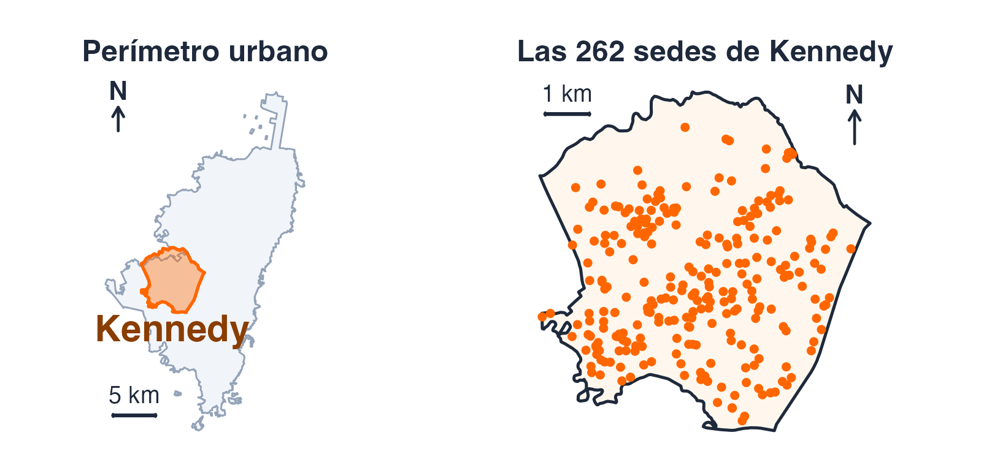{alto=240}

```r La ventana es el contorno, no la caja {resaltar=1,3 tam=0.85}
W <- as.owin(st_union(st_geometry(loc[loc$localidad == "Kennedy", ])))
xy <- st_coordinates(cole)
p <- ppp(xy[, 1], xy[, 2], window = W)   # descarta lo que cae fuera
npoints(p)
#> [1] 262
```

<small>Fuente: módulo 1 del capítulo (R, spatstat, sf).</small>

|||

::: ejemplo Kennedy, la ventana de la sesión
**Qué ilustra:** estimar sobre un borde irregular. **De dónde sale:** las sedes de Kennedy, dentro del contorno de la localidad. **Por qué importa:** es la ventana de toda la sesión: sobre ella se varía el ancho y su borde se corrige después.
:::

::: info Dato
\(n\) = **262** · \(|W|\) = **38.51 km²** · \(\hat\lambda\) = 262 / 38.51 = **6.80** por km².
:::

::: warn Criterio
Manda la geometría, la que usa `ppp()`: un borde es una decisión.
:::

???
Bajamos de la ciudad a una localidad por una razón técnica que el módulo 5 explica: sobre la ciudad entera el mapa no puede dibujar un núcleo estrecho sin dibujar su propia rejilla. La caja que enmarca a Kennedy mide 7.5 × 7.7 km; la ventana es el contorno, no la caja. Por el atributo `localidad` salen 261 sedes y por la geometría, 262: las tres sedes de diferencia están a menos de 87 m del borde («Debora Arango Perez» y el «Instituto Clara Fey», que el atributo pone en Bosa y la geometría deja dentro, y el «Colegio Sagrado Corazon», al revés). Kennedy no está contenida en la ventana urbana: 3 de sus 262 sedes y el 9.8 % de su área caen fuera del perímetro urbano, porque son capas distintas. En el código, `cole` y `loc` son las capas de sedes y de localidades de la preparación. Cotejo: `datos › m1.ventana`, `datos › m1.frontera`, `recomputo › kennedy.n`, `recomputo › kennedy.sedes_fuera_de_la_urbana`, `recomputo › kennedy.area_fuera_de_la_urbana_pct`.

## Contar en cuadrantes ya estima la intensidad local, con dos defectos {columnas=3:2}

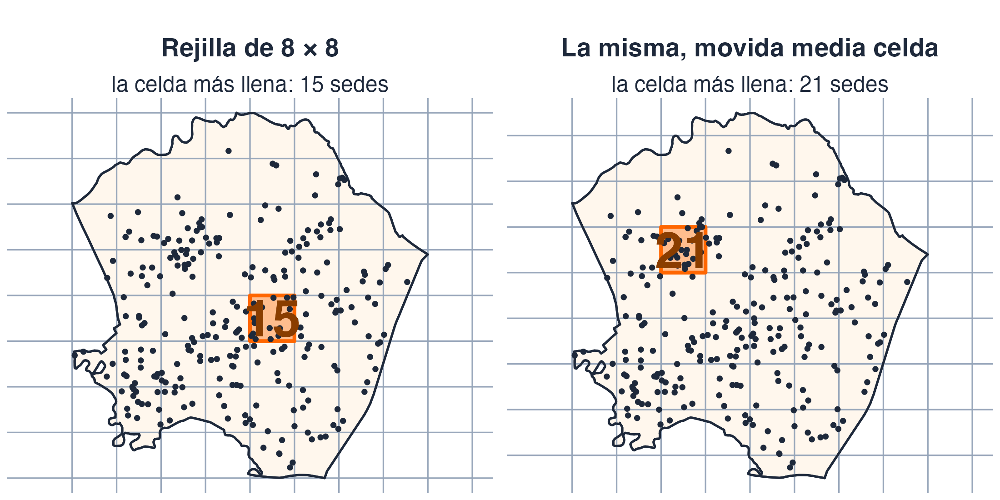{alto=330}

<small>Fuente: módulo 1 del capítulo (R, spatstat) y figura propia.</small>

|||

::: info Dato
Rejilla de 8 × 8: de **0** a **15** sedes por celda. Movida en pasos de ¼ de celda (16 posiciones), la celda más llena tiene entre **15 y 21**.
:::

::: tip Interpretación
**1.** La rejilla la puso alguien (MAUP, capítulo 3): al moverla, la celda más llena pasa de 15 a 21. **2.** Una línea corta la vecindad: una sede a 10 m, al otro lado, no aporta.
:::

::: warn Criterio
Contar en celdas es suavizar con un núcleo de caja y sin solapamiento.
:::

???
En el capítulo, el bloque del módulo 1 usa `quadratcount(p, nx = 8, ny = 8)` y `range()`. De las 64 celdas de la rejilla, 7 caen fuera de la ventana. El 15 sale dos veces. La cifra «entre 15 y 21» no está en el capítulo: se midió moviendo la rejilla en pasos de un cuarto de celda, en x y en y, y contando de nuevo; el máximo, 21, lo da un desplazamiento de media celda en y (el código está en `recomputa_cap5.R`). Python: el módulo trae la versión con `np.add.at`. Cotejo: `recomputo › cuadrantes.conteo_max`, `recomputo › cuadrantes.rango_desplazados`, `recomputo › cuadrantes.desplazamientos`, `recomputo › cuadrantes.celdas_con_ventana`.

## El estimador por núcleos (KDE) suma pesos en vez de contar cajas {columnas=1:1}

$$\hat\lambda(u) \;=\; \frac{1}{e(u)} \sum_{i=1}^{n} k_\sigma\!\left(u - x_i\right)$$

- \(u\): el sitio donde miramos · \(x_i\): las \(n\) sedes
- \(k_\sigma\): el **núcleo**, una función de peso que integra 1 y decae con la distancia
- \(\sigma\): el **ancho de banda**, la desviación típica del núcleo, en metros: hasta dónde llega la influencia de una sede
- \(e(u)\): la **corrección de borde**, la fracción del núcleo que cae dentro de la ventana (la veremos al corregir el borde)

|||

::: tip Interpretación
Mismo objetivo que el conteo por cuadrantes, la intensidad local; cambian el peso y la vecindad, no la idea. Cada sede pone una loma y el mapa es la suma de las lomas.
:::

::: warn Criterio
σ es la decisión que hoy se discute: ocupa el lugar del tamaño de celda.
:::

<small>Fuente: módulo 1 del capítulo (fórmula del capítulo).</small>

???
Leer los símbolos en voz alta y no pasar de ahí. KDE son las siglas inglesas de «kernel density estimate», estimador de densidad por núcleos; aquí la densidad es la intensidad. e(u) queda apuntado y el módulo 4 lo explica entero. Insistir en que σ ocupa el lugar del tamaño de celda: es el ancho de banda.

## Cada sede pone una loma; el mapa es su suma, y σ decide qué tan anchas son {columnas=3:2}

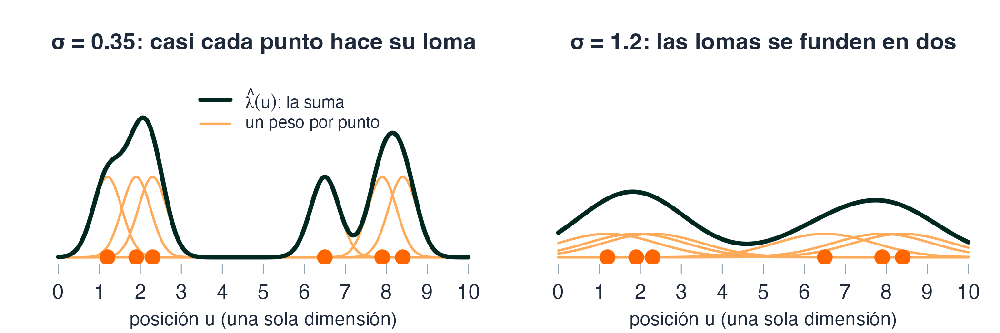{alto=300}

|||

::: ejemplo Una ilustración, no un dato
**Qué ilustra:** cómo la suma de lomas forma la superficie y cómo σ decide su anchura. **De dónde sale:** seis posiciones inventadas en una dimensión (1.2, 1.9, 2.3, 6.5, 7.9 y 8.4), con núcleo gaussiano. **Por qué importa:** fija la idea antes de medirla en Kennedy.
:::

::: tip Interpretación
Con σ pequeño el mapa enseña sedes; con σ grande, zonas: los picos bajan y los valles se llenan, porque cada sede reparte la misma masa en más espacio.
:::

<small>Fuente: ilustración propia, calculada con `dnorm`; no sale del capítulo.</small>

???
Pedir que describan qué cambia entre los dos paneles antes de decir nada. Los dos paneles comparten escala vertical: si cada uno se normalizara contra su propio máximo, el de σ grande parecería igual de alto. Señalar el valle entre los dos grupos: con σ pequeño casi no hay masa y con σ grande se llena, mientras los picos bajan; es la misma masa repartida en más espacio, no un mapa que «baje» entero. Es el mismo estimador con otro σ. No es un dato del capítulo: es una ilustración para fijar la idea antes de medirla en Kennedy. Cotejo: `recomputo › picos_valles`.

## En 3D: cada punto pone una loma y el mapa es su suma

::: html
<iframe class="n3d-marco w-full flex-1 min-h-0 border-0" src="../animaciones/nucleo-3d.html?modo=clase" title="Animación en tres dimensiones: de los puntos a la superficie de intensidad por núcleos" loading="lazy"></iframe>
<script>if (!window.oyenteNucleos) { window.oyenteNucleos = true; window.addEventListener('message', function (e) { var marcos = document.querySelectorAll('iframe.n3d-marco'), f = null; for (var i = 0; i < marcos.length; i++) if (marcos[i].contentWindow === e.source) f = marcos[i]; var m = e.data; if (!f || !m || !m.nucleos) return; if (m.nucleos === 'foco') { f.blur(); window.focus(); } else if (m.nucleos === 'tecla') document.dispatchEvent(new KeyboardEvent('keydown', { key: m.key, shiftKey: !!m.shiftKey, bubbles: true, cancelable: true })); }); }</script>
:::

<small>**Qué ilustra:** cómo la suma de lomas forma la superficie y cómo la cambian σ y el núcleo. **De dónde sale:** puntos inventados; es la animación del módulo 1 del capítulo. **Por qué importa:** fija la idea antes de medirla en Kennedy.</small>

???
Es la misma animación del módulo 1 del capítulo, que allí lleva el texto completo. Dos formas de usarla: pulsar los pasos y hablar encima, o «Reproducir», que recorre los cinco pasos sola en unos tres cuartos de minuto y se detiene. Guion sugerido. Paso de las cajas: desplazar la rejilla y preguntar cuál es ahora la celda más llena; cambia. Paso de las lomas: pedir que apuesten qué le pasa a la altura de cada loma al subir σ (baja: cada una encierra lo mismo, un punto). Paso de la suma: cambiar de núcleo con σ fijo y ver que la superficie se mueve poco (el disco, con el borde más brusco, es el que más se nota); es la tesis del módulo 2, y σ la cambia mucho más; después subir σ y ver que los picos bajan y los valles se llenan, porque cada loma reparte su peso en más terreno; la escala vertical no se renormaliza, así que se nota. Con el disco el pico puede subir a saltos, cuando el círculo alcanza un punto más. Último paso: arrastrar la esfera naranja hacia un grupo y luego hacia un hueco, y leer la columna: la altura es la suma de los pesos. Decir en voz alta que los puntos son inventados y que la animación no corrige el borde: con sus puntos y su ventana, parte de la masa de las lomas queda fuera, y es justo lo que mide el módulo 4. Para girar la vista se arrastra el fondo; las flechas siguen siendo del visor. Necesita red: three.js llega de un CDN, y sin él aparece un aviso con la idea en una frase. La presentación ya no es un solo archivo: depende de `../animaciones/nucleo-3d.html`, que hay que llevar junto con ella. Al imprimir en PDF sale una captura del estado en que se dejó, no la animación. Cotejo: `recomputo › picos_valles`.

## ¿Qué dos cosas le arregla el estimador por núcleos al conteo por cuadrantes? {.pregunta}

1. Que ya no haya que elegir ningún tamaño de vecindad y que el borde de la ventana deje de importar.
2. Que el resultado no dependa de dónde se coloca la rejilla y que las vecindades se solapen.
3. Que la estimación sea insesgada y que no dependa de σ.
4. Que cada sede aporte un peso distinto según su tipo y que la integral devuelva n sin pedírselo.

::: respuesta La 2: sin rejilla que mover, y con vecindades que se solapan
Mover la rejilla cambió la celda más llena de 15 a 21; el núcleo no tiene rejilla, y las vecindades de sedes cercanas se solapan. La 1 es falsa: σ ocupa el lugar del tamaño de celda y el borde importa más, no menos. La 3: σ es justamente la decisión que se discute hoy. La 4 mezcla cosas de otros módulos: el peso por tipo es una marca, y la integral solo devuelve n con una corrección concreta.
:::

<small>Fuente: módulo 12 del capítulo, autoevaluación `cap5-quiz`; opciones reescritas para esta clase.</small>

???
Pedir que la escriban antes de revelar. El error típico es marcar la 1: la KDE no deja de depender de la ventana, y la corrección por defecto ni siquiera conserva el conteo (lo vemos en la corrección de borde). El enunciado del capítulo es el mismo; aquí las opciones se reescribieron para que se refuten con lo visto en las cuatro diapositivas anteriores. Cotejo: `recomputo › cuadrantes.rango_desplazados`.

# Núcleo y ancho de banda: dos decisiones {seccion=modulo-2}

> Elegir un estimador por núcleos son dos decisiones: qué función de peso usar y con qué anchura. Suenan igual de importantes. Midámoslas sobre el mismo patrón.

???
Unos 11 minutos. Este módulo es materia del Quiz 2. Su tesis cabe en una frase: la primera decisión se puede tomar por costumbre; la segunda decide qué dice el mapa. En el capítulo el módulo se titula «El ancho de banda lo es todo»; aquí el divisor no regala la respuesta.

## Antes de medir: ¿cuánto mueve el máximo cambiar el núcleo, y cuánto cambiar el ancho? {.pregunta}

Mismas 262 sedes de Kennedy. Cambiamos **una sola cosa** cada vez y miramos cuánto se mueve la **intensidad máxima** del mapa:

- **el núcleo**: `gaussian`, `epanechnikov`, `quartic` y `disc`, con \(\sigma\) = 400 m fijo;
- **el ancho**: un solo núcleo (`gaussian`) y siete valores de \(\sigma\), de 233 a 1867 m.

1. Los dos igual: cada decisión mueve el máximo en torno al 30 %.
2. El núcleo mueve el máximo un 60 % y el ancho, un 5 %.
3. El núcleo mueve el máximo un 5 % y el ancho, un 60 %.
4. Ninguna de las dos pasa del 10 %.

::: respuesta La 3: el ancho, y por mucho
Lo medimos en las dos diapositivas siguientes: el núcleo, un 5.1 %; el ancho, un 66.3 %.
:::

<small>Fuente: módulo 2 del capítulo (R, spatstat).</small>

???
Pedir una apuesta a mano alzada antes de revelar. No dar las cifras todavía: salen en las dos diapositivas que siguen. Las opciones son órdenes de magnitud para apostar, no datos. Cotejo: `datos › m2.nucleos`, `datos › m2.familia`.

## Cambiar el núcleo mueve el máximo solo un 5.1 % {columnas=3:2}

::: info Dato · Kennedy, 262 sedes
| Núcleo (σ = 400 m) | Máximo (por km²) | Correlación con el gaussiano |
|---|---|---|
| `gaussian` | 18.45 | — |
| `epanechnikov` | 17.51 | 0.9911 |
| `quartic` | 17.69 | 0.9958 |
| `disc` | 17.88 | 0.9647 |

(18.45 − 17.51) / 18.45 = **5.1 %**: máximo menos mínimo, sobre el gaussiano.
:::

::: tip Interpretación
Las otras tres superficies correlacionan por encima de 0.96 con la gaussiana: para quien mira el mapa, es el mismo mapa.
:::

|||

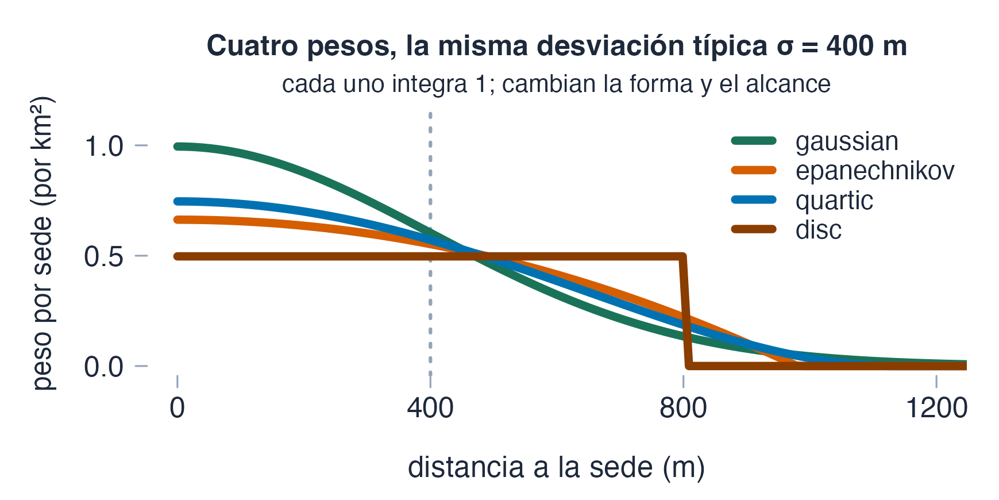{alto=250}

::: warn Criterio
«Al mismo σ» es a la misma **desviación típica**, no al mismo soporte: cada núcleo se escala para que su σ sea la pedida, como en la figura.
:::

<small>Fuente: módulo 2 del capítulo (R, spatstat) y figura propia.</small>

???
Cifras del módulo 2 (18.4483, 17.5145, 17.6900 y 17.8808 por km²; el 5.1 % es 5.0616 % sin redondear). El capítulo dice «por encima de 0.965», pero el disco da 0.9647: aquí se dice 0.96. La advertencia del recuadro es la que hace justa la comparación. La figura es propia: el perfil de cada núcleo sale de `density` sobre una sola sede y cada uno integra 1. El 5.1 % es a un solo σ, 400 m: a otros σ el núcleo mueve más o menos, de modo que no es una ley. Python: el módulo no traduce la llamada, reimplementa la convolución. Cotejo: `datos › m2.nucleos`, `recomputo › nucleos.max_km2`, `recomputo › nucleos.cor_gauss`, `recomputo › nucleos.dif_pct`.

## El ancho sí manda: el máximo cae de 29.5 a 9.9 sedes por km² al abrir σ {columnas=3:2}

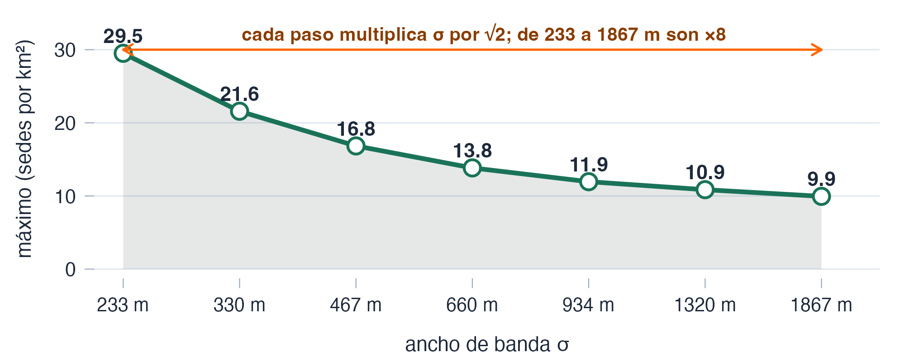{alto=300}

|||

::: info Dato
Kennedy, 262 sedes, núcleo gaussiano, siete anchos de 233 a 1867 m (de uno a otro, ×8). (29.507 − 9.946) / 29.507 = **66.3 %**. El núcleo, a σ = 400 m, movía un 5.1 %.
:::

::: warn Criterio
Elegir el núcleo se puede hacer por costumbre; elegir σ decide qué dice el mapa.
:::

<small>Fuente: módulo 2 del capítulo · rejilla de 96 × 99 celdas de 78 m.</small>

???
Abrir en el material el simulador «El pico contra el ancho de banda» (módulo 2) y mover el deslizador: el punto recorre la curva y el mapa de abajo cambia. Las cifras de los siete anchos están en el bloque de R del módulo (29.5, 21.6, 16.8, 13.8, 11.9, 10.9, 9.9) y cada ancho es √2 veces el anterior. El 66.3 % es 66.291 % sin redondear; con las cifras redondeadas a un decimal saldría 66.4 %, por eso la cuenta usa tres decimales. La comparación con el núcleo no es entre iguales: el núcleo se compara a un solo σ y el ancho abarca un abanico de ×8. El capítulo dice que el ancho mueve «13 veces» lo que el núcleo; esa razón compara dos cosas distintas, y por eso aquí no se repite. Cotejo: `datos › m2.familia`, `recomputo › anchos.picos_km2`, `recomputo › anchos.caida_pct`, `recomputo › anchos.razon_total`.

## Con σ pequeño ves sedes concretas; con σ grande, una sola mancha {columnas=3:2}

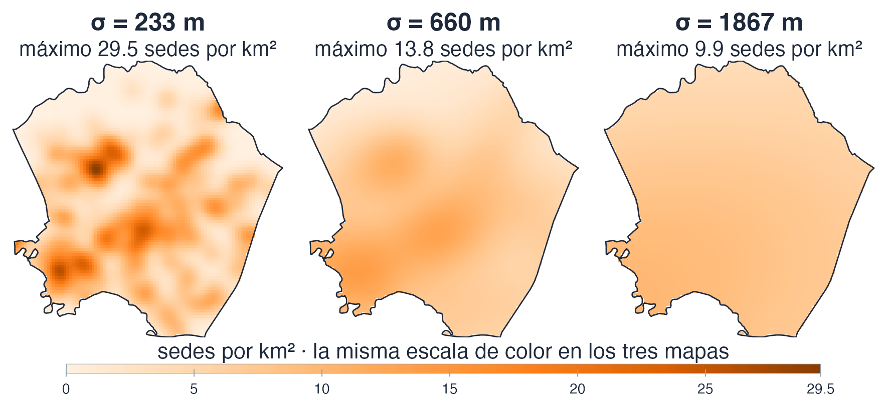{alto=330}

|||

::: tip Interpretación
Con σ = 233 m los focos son sedes concretas; con 660 m aparecen zonas; con 1867 m queda una mancha que no distingue barrios. 233 m son **tres celdas** de 78 m: el mínimo para ver el núcleo y no la rejilla.
:::

::: warn Criterio
Ninguno de los extremos es un error de cálculo: son la misma estimación con otra anchura.
:::

<small>Fuente: módulo 2 del capítulo. Kennedy, 262 sedes, **una sola escala de color**.</small>

???
Las tres superficies comparten una sola escala de color, y no es presentación: si cada una se normalizara contra su propio máximo, las tres saldrían igual de intensas y el mapa afirmaría lo contrario que la curva. El módulo 2 trae las siete; aquí van tres. En el capítulo esos mapas salen con el sur arriba; en estas diapositivas están con el norte arriba. Cotejo: `datos › m2.familia`, `recomputo › anchos.celdas_en_233`.

# Selectores de ancho de banda {seccion=modulo-3}

> Si el ancho lo decide todo, ¿quién lo decide? R trae cuatro selectores automáticos y cada uno devuelve un número. Ese número no es «el ancho óptimo».

???
Unos 11 minutos. Materia del Quiz 2. La tesis del módulo: los cuatro no dan respuestas distintas a la misma pregunta; es que no se les está preguntando lo mismo. Puente con la sección anterior: con σ decidido, queda la segunda decisión, qué pasa donde la ventana corta el núcleo; es el módulo 4.

## Cada selector le pregunta algo distinto al patrón (y uno, nada)

::: info Dato · Kennedy (262 sedes) y ciudad (2 107 sedes)
Ancho de banda elegido, en metros, con los valores por defecto de cada selector:

| Selector | Qué minimiza o maximiza | Kennedy | Ciudad |
|---|---|---|---|
| `bw.diggle` | el error cuadrático medio de la intensidad, por validación cruzada · **mira la superficie** | 347.1 | 373.2 |
| `bw.ppl` | la verosimilitud del proceso puntual, dejando un punto fuera cada vez · **mira los puntos** | 374.9 | 235.9 |
| `bw.CvL` | que la suma de \(1/\hat\lambda\) sobre los puntos devuelva el área de la ventana · **mira el área** | 556.7 | 720.4 |
| `bw.scott` | nada: regla de referencia normal, sd · n<sup>−1/6</sup>, en forma cerrada y sin buscar · **mira solo la dispersión y n** | 633.6 | 1251.3 |
:::

::: tip Interpretación
Discrepar no es un defecto: a cada selector se le pregunta otra cosa.
:::

<small>Fuente: módulo 3 del capítulo (R, spatstat).</small>

???
Tabla del módulo 3. `bw.diggle` es de Berman y Diggle; `bw.ppl`, de Loader; `bw.CvL`, de Cronie y van Lieshout. `bw.scott` es el único de forma cerrada. Los valores salen de `bw.diggle(p)`, `bw.ppl(p)`, `bw.CvL(p)` y `bw.scott(p)` sobre los dos patrones. Una precisión que el capítulo no hace: `bw.ppl` y `bw.CvL` no optimizan sobre un continuo; evalúan su criterio en 16 anchos de una rejilla geométrica (`ns = 16`) y devuelven el mejor de ellos, y `bw.ppl` además usa `shortcut = TRUE`, que omite el término integral. Sus valores por defecto son, por tanto, nodos de esa rejilla y no óptimos finos: con 256 anchos, `bw.ppl` da 326 m en Kennedy y 350 m en la ciudad, y `bw.CvL`, 640 y 877 m (ver el registro). Python: solo `bw.scott` tiene traducción directa (sd por n a la menos un sexto). Cotejo: `datos › m3.kennedy`, `datos › m3.urbana`, `recomputo › selectores.kennedy`, `recomputo › selectores.ciudad`, `recomputo › selectores.ns_ppl`, `recomputo › selectores.ns_cvl`, `recomputo › selectores.shortcut_ppl`, `recomputo › selectores_fino.ns`, `recomputo › selectores_fino.kennedy`, `recomputo › selectores_fino.ciudad`.

## Por defecto, los selectores discrepan 1.83 veces en Kennedy y 5.30 en la ciudad {columnas=3:2}

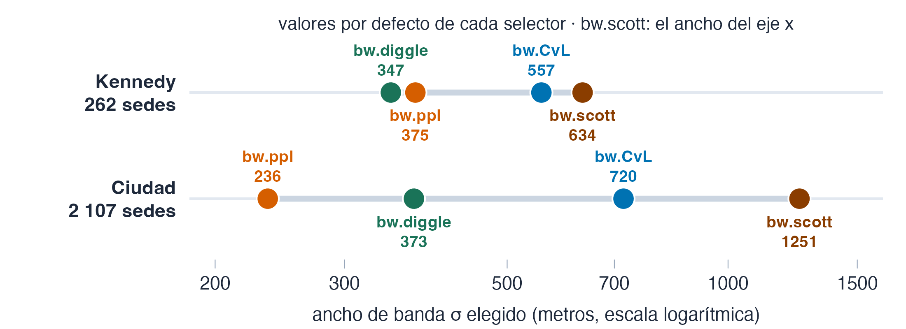{alto=260}

|||

::: info Dato
Kennedy: 633.6 / 347.1 = **1.83**. Ciudad: 1251.3 / 235.9 = **5.30**. `bw.scott` devuelve **dos** anchos, uno por eje: 634 y 580 m en Kennedy; 1251 y 2197 m en la ciudad. Las razones usan el del eje x.
:::

::: tip Interpretación
En estas dos ventanas, el abanico de los selectores se abre más en la ciudad que en Kennedy.
:::

<small>Fuente: módulo 3 del capítulo (R, spatstat).</small>

???
Simulador «Los cuatro selectores sobre las dos ventanas» (módulo 3): cambiar de ventana y mirar cuánto se abre el abanico. Quien ejecute `bw.scott(p)` va a ver dos números; conviene que sepa por qué: con el ancho del eje y de `bw.scott` las razones serían 1.67 en Kennedy y 9.31 en la ciudad. El abanico depende de los valores por defecto de `bw.ppl` y `bw.CvL` (nodos de una rejilla de 16 anchos, ver la diapositiva anterior); con una rejilla fina `bw.ppl` queda por debajo de `bw.diggle` en las dos ventanas (326 contra 347 m en Kennedy; 350 contra 373 m en la ciudad), de modo que el cruce que el capítulo comenta entre `bw.ppl` y `bw.diggle` es un efecto de la rejilla. La consecuencia práctica llega en el módulo 5: sobre la ciudad, la rejilla solo puede dibujar núcleos de al menos 550 m. Cotejo: `datos › m3.kennedy.razon`, `datos › m3.urbana.razon`, `recomputo › selectores.ciudad.scott_y_m`.

## Un selector que devuelve el borde de su intervalo no seleccionó nada {columnas=1:1}

::: ejemplo Los pinos japoneses, un patrón de libro
**Qué ilustra:** `bw.ppl` choca con su intervalo: busca el σ que maximiza un criterio, pero solo hasta la mitad del diámetro de la ventana. **De dónde sale:** `japanesepines` (spatstat.data): 65 pinos jóvenes en un cuadrado de 5.7 m (Numata, 1961), reescalado a la unidad. **Por qué importa:** R avisa por consola, pero el número llega hasta el mapa.
:::

```r El extremo de su propio intervalo {resaltar=1-2,4-6 tam=0.85}
round(as.numeric(bw.ppl(japanesepines)), 4)
#> [1] 0.7071

# la mitad de la diagonal de la ventana unidad
diameter(Window(japanesepines)) / 2
#> [1] 0.7071068
```

|||

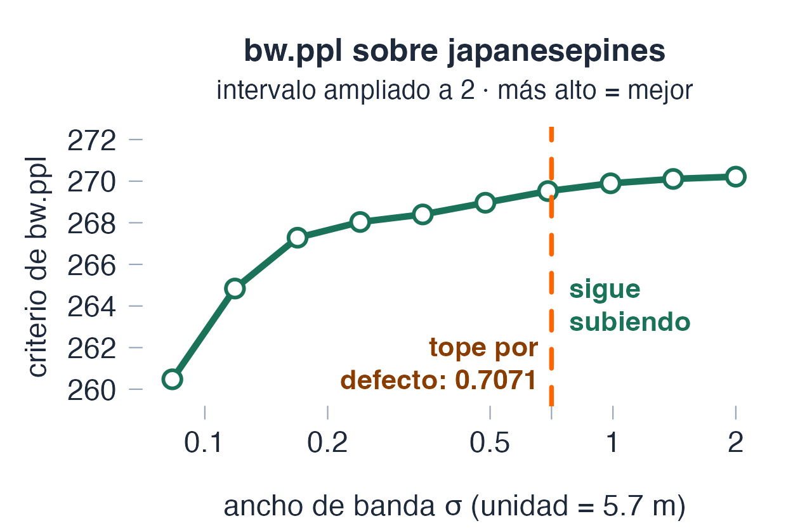{alto=250}

::: warn Criterio
Un óptimo que coincide con el borde del intervalo, al último decimal, no es un óptimo: es el sitio donde se dejó de buscar. Con el intervalo ampliado el criterio sigue subiendo: la mejor intensidad es una constante.
:::

<small>Fuente: módulo 3 del capítulo (R, spatstat.data).</small>

???
`bw.ppl` busca en un intervalo que llega hasta la mitad del diámetro de la ventana; en el cuadrado unidad es la mitad de la diagonal, 0.7071. R sí avisa («criterion was maximised at right-hand end of interval»), pero el aviso va a la consola. Con el intervalo ampliado a 2, el criterio sigue subiendo y devuelve 2: otra pared. En el ejercicio 1 del módulo 12 se amplía a 20 y devuelve 20; ahí la conclusión es que para este patrón la mejor intensidad es una constante. La gráfica no es del capítulo: se calculó con `bw.ppl(japanesepines, srange = c(0.01, 2), warn = FALSE)`. Cotejo: `datos › m3.topes`, `recomputo › japanesepines.bw_ppl`, `recomputo › japanesepines.tope_intervalo`, `recomputo › japanesepines.optimo_con_srange_2`.

## Mismo patrón, dos mapas distintos: ¿quién se equivocó, `bw.diggle` o `bw.scott`? {.pregunta}

Dos personas estiman la intensidad del mismo patrón y publican mapas distintos: una usó `bw.diggle` y la otra `bw.scott`.

1. La que usó `bw.scott`, porque es la regla más burda.
2. La que usó `bw.diggle`, porque la validación cruzada es inestable.
3. Ninguna de las dos: cada selector optimiza una cosa distinta.
4. Las dos, porque lo correcto es promediar los cuatro selectores.

::: respuesta La 3: ninguna de las dos
Sobre la ciudad los cuatro selectores dan de 236 a 1251 m, porque cada uno pregunta otra cosa. `bw.scott` es simple, pero eso no lo hace incorrecto; la validación cruzada de `bw.diggle` puede ser inestable, y aquí da un valor razonable. Lo que falta en los dos mapas no es una corrección: es **decir cuál se usó**.
:::

<small>Fuente: módulo 3 del capítulo (R, spatstat), autoevaluación del módulo 6 (`cap5-trampas`).</small>

???
Pedir que la escriban antes de revelar. Los que marcan la 1 o la 2 están juzgando al selector por lo simple o lo inestable, no por lo que optimiza. Cotejo: `datos › m3.urbana`.

## Elegir sin decir cuál se eligió es publicar una superficie sin decir qué se le pidió {.idea}

El ancho de banda se **declara**: cuál selector lo eligió, o por qué ninguno.

<small>Fuente: módulo 3 del capítulo (criterio del autor).</small>

???
Dejarla en pantalla unos segundos. Las dos decisiones que quedan de esta sesión, la corrección de borde y el significado del mapa, son otras dos formas de la misma pregunta.

# Corrección de borde en la KDE {seccion=modulo-4}

> El núcleo de una sede pegada al borde se sale de la ventana, y la masa que se sale no la recoge nadie. La prueba de que algo va mal no es visual: es una integral.

???
Unos 17 minutos, tres de ellos en la animación en 3D (14 minutos sin ella). Materia del Quiz 2. Antes de empezar: en el capítulo 4 la «corrección de borde» era la de K, y costaba cientos de veces la alternativa. Aquí es otra operación con el mismo nombre.

## El núcleo de una sede pegada al borde se sale de la ventana {columnas=3:2}

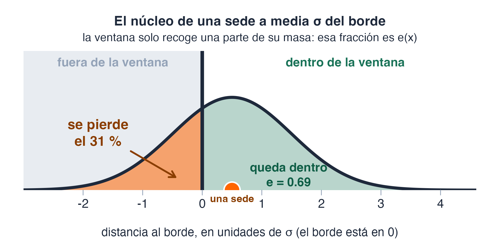{alto=330}

|||

::: info Dato
Ilustración en una dimensión: una sede a 0.5 σ del borde, con σ = 1. Se queda dentro el **69 %** de su núcleo (\(e\) = 0.69) y se sale el **31 %**.
:::

::: tip Interpretación
\(e(x)\) es la fracción del núcleo centrado en \(x\) que cae dentro de la ventana. Sin corregir, esa masa se pierde y el mapa baja cerca del borde.
:::

<small>Fuente: ilustración propia, calculada con la normal; el capítulo la aplica a las sedes de Kennedy.</small>

???
Es la imagen central del módulo y el capítulo la dice sin dibujarla. En una dimensión se calcula con la normal: la fracción del núcleo que queda a un lado del borde, a media σ, es 0.69 (la función de distribución normal en 0.5), y se sale el resto. En Kennedy, e(x) se calcula con la misma idea en dos dimensiones. Cotejo: ilustración propia (`recursos/cap5/genera_figuras_s1.R`).

## Lo que el mapa no deja ver: ¿la integral de λ̂ devuelve n?

$$\int_W \hat\lambda(u)\,du \;\overset{?}{=}\; n$$

::: tarjetas {columnas=3}
### Sin corregir
`edge = FALSE`. El núcleo de una sede en el borde **se sale**, y esa masa se pierde.
### Por defecto
`density(p, sigma)`. `density.ppp` corrige el borde **sin que se lo pidas**.
### Diggle
`diggle = TRUE`. Otra corrección, con el divisor evaluado en otro sitio.
:::

::: tip Interpretación
Es una exigencia exacta: conservar el conteo observado. Por eso sirve de prueba de qué conserva cada corrección, no de cuál acierta.
:::

<small>Fuente: módulo 4 del capítulo (texto del capítulo). Ejemplo: Kennedy, 262 sedes.</small>

???
El módulo 4 mide tres comportamientos donde el manual sugiere dos. Pedir una apuesta: ¿cuál de las tres devuelve n? La respuesta viene en la diapositiva siguiente, con cifras. En rigor, la integral de la intensidad es el número esperado de sedes, no el n de esta muestra: pedir que sea n es pedir que se conserve el conteo observado, que Diggle cumple por construcción. Pasar la prueba no hace mejor al estimador, y suspenderla no lo hace malo: dice qué conserva. Lo comprueba una simulación hecha para esta presentación: con 300 patrones al azar de 262 sedes en la ventana de Kennedy, la corrección por defecto se desvía de n en promedio un +0.04 % con σ = 800 m (conserva el conteo en promedio) y sin corregir se pierde un −19.6 %; el +3.19 % del patrón real es de este patrón, que no es al azar, y no de la corrección. Cotejo: `datos › m4.tabla`, `recomputo › bordes_csr.patrones`, `recomputo › bordes_csr.media_pct`.

## Medido sobre Kennedy: tres correcciones, tres comportamientos

::: info Dato · Kennedy, 262 sedes
Masa integrada por cada corrección y, entre paréntesis, su desviación de n = 262:

| σ (m) | Sin corregir | Por defecto | `diggle = TRUE` |
|---|---|---|---|
| 200 | 255.08 (−2.64 %) | 263.30 (+0.50 %) | 262.00 (0.0000 %) |
| 400 | 245.86 (−6.16 %) | 265.80 (+1.45 %) | 262.00 (0.0000 %) |
| 800 | 224.41 (−14.35 %) | 270.36 (+3.19 %) | 262.00 (0.0000 %) |
:::

::: tip Interpretación
Sin corregir, **la masa se escapa** y cada vez más al abrir el núcleo; por defecto, **en Kennedy se pasa**; con `diggle = TRUE`, n **clavado** a cualquier ancho. Solo una de las tres conserva el conteo, y no es la que sale sin pedirla.
:::

<small>Fuente: módulo 4 del capítulo (R, spatstat).</small>

???
Cifras del módulo 4 (tabla `m4` del precálculo). Simulador «Las tres correcciones, y lo que le hacen a la masa»: los dos botones cambian entre la masa integrada y su desviación en tanto por ciento. Lo que interesa es que las dos desviaciones crecen con σ: el problema del borde no es un detalle fijo, escala con el núcleo. Entre no corregir y corregir por defecto hay 17.54 puntos porcentuales a σ = 800 m. Lo que se ve aquí es el comportamiento sobre este patrón; que la de por defecto se pase no quiere decir que sea sesgada en general, sino que sobre el patrón de Kennedy suma de más; la lámina siguiente lo enseña en 3D. Cotejo: `datos › m4.tabla`, `recomputo › bordes`.

## En 3D: lo que se escapa por el borde, y cada corrección

::: html
<iframe class="n3d-marco w-full flex-1 min-h-0 border-0" src="../animaciones/nucleo-3d.html?modo=clase&amp;escena=borde" title="Animación en tres dimensiones: lo que se escapa por el borde de la ventana y las dos correcciones" loading="lazy"></iframe>
<script>if (!window.oyenteNucleos) { window.oyenteNucleos = true; window.addEventListener('message', function (e) { var marcos = document.querySelectorAll('iframe.n3d-marco'), f = null; for (var i = 0; i < marcos.length; i++) if (marcos[i].contentWindow === e.source) f = marcos[i]; var m = e.data; if (!f || !m || !m.nucleos) return; if (m.nucleos === 'foco') { f.blur(); window.focus(); } else if (m.nucleos === 'tecla') document.dispatchEvent(new KeyboardEvent('keydown', { key: m.key, shiftKey: !!m.shiftKey, bubbles: true, cancelable: true })); }); }</script>
:::

<small>**Qué ilustra:** qué hace cada corrección con la masa que se sale de la ventana. **De dónde sale:** puntos inventados, los del módulo 1; no son las sedes de Kennedy. **Por qué importa:** «se pasa» depende de dónde caen los puntos.</small>

???
Es la animación del módulo 4 del capítulo, con los mismos 19 puntos inventados de la lámina «En 3D» del módulo 1, pero ahora la ventana cuenta. Cuatro pasos, o «Reproducir», que los recorre sola en unos 36 segundos (más si el equipo dibuja despacio) y se detiene; si falta tiempo, basta con eso y con detenerse en el tercer paso. Primer paso: la parte roja de la loma de la sede en foco cae fuera y no la recoge nadie. Al abrir, la sede n.º 1 está a 0.7 del borde y deja dentro el 72 % de su loma (e = 0.72, con σ = 1.2); arrastrarla hacia el borde y hacia una esquina, y ensanchar σ: se escapa más. Segundo paso: sin corregir, la superficie se queda corta justo en el perímetro y su volumen es Σ e(xᵢ): 17.1 de 19. Tercer paso: por defecto se divide en cada sitio u por e(u); el perímetro sube sobre la red gris, pero el volumen ya no tiene por qué ser n. Con estas sedes sale 20.2, por encima de 19, como en Kennedy; no es una ley: la sede n.º 1, pegada al borde, aporta 0.97 (menos de 1), y una a uno y medio o dos σ del borde aporta más de 1. Pedir una apuesta, luego mover la sede en foco y mirar su barra. Cuarto paso: con Diggle se divide en cada dato, por e(xᵢ): cada sede aporta exactamente 1 y el volumen vuelve a ser 19.0, con cualquier σ y cualquier núcleo. Decir en voz alta que los puntos son inventados: el +3.19 % de Kennedy es de aquel patrón. Para girar la vista se arrastra el fondo; las flechas siguen siendo del visor. Necesita red (three.js llega de un CDN) y la misma página que la lámina «En 3D» del módulo 1, `../animaciones/nucleo-3d.html`, con `?escena=borde`. Al imprimir en PDF sale una captura del estado en que se dejó, no la animación. Cotejo: `recomputo › borde3d`.

## ¿Se distingue cuál es cuál mirando el mapa? {.pregunta columnas=3:2}

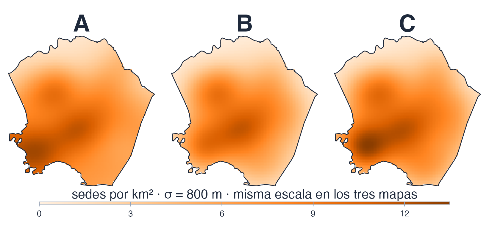{alto=330}

|||

Kennedy, 262 sedes, σ = 800 m, la misma escala de color. Uno de los tres mapas es el de Diggle y conserva el conteo: ¿cuál es, y se nota mirándolo?

::: respuesta C es la de Diggle
Mirando no se nota que uno conserve el conteo: eso lo dice la integral (A, por defecto, 270.4; B, sin corregir, 224.4; C, Diggle, 262.0). Sí se ven diferencias —al no corregir el pico baja, de 12.66 a 11.54 sedes por km²—, pero ninguna dice cuál es la buena.
:::

<small>Fuente: módulo 4 del capítulo (R, spatstat) y figura propia.</small>

???
Es el modo de fallo de siempre: la operación que devuelve algo creíble en vez de fallar. Los tres mapas están dibujados con la misma llamada del bloque de R de dos diapositivas más adelante, y se rotularon A, B y C sin su nombre para poder pedir primero la opinión: ¿cuál creen que es la de Diggle? La de por defecto muestra la mancha más oscura en el borde suroeste, donde e(u) es pequeño y la división amplifica. Cotejo: `datos › m4.tabla`, `recomputo › bordes`.

## Diggle divide donde está el dato; la de por defecto, donde se estima {columnas=1:1}

::: definicion Por defecto: divide donde se estima
$$\hat\lambda(u) \;=\; \frac{1}{e(u)} \sum_{i=1}^{n} k_\sigma(u - x_i)$$
\(e(v)\) es la fracción del núcleo centrado en \(v\) que cae dentro de la ventana.
:::

|||

::: definicion Diggle: divide donde está el dato
$$\hat\lambda_D(u) \;=\; \sum_{i=1}^{n} \frac{k_\sigma(u - x_i)}{e(x_i)}$$
:::

::: tip Interpretación
Con Diggle cada sede aporta a la integral \(e(x_i)/e(x_i) = 1\): el total es \(n\) **por construcción**. Las dos son legítimas; solo una conserva el conteo.
:::

::: warn Criterio
Se declara cuál corrección se usó y qué conserva.
:::

<small>Fuente: módulo 4 del capítulo (texto del capítulo).</small>

???
Se comprobó numéricamente contra `density(p, sigma = 800, diggle = TRUE)` en puntos del borde: la fórmula de Diggle coincide con spatstat (a menos de 3 % por la discretización de la malla) y la fórmula de la corrección por defecto, usada en su lugar, se aparta hasta 88 % en el peor de los puntos de borde probados. Las dos fórmulas dividen en sitios distintos; esa es toda la diferencia. Cotejo: `recomputo › diggle_identidad`.

## La integral de la KDE: 270.36 por defecto, 262.00 con Diggle {columnas=3:2}

```r La integral que tiene que dar n {resaltar=8-9,13-14}
integra <- function(im) {
  v <- as.numeric(im$v); v <- v[is.finite(v)]
  sum(v) * im$xstep * im$ystep
}

s <- 800
con <- density(p, sigma = s, dimyx = c(99, 96))
sin <- density(p, sigma = s, dimyx = c(99, 96), edge = FALSE)
dig <- density(p, sigma = s, dimyx = c(99, 96), diggle = TRUE)

round(c(defecto = integra(con), diggle = integra(dig),
        sin_corregir = integra(sin), n = npoints(p)), 4)
#>      defecto       diggle sin_corregir            n
#>     270.3619     262.0000     224.4065     262.0000
```

|||

::: info Dato · Kennedy, 262 sedes
Con σ = 800 m y una rejilla de 96 × 99 píxeles, la masa integrada es: por defecto **270.3619**, `diggle` **262.0000**, sin corregir **224.4065**; n = 262.
:::

::: warn Criterio
Integrar y comparar con n es la prueba: el mapa no dice cuál conserva el conteo.
:::

<small>Fuente: módulo 4 del capítulo, bloque de R.</small>

???
Bloque del módulo 4. `p` es la ppp de Kennedy de la segunda diapositiva. El ejercicio 2 del módulo 12 repite esta comprobación sobre `chorley`. En la fórmula, `sum(v) * im$xstep * im$ystep` es la suma de Riemann: valor de cada píxel por su área. Aparte, para quien pregunte por el coste: la corrección de borde de K del capítulo 4 costaba cientos de veces la alternativa (la isotrópica, 122.655 s; la de traslación, 0.221 s), mientras que aquí corregir o no la KDE a 128 × 128 sobre la ciudad cuesta lo mismo: 0.14 contra 0.15 s, del mismo orden. Son tiempos de máquina: se volvieron a medir en esta (0.155, 0.147 y 0.161 s) y salen del mismo orden. El módulo 11 traerá el caso opuesto: una llamada que elige la corrección por ti, la más cara, sin mencionarla. Cotejo: `datos › m4.tabla`, `recomputo › bordes`, `datos › m4.coste_segundos`, `recomputo › tiempos`.

# La KDE como mapa de calor {seccion=modulo-5}

> En cuanto la superficie sale de la pantalla y entra en un informe, se le atribuye un significado que el estimador no tiene: la gente lee «aquí hay más» y entiende «aquí hace falta más».

???
Unos 10 minutos. Este módulo no entra en el Quiz 2 (el quiz cubre los módulos 1 a 4). El módulo iba a llevar un caso trabajado de la literatura sobre localización de servicios educativos; la fuente no llegó, así que el capítulo lo dice por escrito y trabaja con el hilo colombiano.

## Tres mapas de Bogotá se parecen mucho y responden tres preguntas distintas {columnas=3:2}

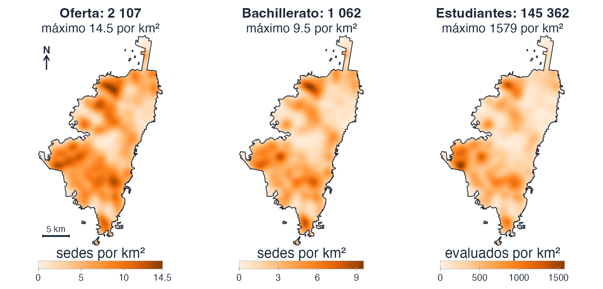{alto=400}

<small>Fuente: módulo 5 del capítulo (R, spatstat) y figura propia.</small>

|||

::: ejemplo Tres capas sobre las mismas sedes
**Qué ilustra:** que «el mapa de calor» no es un solo mapa. **De dónde sale:** las sedes del perímetro urbano (SED) y los evaluados en Saber 11, periodo 20224 (ICFES); el mismo σ = 720 m (el valor por defecto de `bw.CvL`). **Por qué importa:** el mapa que se publique se leerá como demanda.
:::

::: info Dato
1 062 de las 2 107 sedes (50.4 %) tienen grado 11; son 145 362 evaluados. Correlaciones: oferta–bachillerato **0.943**, oferta–estudiantes **0.862**, bachillerato–estudiantes **0.919**.
:::

???
Entre el primero y el segundo se cae media capa: una sede de primaria no tiene undécimo. Pesar por Saber 11 sin decirlo convertiría un mapa de oferta en uno de bachillerato sin que el título cambiara. El tercero cuenta personas, no edificios: su unidad ya no es «sedes por km²», y por eso cada mapa va a su propia escala. Los máximos son 14.5 sedes por km² (oferta), 9.5 (bachillerato) y 1579 evaluados por km² (estudiantes). Se parecen mucho, pero ninguna pareja correlaciona 1; la que menos se parece es oferta–estudiantes. Simulador «Las tres capas, y cuánto se parecen» (módulo 5). Las correlaciones de la versión de Python salen 0.9391, 0.8555 y 0.9155: no es otra discretización, es la corrección de borde por defecto de `density`; las cifras y los mapas de R usan `diggle = TRUE` y dan las de la diapositiva, de modo que las dos versiones son correctas y declaran correcciones distintas. «Sedes con grado 11» son las sedes con al menos un evaluado en el periodo 20224. Cotejo: `datos › m5.capas`, `datos › m5.cor_oferta_grado11`, `datos › m5.cor_oferta_estudiantes`, `datos › m5.cor_grado11_estudiantes`, `recomputo › capas_defecto.cor_of_11`, `recomputo › capas_defecto.cor_of_es`, `recomputo › capas_defecto.cor_11_es`.

## Donde las manchas no coinciden, el edificio y el estudiante dejan de ser lo mismo {columnas=3:2}

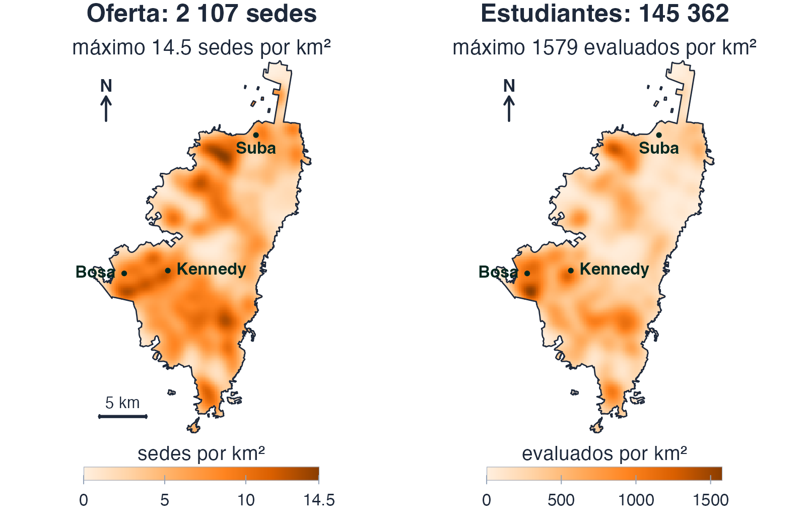{alto=440}

<small>Fuente: módulo 5 del capítulo (R, spatstat) y figura propia.</small>

|||

::: info Dato
σ = 720 m (el valor por defecto de `bw.CvL`), rejilla de 128 × 218 celdas de 183 m, **cada mapa a su escala**. El máximo de la **oferta** (14.5 por km²) está en **Suba**; el de **estudiantes** (1579 por km²), en **Bosa**.
:::

::: tip Interpretación
Mismo σ y misma rejilla, pero cambian dos cosas: qué sedes entran (las 2 107, o solo las 1 062 con grado 11) y cuánto pesa cada una (1, o sus evaluados). Para aislar el peso, compara bachillerato con estudiantes (r = 0.919).
:::

???
Comprobado en R: el máximo de la oferta cae en Suba (norte) y el de estudiantes, en Bosa (suroccidente). Es un estadístico frágil: los dos picos mayores son los mismos en los dos mapas y lo que cambia es cuál gana, así que la diferencia de localidad es una lectura, no una prueba. Los mapas del capítulo están dibujados con el sur arriba (los ráster salen invertidos); estos, con el norte arriba, por eso «norte» y «suroccidente» se leen donde deben. Un estudiante cuenta donde estudia, no donde vive. Cotejo: `datos › m5.capas`, `recomputo › capas_maximos`.

## Con celdas de 183 m, la ciudad no puede dibujar un σ menor que 550 m {columnas=1:1}

::: info Dato · ventana urbana
370.09 km², rejilla de 128 × 218 celdas de 183 m. Regla práctica: celda ≤ σ/3, o sea 3 celdas dentro de σ; con 183.4 m por celda, σ mínimo = 3 × 183.4 = **550 m**.

| Selector | σ sobre la ciudad | ¿Cumple la regla de 3 celdas? |
|---|---|---|
| `bw.diggle` | 373 m | No: menor que 550 m |
| `bw.ppl` | 236 m | No: menor que 550 m |
| `bw.CvL` | **720 m** | Sí: el más estrecho de los que sí |
| `bw.scott` | 1251 m | Sí |
:::

|||

::: tip Interpretación
183 m es la celda más fina que el capítulo pudo pagar en el peso de su archivo: con una rejilla más fina, `bw.diggle` y `bw.ppl` sí se podrían dibujar. Por eso el mapa de la ciudad usa `bw.CvL`, y Kennedy, con celdas de 78 m, puede bajar a 233 m.
:::

::: warn Criterio
Primero se decide σ y se declara quién lo eligió; después se ajusta la resolución, no al revés.
:::

<small>Fuente: módulo 5 del capítulo (R, spatstat).</small>

???
Es la consecuencia práctica de la diapositiva de los selectores. La regla de las 3 celdas es un parámetro de diseño del capítulo, no una medida: el error de la KDE en la rejilla baja de forma gradual con el número de celdas por σ, de modo que a 2 celdas la rejilla ya distorsiona poco. Lo que la regla evita es que el mapa dibuje su propia rejilla. Cotejo: `datos › m5.rejilla`, `datos › m3.urbana`, `datos › meta.rejilla.celdas_por_sigma`.

## ¿Cuál de los tres mapas es «el mapa de la demanda educativa»? {.pregunta}

1. El de todas las sedes, porque incluye la oferta completa.
2. El de las sedes con grado 11, porque restringe a quien puede atender bachillerato.
3. El de las sedes pesadas por sus evaluados, porque cuenta estudiantes.
4. Ninguno por sí solo: llamarlo así es una decisión, y hay que escribirla.

::: respuesta La 4: ninguno por sí solo
El primero dice dónde hay colegio; el segundo, dónde hay bachillerato; el tercero, dónde están los estudiantes que ya lo cursan. Y un estudiante cuenta donde **estudia**, no donde vive: es demanda **atendida**, no la insatisfecha.
:::

<small>Fuente: módulo 12 del capítulo, autoevaluación `cap5-quiz`.</small>

???
Llamar «demanda» a cualquiera de los tres es una decisión, no una descripción. Si hay tiempo, preguntar qué dato haría falta para hablar de demanda insatisfecha (dónde viven los estudiantes, no dónde estudian). Cotejo: `datos › m5.capas`.

# Intensidad relativa {seccion=modulo-6}

> Muchas preguntas reales no van de cuántos hay, sino de qué proporción: dónde pesan más los casos que los controles, dónde pesa más lo público que lo privado.

???
Unos 13 minutos. Cierra la mitad descriptiva del capítulo: ya sabemos estimar una superficie, elegirle el ancho, corregirle el borde y, ahora, dividir dos. Desde la próxima sesión la intensidad deja de ser una superficie que se dibuja y pasa a ser una función de algo.

## La proporción es el cociente de dos KDE con el mismo ancho {columnas=1:1}

Ahora cada punto trae una **marca**, su tipo (caso o control, oficial o privada), y estimamos una KDE por tipo.

$$\hat p(u) \;=\; \frac{\hat\lambda_1(u)}{\hat\lambda_1(u) + \hat\lambda_0(u)}$$

- \(\hat p(u)\): dado que en \(u\) hay un evento, la **probabilidad de que sea del tipo 1**; vive entre 0 y 1
- El riesgo relativo, \(\hat r = \hat\lambda_1/\hat\lambda_0\), vive entre 0 e infinito y \(\hat p = \hat r/(1+\hat r)\)

|||

::: tip Interpretación
La misma información en otra escala. `relrisk` devuelve la probabilidad, salvo que se le pida `relative = TRUE`.
:::

::: warn Criterio
Las dos KDE van sobre la misma ventana y con el mismo σ. Con la corrección por defecto, e(u) **se cancela**: numerador y denominador la llevan igual; con Diggle, no.
:::

<small>Fuente: módulo 6 del capítulo (fórmula del capítulo).</small>

???
Comprobar en la pizarra que \(r/(1+r)\) da la fórmula de arriba. El capítulo publica la probabilidad porque tiene tope y se pinta con escala fija. Un mapa de proporción es robusto frente al borde con la corrección por defecto, porque el divisor se cancela; no lo es frente a la falta de datos: donde casi no hay puntos, el cociente se apoya en muy poca masa.

## Chorley: 58 casos de laringe contra 978 controles de pulmón {columnas=3:2}

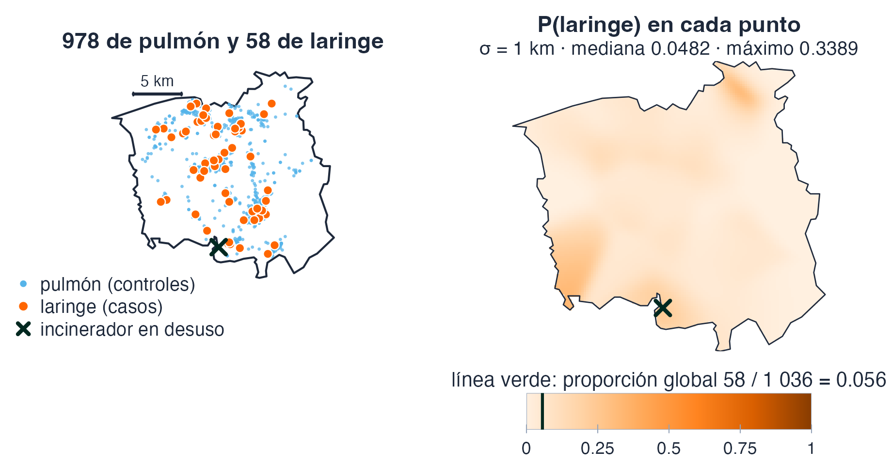{alto=300}

::: info Dato
Global 58 / 1 036 = **0.0560**; mediana de la superficie **0.0482**; máximo **0.3389**, donde casi no hay puntos: 4 de sus 50 vecinos más próximos son casos.
:::

<small>Fuente: módulo 6 del capítulo (R, spatstat.data) y figura propia.</small>

|||

::: ejemplo Chorley y South Ribble
**Qué ilustra:** un cociente de intensidades con casos y controles. **De dónde sale:** `chorley` (spatstat.data): 58 casos de laringe y 978 de pulmón, Lancashire, 1974–1983, en 315.16 km². **Por qué importa:** Diggle (1990) buscaba más cáncer de laringe cerca de un incinerador en desuso (la ×); el pulmón marca dónde vive la población en riesgo.
:::

::: warn Criterio
El máximo cae en la cola: no se lee como riesgo. Los controles son de **pulmón**, no población sana.
:::

???
Datos de spatstat.data (Diggle, 1990). El propósito original, según la ayuda: evaluar si hay más cáncer de laringe cerca de un incinerador industrial en desuso; los casos de pulmón sirven de sustituto de la densidad de la población susceptible. El capítulo no analiza el incinerador, solo el cociente. El máximo de 0.3389 cae donde casi no hay puntos: en el máximo solo 4 de los 50 vecinos más próximos son casos, y el punto más cercano al píxel del máximo está a 4.6 km (con σ = 1 km). Es la cola, la misma trampa que enseña la sesión 2: el titular de una curva suele ser su cola. El capítulo lo lee como titular («uno de cada tres cánceres registrados es de laringe») y el material lo corrige solo aquí. La figura usa la escala fija de 0 a 1 de toda probabilidad. Cotejo: `datos › m6.chorley`, `recomputo › chorley`, `recomputo › chorley.max_dist_punto_mas_cercano_km`.

## Los casos se llaman `larynx` y los controles `lung`. ¿Qué probabilidad pinta `relrisk`? {.pregunta}

1. Las dos a la vez, como dos superficies complementarias.
2. P(laringe), porque `larynx` va primero.
3. P(pulmón), porque los niveles se ordenan alfabéticamente y `relrisk` pinta el del segundo.
4. Depende de σ, porque decide qué nivel domina el cociente.

::: respuesta La 3: P(pulmón)
Los niveles de un factor se ordenan alfabéticamente: en `larynx, lung` el segundo es «lung». Sin tocar nada, el mapa de `chorley` es P(pulmón): la mediana sale 0.9518 en vez de 0.0482. σ cambia lo suave que sale el mapa, no de qué nivel es la probabilidad.
:::

<small>Fuente: módulo 6 del capítulo (R, spatstat.data); pregunta propia, variante de la autoevaluación `cap5-trampas`.</small>

???
La pregunta del capítulo es la misma con las sedes oficiales y privadas (el segundo nivel es «privado»); aquí se hace con `chorley` para que el código de la diapositiva siguiente sea su respuesta. El 0.9518 se comprobó en R. Cotejo: `recomputo › chorley.mediana_sin_fijar_niveles`, `recomputo › chorley.mediana`.

## La trampa: todo corre, nada avisa y el mapa sale al revés {columnas=1:1}

```r Fijar el orden de los niveles {resaltar=2-3}
ch <- chorley
marks(ch) <- factor(as.character(marks(chorley)),
                    levels = c("lung", "larynx"))
rr <- relrisk(ch, sigma = 1)
v <- as.numeric(rr$v); v <- v[is.finite(v)]

round(c(mediana = median(v),
        global = mean(marks(ch) == "larynx"),
        maxima = max(v)), 4)
#> mediana  global  maxima
#>  0.0482  0.0560  0.3389
```

|||

::: info Dato · chorley
Sin fijar el orden, el mapa de `chorley` es **P(pulmón)**: la mediana sale 0.9518 en vez de 0.0482. Con el orden fijado, en el máximo los 50 vecinos más próximos son casos en un **8 %** (4 de 50) contra **5.6 %** en el conjunto.
:::

::: warn Criterio
Dos comprobaciones a la vez: **fijar el orden** de los niveles y **comprobar la orientación contra el dato**: el tipo debe pesar más entre los vecinos del máximo que en todo el conjunto.
:::

<small>Fuente: módulo 6 del capítulo (R, spatstat.data).</small>

???
Es el defecto que casi publica el módulo: la primera versión tituló su mapa «proporción de sedes oficiales» y era P(privado); todo corría y ninguna comprobación fallaba. Se arregla de dos formas a la vez, y la comprobación sobrevive a que alguien reordene los niveles. El código muestra la primera; la segunda se hace con los 50 vecinos más próximos al máximo. El capítulo dice que los vecinos deben ser «mayoritariamente» de ese tipo; en `chorley` son el 8 %, así que la comprobación que hace el código es contra la proporción global. Cotejo: `datos › m6.chorley`, `recomputo › chorley`.

## En Bogotá no es riesgo, es proporción de tipo: nadie «contrae» ser oficial {columnas=3:2}

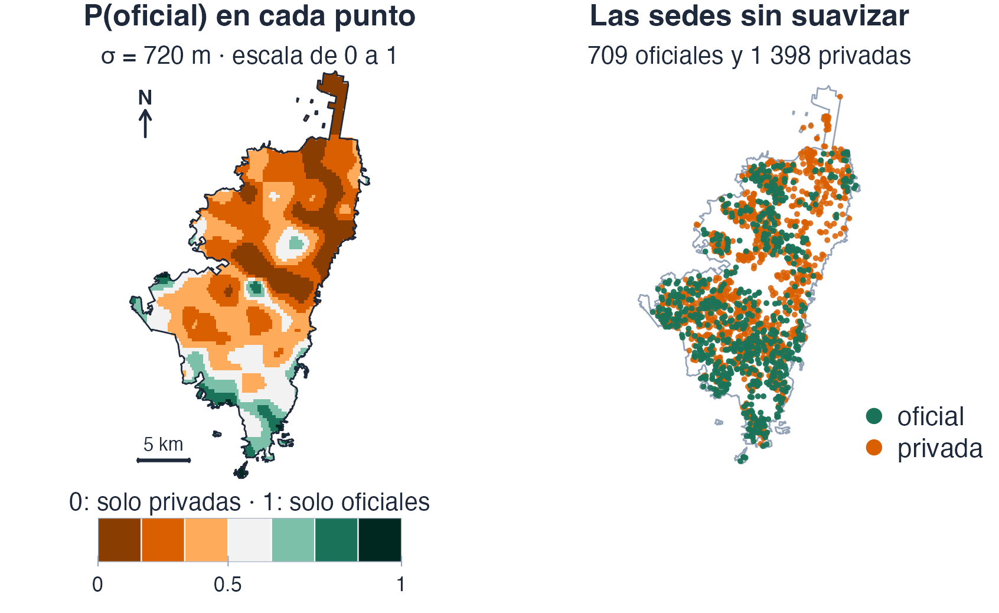{alto=380}

<small>Fuente: módulo 6 del capítulo (R, spatstat) y figura propia.</small>

|||

::: ejemplo Oficial contra privado
**Qué ilustra:** la misma matemática leyendo otra cosa. **De dónde sale:** las 2 107 sedes urbanas por sector (SED); σ = 720 m (el valor por defecto de `bw.CvL`). **Por qué importa:** hay dos poblaciones completas, no casos y controles.
:::

::: info Dato
**709** oficiales + **1 398** privadas = 2 107. Escala fija de 0 a 1: marrón, solo privadas; verde, solo oficiales. En el máximo de P(oficial), los 50 vecinos más próximos son oficiales en un **64 %** (32 de 50) contra **33.65 %** en el conjunto.
:::

???
Criterio: llamarlo «riesgo» importaría una palabra que aquí no significa nada, porque no hay casos y controles, hay dos poblaciones completas. La escala va fija de 0 a 1 y no se normaliza contra el máximo: una proporción tiene escala propia. El mapa de puntos es el control de la superficie: lo privado domina el norte y el centro-norte; lo oficial pesa más en el sur. En el capítulo, este mapa sale con el sur arriba. Cotejo: `datos › m6.bogota`, `recomputo › oficial`.

## Contar puntos da 0.3365; mirar el mapa da 0.3086: son dos preguntas distintas {columnas=3:2}

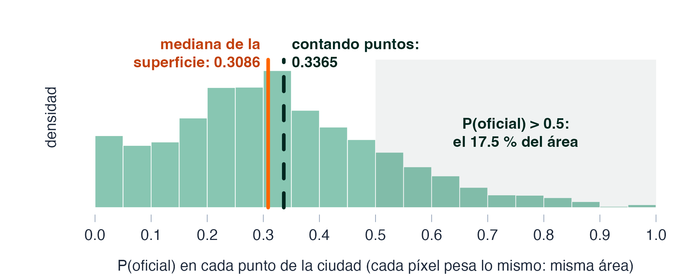{alto=300}

|||

::: info Dato · las 2 107 sedes urbanas
709 / 2 107 = **0.3365** (contando puntos). Mediana de la superficie P(oficial) = **0.3086** (contando área). Las oficiales son mayoría, con P(oficial) > 0.5, en el **17.5 %** del área.
:::

::: tip Interpretación
La mediana del área queda por debajo de la proporción de los puntos, pero la diferencia es pequeña (0.028) y las dos cifras contestan preguntas distintas. La respuesta directa a «¿en qué fracción de la ciudad son mayoría?» es el 17.5 %.
:::

<small>Fuente: módulo 6 del capítulo (R, spatstat) y figura propia.</small>

???
La diferencia es pequeña (0.028) pero tiene signo. Un informe que solo publique una de las dos no miente, pero tampoco dice lo que el lector va a entender. Simulador «Contar puntos y mirar el mapa dan respuestas distintas» (módulo 6). El capítulo lo dice así: «¿en qué fracción de la ciudad son mayoría?»; precisando, la mediana mide el valor de la proporción en el punto típico de la ciudad, y la fracción de área con mayoría oficial es el 17.5 %. La misma desigualdad aparece con `chorley` (0.0482 contra 0.0560): es en parte un rasgo de cualquier cociente de KDE con un tipo minoritario y zonas con pocos puntos, así que no se concluye «concentrado» de esta diferencia. Cotejo: `datos › m6.bogota`, `recomputo › oficial`, `recomputo › oficial.area_mayoria_oficial_pct`.

# Cierre y práctica {seccion=modulo-12}

## Una superficie de intensidad es la respuesta a una pregunta que alguien formuló {.idea etiqueta="Tesis de la sesión"}

Con qué ancho, con qué corrección de borde, sobre qué ventana y con qué peso por punto: hoy vimos dónde vive cada decisión y qué pasa cuando no se escribe.

<small>Fuente: módulo 12 del capítulo (tesis del autor).</small>

???
Es el hilo de toda la sesión y del capítulo. Cada bloque añadió una decisión: el ancho de banda (módulos 2 y 3), la corrección de borde (módulo 4), qué cuenta el mapa (módulo 5) y qué nivel pinta el cociente (módulo 6). El capítulo, en el módulo 12, las nombra como ancho, corrección, ventana y referencia.

## Dónde vive cada decisión {.cierre}

- La **ventana**: `ppp(window = W)`; un borde es una decisión
- El **ancho**: `sigma =`; se declara quién lo eligió (`bw.*`), y ninguno entrega «el óptimo»
- El **núcleo**: `kernel =`; casi no mueve el mapa
- El **borde**: `edge =` y `diggle =`; se declara qué conserva la integral, que se compara con n
- El **peso** de cada punto: `weights =`; qué cuenta el mapa
- El **nivel** que pinta un cociente: los niveles del factor en `relrisk`; se comprueba contra el dato

<small>Todo mapa de intensidad se entrega con su ventana, su σ y quién lo eligió, su corrección de borde y lo que pesa cada punto.</small>

???
Remitir a las cuatro preguntas del módulo 6 y a las del módulo 12 que son de esta sesión (cuatro de las ocho; las otras cuatro son de la sesión 2). Lo que se declara por escrito en cualquier trabajo con una KDE: la ventana, el ancho y qué selector lo eligió, y la corrección de borde con lo que conserva.

## Práctica: dos ejercicios guiados, el simulacro del Quiz 2 y la próxima sesión

::: flujo
1. **Ejercicio 1 · El selector que no seleccionó** — los cuatro selectores sobre `japanesepines`, `redwood` y `swedishpines`; encontrar cuál de los doce valores no es una selección
2. **Ejercicio 2 · La masa que se escapa** — `chorley`, con σ = 0.5, 1 y 2: la integral de las tres correcciones contra n
3. **Simulacro del Quiz 2 (módulo 13)** — con el reloj puesto y sin abrir nada; se contrasta en clase. El Quiz 2 cubre las cuatro primeras secciones de hoy, hasta la corrección de borde
4. **Próxima sesión** — de dibujar la intensidad a modelarla: covariables, `ppm`, diagnóstico y conglomerados
:::

<small>Fuente: módulo 12 del capítulo, ejercicios guiados 1 y 2, y simulacro del módulo 13.</small>

???
Los ejercicios son el laboratorio de la semana: cada uno termina en una decisión que hay que defender. Los ejercicios 3, 4 y 5 son de la próxima sesión. El simulacro no trae la clave a propósito: la página es pública.
