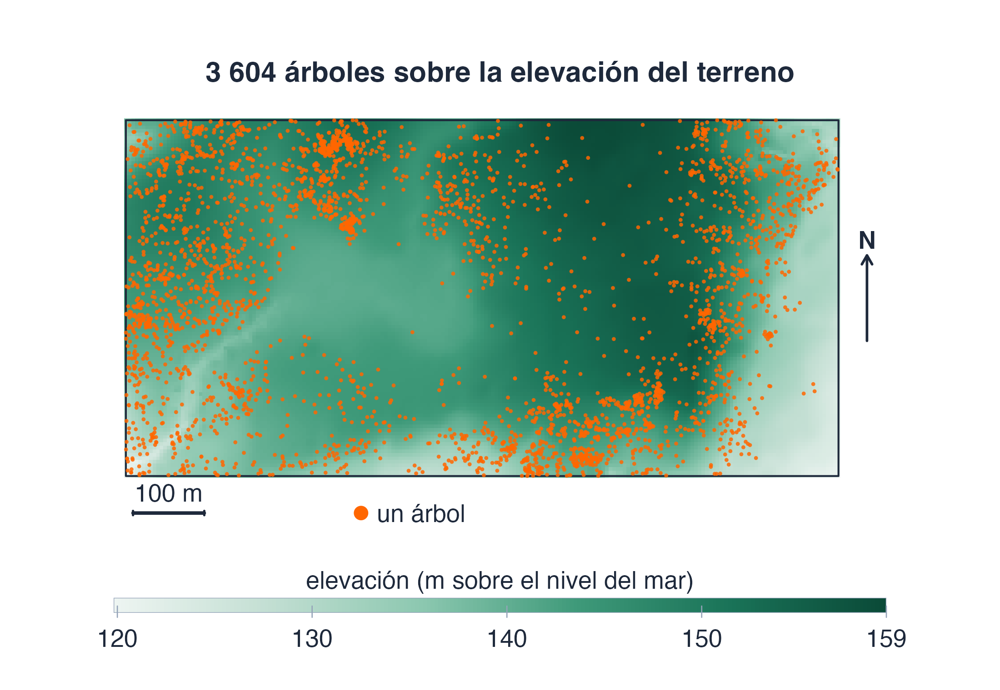
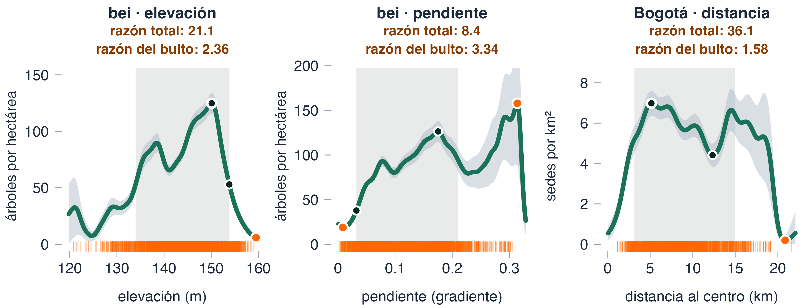
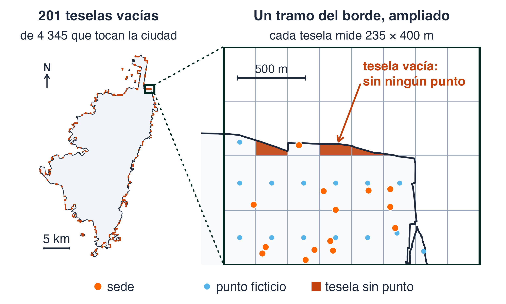
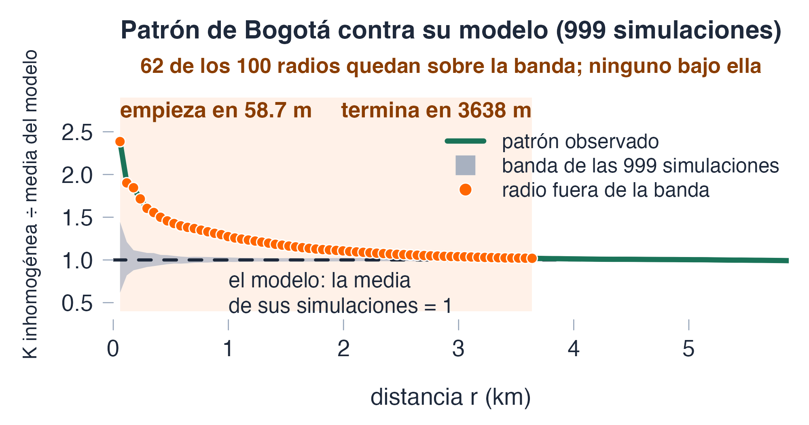
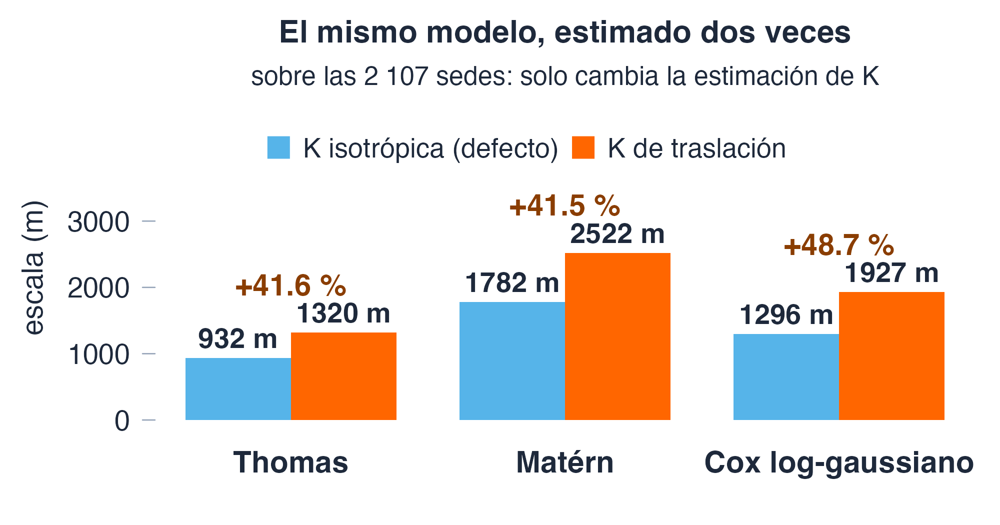
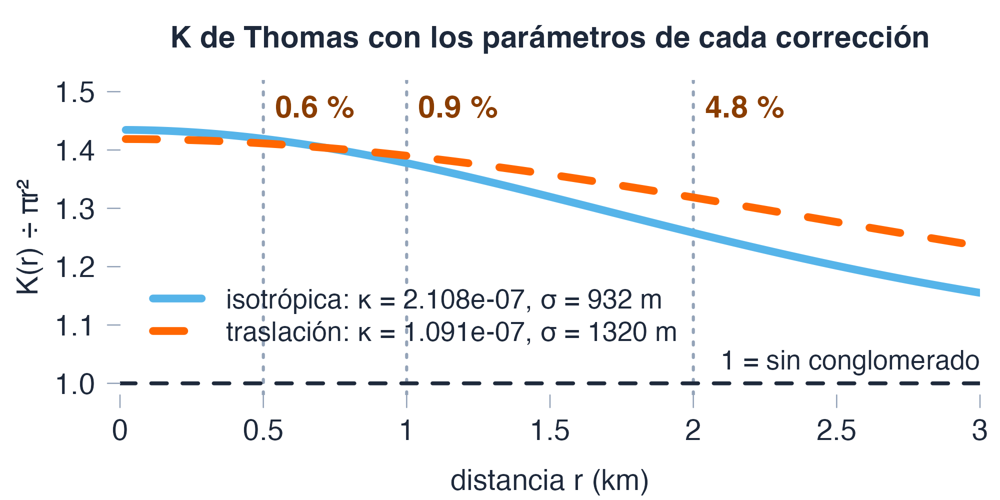
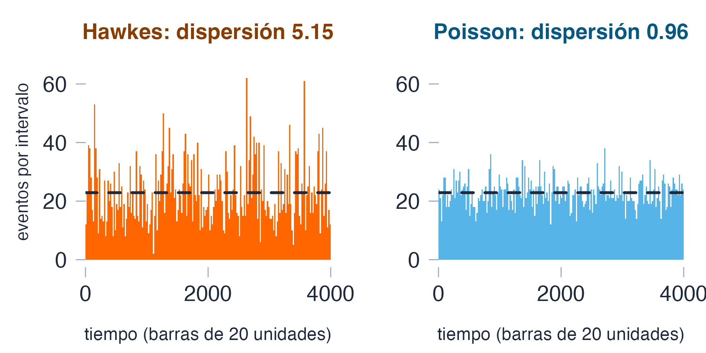

<!--
  Capítulo 5 · Intensidad por núcleos, sesión 2 de 2: módulos 5.7 a 5.11 y el proyecto integrador.
  La sesión 1 cubre 5.1 a 5.6.

  Decisiones de Javier (29 sep 2026). No re-preguntar:
  D1  Dos sesiones de 90 min: 5.1–5.6 (estimar la intensidad) y 5.7–5.11 más el proyecto
      integrador (modelarla).
  D2  Código en R, recortado, con el argumento decisivo resaltado; Python solo en las notas.
  D3  Viven en Htmls_Espacial/diapositivas/. Estuvieron sin commit y apartadas del `git add -A`
      mientras se revisaban; se versionaron y se enlazaron desde la portada el 1 oct 2026, a petición suya.

  REGLAS DE CONTENIDO (las mismas de la sesión 1):
  · Toda cifra sale de `cap5_datos.json` (salidas de R del precálculo) o del recómputo que se
    volvió a correr en R (`recomputo_cap5_m*.json`), y está cotejada en `registro_cifras_cap5_s2.md`.
  · Todo ejemplo dice qué ilustra, de dónde sale y por qué importa.
  · Toda afirmación va como Dato, Interpretación o Criterio. Lo que no se pudo comprobar lleva
    la marca [SIN VERIFICAR].
  · Los bloques de R se ejecutan de verdad (`verifica_bloques_cap5.py`), encadenados después de
    los de la sesión 1.
  · Las figuras son propias (recursos/cap5/genera_figuras_s2.R).

  Fuera a propósito: la autoevaluación y los cinco ejercicios guiados (módulo 12: se remiten en la
  práctica) y el simulacro (módulo 13: no lleva clave).
-->

# De estimar a modelar {icono=fa-diagram-project}

> La sesión 1 dibujó la intensidad. Hoy se modela: se escribe de qué depende, se ajusta y se lee. Y en cada paso espera un resultado que sale limpio y no se puede creer.

???
Presupuesto de los 90 min: apertura (portada, hoja de ruta, tesis y ejemplo), 6 min; covariables, 12 min; Poisson inhomogéneo, 20 min; `ppm`, 12 min; diagnóstico del ajuste, 14 min; conglomerados, 17 min; cierre y práctica, 5 min. Suman 86; los 4 restantes son margen para preguntas. Si el tiempo aprieta, se pueden saltar sin romper el hilo, en este orden, las diapositivas 39, 36 y 16 (adelgazamiento de Ogata, duplicados y teselas vacías). Se retoma el hilo de la sesión 1 (con qué ancho, con qué corrección de borde, sobre qué ventana) y se le añade una pregunta: ¿de qué depende la intensidad? Las cifras salen de dos archivos que genera R, como en la sesión 1: el JSON del capítulo y el recómputo de esta sesión.

## Un modelo que ajusta no es un modelo que se pueda leer {.idea etiqueta="Tesis de la sesión"}

Cinco veces, hoy, un resultado sale limpio y engaña:

- una curva `rhohat` que varía 36.1 veces en total y 1.58 donde hay datos
- un AIC (el criterio con que se comparan modelos) que se mueve 9.2 puntos sin que el modelo cambie
- un ajuste con tres coeficientes y ningún error estándar
- una banda «de 0.2 %» que el propio modelo cruza entre el 5 y el 8 % de las veces
- un conglomerado de 27.1 sedes o de 52.3, según cómo se estime K

<small>Fuente: módulos 7 a 11 del capítulo (R, spatstat).</small>

???
Es el hilo de la sesión 1 llevado a los modelos: allí una superficie respondía una pregunta que alguien formuló; aquí un ajuste responde una pregunta que alguien formuló, y hay decisiones que la llamada no muestra. Anunciar los cinco resultados y pedir que apunten qué decisión escondida hay detrás de cada uno; la sesión termina comprobándolo. Cotejo: `datos › m7.bogota.curva.razon`, `datos › m7.bogota.curva.razon_bulto`, `datos › m8.cuadratura.rango_aic`, `recomputo › m9.crudo.n_ee`, `datos › m10.nivel_puntual_pct`, `datos › m10.tasa_salida.pct`, `recomputo › m11_Thomas.iso.mu`, `recomputo › m11_Thomas.translate.mu`.

## El ejemplo que nos acompaña sigue siendo el de la sesión 1: las sedes de Bogotá

::: ejemplo El patrón de las sedes educativas de Bogotá
**Qué ilustra:** el patrón de la sesión 1 y del capítulo 4, ahora para modelarlo. **De dónde sale:** la capa de la Secretaría de Educación del Distrito (SED, vía Datos Abiertos Bogotá, versión 12.25): 2 209 sedes, de las que **2 107** caen dentro del perímetro urbano (una ventana de 22 piezas); coordenadas en metros (EPSG:9377). **Por qué importa:** es el hilo colombiano del curso y el que usan los bloques de código de hoy (`pu`, con su ventana `WU`).
:::

::: info Dato
\(\hat\lambda = 2\,107 / 370.09\ \text{km}^2 = 5.69\) sedes por km² sobre la ventana urbana.
:::

<small>Fuente: módulos 1 y 8 del capítulo (R, spatstat).</small>

???
Es el mismo patrón de la sesión 1: las sedes urbanas de Bogotá, con las que se ajustan todos los modelos de hoy. En el código, `pu` es el patrón de las 2 107 sedes y `WU`, su ventana. Los 5.69 son la intensidad ingenua n entre el área, la del capítulo 1, que el módulo 8 vuelve a encontrar como la estimación de máxima verosimilitud del modelo constante. Cotejo: `datos › m5.capas.oferta.n`, `recomputo › urbana.n_capa`, `recomputo › urbana.area_km2`, `recomputo › urbana.lambda_km2`, `recomputo › m11_ventana.piezas`.

# Covariables {seccion=modulo-7}

> **Módulo 7 del capítulo.** Un mapa de calor dice *dónde*. La pregunta siguiente es *por qué ahí*, y la forma más honesta de empezar a contestarla es sin modelo.

???
Unos 12 minutos. Cuatro piezas: qué hace `rhohat`, una pregunta sobre su titular, la figura que lo desmonta y el código que lo mide.

## `rhohat` dibuja la intensidad como función de una covariable, sin suponer ninguna forma {columnas=3:2}

{alto=420}

<small>Fuente: módulo 7 del capítulo (R, spatstat.data).</small>

|||

::: ejemplo El caso canónico: árboles de Barro Colorado
**Qué ilustra:** una curva sin modelo, con una covariable medida aparte. **De dónde sale:** `bei` y `bei.extra` (spatstat.data): 3 604 árboles en 1000 m por 500 m; la elevación va de 119.81 a 159.48 m. **Por qué importa:** si la covariable saliera de los árboles, la curva se contestaría sola.
:::

::: definicion Definición
`rhohat` estima \(\rho(z)\): la intensidad por unidad de área *dado* que la covariable vale \(z\). No supone ninguna forma.
:::

???
`rhohat` es un suavizado de Nadaraya–Watson: en el numerador, el núcleo evaluado en la covariable de los puntos; en el denominador, el mismo núcleo sobre toda la ventana, que es el área disponible para cada valor de la covariable. No supone relación lineal ni monótona: la dibuja. La covariable de `bei` se midió aparte: elevación y pendiente no salen de los árboles, y eso es lo que hace honesta la pregunta. Son árboles de *Beilschmiedia pendula* en una parcela de la isla de Barro Colorado. Unidades: árboles por hectárea en `bei`, sedes por km² en Bogotá. La ayuda de `bei` habla de 3605 árboles; el conjunto trae 3 604, que es la cifra del capítulo (ver el registro). Python: el módulo trae el suavizador reimplementado a mano. Cotejo: `datos › m7.bei.n`, `recomputo › m7.bei.elevacion_min_m`, `recomputo › m7.bei.elevacion_max_m`, `recomputo › m7.bei.ventana_x_m`, `recomputo › m7.bei.ventana_y_m`.

## La curva `rhohat` de Bogotá sube 36.1 veces de mínimo a máximo. ¿De dónde sale? {.pregunta}

La covariable es la distancia al centro de masa de las 2 107 sedes urbanas.

1. De que la distancia al centro manda mucho sobre dónde hay sedes.
2. De los extremos de la curva, donde casi no hay sedes con las que estimarla.
3. De que `rhohat` usa un núcleo demasiado estrecho.
4. De un error de medida en la distancia al centro.

::: respuesta La 2: de los extremos, donde casi no hay datos
Entre los percentiles 5 y 95 de la distancia observada, la misma curva varía 1.58 veces: la cola infla la razón 22.8 veces. La 1 es la lectura del titular. La 3 es parte de la historia, no la causa: el ancho del núcleo mueve el titular (3 063 con la mitad del ancho, 2.39 con cuatro veces el ancho) y el bulto (de 2.10 a 1.11), pero con cualquier ancho la cola lo infla. La 4 no aplica: la distancia es exacta.
:::

<small>Fuente: módulo 7 del capítulo (R, spatstat).</small>

???
Dejar que voten antes de abrir la respuesta. Es una pregunta de cola: el máximo y el mínimo de una curva suavizada cambian con muy pocos puntos. La figura siguiente lo muestra en tres curvas. El ancho del núcleo se cambia con `adjust` (el defecto es el ancho que calcula `rhohat`); las cifras de la opción 3 se calcularon con `jitter = FALSE`, para que no dependan de la semilla. Cotejo: `datos › m7.bogota.curva.razon`, `datos › m7.bogota.curva.razon_bulto`, `datos › m7.bogota.curva.cola_infla`, `recomputo › m7b_adjust.total`, `recomputo › m7b_adjust.bulto`.

## Donde hay datos, la curva de Bogotá varía 1.58 veces y no 36.1

{alto=335}

::: info Dato
La cola infla la razón 9.0 (elevación), 2.5 (pendiente) y 22.8 veces (Bogotá): con ella, Bogotá es la curva más variable; sin ella, la menos.
:::

<small>Fuente: módulo 7 del capítulo (R, spatstat) y figura propia.</small>

???
Leer la figura de izquierda a derecha; «razón» es el máximo entre el mínimo de la curva. La banda gris es el bulto; los puntos naranjas son el máximo y el mínimo de toda la curva; los oscuros, los del bulto. En la elevación de `bei` y en la distancia de Bogotá el máximo ya está dentro del bulto: lo que infla la razón es un mínimo diminuto estimado en la cola. El capítulo escribe que el máximo y el mínimo «viven casi siempre en los extremos»; medido, es cierto del mínimo en las tres curvas y del máximo solo en la pendiente (ver el registro). Por el titular, Bogotá iba primera; por el bulto, es la última, y la pendiente de `bei` manda más (3.34) que su elevación (2.36) y que la distancia al centro (1.58): el orden se invierte. Criterio: se publican las dos razones y se compara por la del bulto. Publicar covariables que no funcionan es la mitad de la lección: un material que solo enseña las que sí entrena a encontrarlas siempre. Cotejo: `datos › m7.bei.elevacion.cola_infla`, `datos › m7.bei.pendiente.cola_infla`, `datos › m7.bogota.curva.cola_infla`, `datos › m7.bei.elevacion.razon_bulto`, `datos › m7.bei.pendiente.razon_bulto`.

## `rhohat` es aleatorio: se fija la semilla y se mide el bulto antes de publicar una razón {columnas=3:2}

```r Razón en todo el rango y en el bulto {resaltar=1,6-7 tam=0.8}
set.seed(2026)                   # rhohat es aleatorio
rango <- function(p, cov) {
  rh <- rhohat(p, cov); ok <- is.finite(rh$rho)
  x <- rh[[1]][ok]; y <- rh$rho[ok]
  vp <- if (is.function(cov)) cov(p$x, p$y) else cov[p]
  q <- quantile(vp, c(0.05, 0.95))        # el bulto: donde hay dato
  b <- x >= q[1] & x <= q[2]
  c(total = max(y) / min(y), bulto = max(y[b]) / min(y[b]))
}
centro <- ppp(mean(pu$x), mean(pu$y), window = WU)
signif(rbind(
  elev   = rango(bei, bei.extra$elev),
  grad   = rango(bei, bei.extra$grad),
  bogota = rango(pu, distfun(centro))), 6)
#>           total   bulto
#> elev   21.13460 2.35639
#> grad    8.37795 3.34267
#> bogota 36.07590 1.58183
```

<small>Fuente: módulo 7 del capítulo (R, spatstat); las 20 semillas, en el recómputo.</small>

|||

::: info Dato
Con 20 semillas distintas, la razón de la elevación de `bei` va de 21.10 a 21.15.
:::

::: warn Criterio
Sin `set.seed` (o con `jitter = FALSE`), la cifra no la reproduce nadie. Se compara el bulto, no el titular, y se publica el ancho (`adjust`).
:::

???
El bloque es el del módulo 7, recortado: faltan los comentarios del capítulo, las tres llamadas se juntaron en un solo `rbind` (en el mismo orden) y falta la versión de Python (que usa otro suavizador y por eso da otras razones; la conclusión no cambia). `pu` y `WU` son las sedes urbanas y su ventana de la preparación; `bei` y `bei.extra` vienen de spatstat.data. `rhohat` es aleatorio porque, por defecto, añade un poco de ruido (`jitter = TRUE`) a los valores de la covariable en los puntos, y eso consume números aleatorios: el orden de las tres llamadas importa, porque cada una parte de donde dejó la anterior. Con `jitter = FALSE` el resultado es idéntico en cada corrida y no consume el generador (el capítulo atribuye lo aleatorio a una «cuadratura muestreada»; la ayuda dice que es el jitter). La razón de la elevación depende de la semilla: con 20 semillas va de 21.10 a 21.15, y el capítulo escribe «entre 21.12 y 21.14» (ver el registro). La de Bogotá depende además del suavizador: 36.1 es lo que da este. Cotejo: `datos › m7.bei.elevacion.razon`, `recomputo › m7_semillas.n_semillas`, `recomputo › m7_semillas.min`, `recomputo › m7_semillas.max`, `recomputo › m7b_jitter.identico_con_FALSE`, `recomputo › m7b_jitter.distinto_con_TRUE`.

# El Poisson inhomogéneo {seccion=modulo-8}

> **Módulo 8 del capítulo.** Modelar es escribir de qué depende la intensidad, ajustar los coeficientes de esa dependencia y poder contrastarlos. Y la verosimilitud que lo permite esconde una cuadratura.

???
Unos 20 minutos: la parte más técnica de la sesión. Siete piezas: el modelo, la identidad que lo cierra, la cuadratura de Berman y Turner, el código que la pone a prueba, el área que nadie cuenta, la tabla del AIC y una pregunta.

## El modelo es una intensidad log-lineal, y ajustarlo es maximizar la log-verosimilitud {columnas=2:3}

::: definicion Proceso de Poisson inhomogéneo
Los conteos en regiones disjuntas son Poisson independientes, con media \(\int_B \lambda(u)\,du\).
:::

::: definicion Modelo log-lineal
La intensidad es log-lineal en las covariables \(z_j\):
$$\lambda(u) \;=\; \exp\!\big(\beta_0 + \beta_1 z_1(u) + \dots\big)$$
:::

<small>Fuente: módulo 8 del capítulo (fórmulas del capítulo).</small>

|||

Ajustar es maximizar la **log-verosimilitud**:

$$\ell(\beta) \;=\; \sum_{i=1}^{n} \log \lambda(x_i;\beta) \;-\; \int_W \lambda(u;\beta)\,du$$

- primer término: premia intensidad **en cada sede** \(x_i\); sin él, el máximo sería cero
- segundo: las sedes esperadas en toda la ventana \(W\); cobra intensidad **en cualquier sitio**; sin él, sería infinito

???
El primer supuesto es el del capítulo 4: dadas las regiones, los conteos son Poisson e independientes. El segundo es la novedad: λ ya no es constante, sino una función log-lineal de covariables. La exponencial no es un adorno: garantiza que λ sea positiva pase lo que pase con los coeficientes. Los x_i son las n sedes, W es la ventana y u recorre todos sus puntos, haya sede o no. El ajuste es el punto en que los dos términos de la log-verosimilitud se equilibran.

## En el máximo, el modelo reparte por la ventana exactamente tantas sedes como hay {columnas=1:1}

$$\frac{\partial \ell}{\partial \beta_0} \;=\; n \;-\; \int_W \lambda(u)\,du$$

En el máximo, la derivada vale cero:

$$\int_W \hat\lambda(u)\,du \;=\; n$$

\(\beta_0\) multiplica toda la intensidad por \(e^{\beta_0}\): al subirlo un poco, el primer término crece \(n\) veces lo subido y el segundo, su propio valor por lo mismo. En el máximo se cancelan.

<small>Fuente: módulo 8 del capítulo (R, spatstat).</small>

|||

::: definicion Identidad
Vale con cualquier covariable, con intercepto. Sin ellas: \(\hat\lambda\,|W| = n\), o sea \(\hat\lambda = n/|W|\), la intensidad ingenua del capítulo 1.
:::

::: info Dato
`ppm(pu ~ 1)` da 5.6932 sedes por km², con una diferencia relativa de 7.44e-16.
:::

::: warn Criterio
Para probar la maquinaria no sirve el modelo constante, que usa la fórmula cerrada: hay que mirar uno con covariables.
:::

???
La igualdad vuelve en cada sección que sigue: con la cuadratura se vuelve una suma, y con la integral bien hecha deja de valer n. La diferencia de 7.44e-16 es ruido de coma flotante. El modelo constante sale limpio porque `ppm` lo declara en el propio ajuste (`fitter = "exact"`): la maquinaria con que se ajusta todo lo demás se pone a prueba en las dos diapositivas siguientes. Cotejo: `datos › m8.homogeneo.dif_relativa`, `recomputo › m8_homogeneo.dif_relativa`, `datos › m8.homogeneo.lambda_km2`, `recomputo › m8_homogeneo.fitter`.

## Berman y Turner cambian la integral por una suma sobre las sedes y 4 140 puntos ficticios {columnas=3:2}

$$\int_W \lambda(u)\,du \;\approx\; \sum_j w_j\,\lambda(u_j)$$

$$\ell(\beta) \;\approx\; \sum_j w_j\big(y_j \log\lambda(u_j) - \lambda(u_j)\big)$$

- \(u_j\): las sedes **más** una malla de puntos *ficticios*
- \(w_j\): el trozo de ventana que cada punto representa
- \(y_j = 1/w_j\) en las sedes y \(0\) en los ficticios

<small>Fuente: módulo 8 del capítulo (fórmulas del capítulo y R, spatstat).</small>

|||

::: tip Interpretación
Esta suma con pesos es la **cuadratura**. La segunda línea es una **regresión de Poisson ponderada**: por eso `ppm` ajusta con `glm`.
:::

::: info Dato
Con `nd` = 100 (el defecto) hay 4 140 ficticios, además de las 2 107 sedes.
:::

::: warn Criterio
Se mira la malla que escribe `spatstat`, porque la llamada no la muestra.
:::

???
Cuando λ depende de una covariable la integral deja de tener forma cerrada, y el truco es aproximarla por cuadratura: unos puntos con un peso cada uno, que es el trozo de ventana que representan. Con y_j igual a 1/w_j en las sedes, el peso w_j multiplica a y_j y cada sede aporta log λ; en los ficticios solo queda el término que resta. Cotejo: `datos › m8.cuadratura.defecto_nd`, `datos › m8.cuadratura.defecto_ficticios`, `recomputo › m8_nd.ficticios_por_defecto`.

## Por la cuadratura, el modelo constante pasa de 5.69321 a 5.71211 sedes por km² {columnas=3:2}

```r El modelo constante, exacto y forzado por la cuadratura {resaltar=9,11-15 tam=0.85}
f0 <- ppm(pu ~ 1)
print(c(mle = exp(coef(f0)[[1]]),
        ingenua = npoints(pu) / area.owin(WU)), digits = 6)
#>         mle     ingenua
#> 5.69321e-06 5.69321e-06
f0$fitter
#> [1] "exact"

f0q <- ppm(pu ~ 1, forcefit = TRUE)   # obliga a pasar por la cuadratura
w0 <- w.quad(quad.ppm(f0q))
round(exp(coef(f0q)[[1]]) * 1e6, 5)
#> [1] 5.71211
print(c(pesos = sum(w0), ventana = area.owin(WU)) / 1e6, digits = 8)
#>     pesos   ventana
#> 368.86563 370.08982
```

<small>Fuente: módulo 8 del capítulo (R, spatstat).</small>

|||

::: info Dato
Forzado por la cuadratura: 0.33 % más que el cálculo exacto. Los pesos suman 368.86563 km² y la ciudad mide 370.08982.
:::

::: tip Interpretación
Por la cuadratura la estimación es \(n\) entre la suma de los pesos: si no suman el área de la ventana, la intensidad sale más alta.
:::

???
El bloque junta dos del módulo 8, recortados. La primera mitad: el modelo constante no se ajusta, se calcula, y el campo `fitter` lo declara (5.69321 sedes por km², el mismo n entre el área). La segunda: `forcefit = TRUE` obliga a `ppm` a ajustarlo con `glm` sobre la cuadratura, y sale 5.71211. Se quitó del bloque del capítulo la línea que calcula `npoints(pu)` entre la suma de pesos, que es la evidencia de la Interpretación: 2 107 entre 368.86563 km² da lo mismo que el ajuste forzado. `pu` y `WU` son los de la preparación. Python: el módulo trae la estimación homogénea en dos líneas. Cotejo: `datos › m8.homogeneo.lambda_km2`, `datos › m8.forzado.lambda_km2`, `recomputo › m8_homogeneo.forzado.exceso_pct`, `datos › m8.forzado.suma_pesos_km2`, `datos › m8.forzado.area_km2`.

## La cuadratura deja sin contar 1.22418 km² de ciudad: 201 teselas del borde sin puntos {columnas=3:2}

{alto=395}

<small>Fuente: módulo 8 del capítulo (R, spatstat) y figura propia.</small>

|||

::: info Dato
Los pesos salen de una rejilla de 100 × 100 teselas: de las 4 345 que tocan la ciudad, **201** quedan sin ningún punto y faltan 1.22418 km² de 370.08982.
:::

::: tip Interpretación
Son franjas del borde: `spatstat` coloca los ficticios sobre píxeles de 200 × 200 y ningún píxel tiene su centro dentro de la franja.
:::

::: warn Criterio
No se ve en el mapa ni en la llamada: se pregunta con `quad.ppm`.
:::

???
En el tramo ampliado cada tesela mide unos 235 por 400 m (la caja de la ciudad entre 100 en cada eje); en rojo, las que tocan la ciudad y no tienen ningún punto: ni una sede ni un ficticio. Los puntos azules son los ficticios por defecto; los naranjas, las sedes. Son teselas que tocan la ciudad con una esquina o una franja estrecha. Cotejo: `datos › m8.cuadratura.tabla[1].teselas_tocan`, `datos › m8.cuadratura.tabla[1].teselas_vacias`, `datos › m8.cuadratura.tabla[1].sin_contar_km2`, `recomputo › m8_homogeneo.forzado.faltan_km2`, `datos › m8.cuadratura.tabla[1].rejilla_pesos`, `datos › m8.cuadratura.tabla[1].pixeles`, `recomputo › m8_homogeneo.tesela_m`.

## Un modelo, cuatro cuadraturas: el AIC se mueve 9.2 puntos

| `nd` en `ppm(pu ~ dcen)` | Ficticios | Ciudad sin contar (km²) | AIC = −2ℓ + 2k, de `ppm` | ℓ de `ppm` | ℓ con la integral bien hecha |
|---|---|---|---|---|---|
| 50 | 1 099 | 0.75800 | 55097.08 | −27546.54 | −27550.65 |
| 100 | 4 140 | 1.22418 | 55091.81 | −27543.91 | −27550.66 |
| 200 | 15 764 | 1.22418 | 55091.80 | −27543.90 | −27550.66 |
| 300 | 35 495 | 0.38996 | 55101.00 | −27548.50 | −27550.64 |

::: info Dato
Con `dcen` (distancia al centro), entre `nd` = 50 y 300: el coeficiente se mueve 0.12895 errores estándar; el AIC, 9.2 puntos; la ℓ de `ppm`, 4.59973; la ℓ con la integral bien hecha, 0.03.
:::

::: warn Criterio
El AIC (k: parámetros) sigue a la ciudad sin contar, no a `nd`: dos `ppm` solo se comparan con la misma cuadratura.
:::

<small>Fuente: módulo 8 del capítulo (R, spatstat).</small>

???
«Ciudad sin contar» es el área de las teselas sin ningún punto. El AIC sigue a esa columna y no a `nd`. La última columna hace la integral bien, sin cuadratura: el área por la media de λ̂ sobre una máscara muy fina de píxeles, y resta eso a la suma de logaritmos en las sedes; con `nd` = 100 el modelo espera 2113.76 sedes sobre la ciudad, y hay 2 107. Los cuatro ajustes son el mismo modelo: con la integral bien hecha su log-verosimilitud cambia 0.03 de un extremo a otro; la de `ppm` cambia 4.59973, y todo lo que sobra es la intensidad que el modelo pone sobre la ciudad que su cuadratura no ve. La inferencia aguanta y el AIC no: baja, se queda quieto y vuelve a subir. Con `nd` = 100 y 200 se pierde la misma área, porque comparten la rejilla de teselas y la de píxeles, y el AIC es casi el mismo; con 300 se pierde la que menos y su AIC es el más alto. Cotejo: `datos › m8.cuadratura.tabla`, `datos › m8.cuadratura.rango_aic`, `datos › m8.cuadratura.rango_pendiente_en_ee`, `datos › m8.cuadratura.rango_logver_ppm`, `datos › m8.cuadratura.rango_logver_exacta`, `recomputo › m8_nd.filas`.

## La distancia gana al constante por 13.44572 puntos de AIC. ¿Y con la integral bien hecha? {.pregunta}

1. Sigue ganando por 13.4 puntos: el AIC de `ppm` es el AIC.
2. Empatan: la diferencia cae a 0.07 puntos, y a favor del constante.
3. Gana el constante por 13.4 puntos: la comparación estaba al revés.
4. Se arregla pidiendo `ppm(~ 1, nd = 300)`: así los dos pasan por una cuadratura.

::: respuesta La 2: empatan, con 0.07 puntos a favor del constante
El constante usó la fórmula cerrada, que ve la ciudad entera; el de la distancia, la cuadratura por defecto, que deja 1.22418 km² sin contar. Con la integral bien hecha en los dos, la diferencia es 0.07; forzando al constante por la misma cuadratura, 0.51644, también a favor del constante. La 4 no arregla nada: con un ajuste exacto `nd` no interviene, y `ppm(~ 1, nd = 300)` sigue siendo exacto, con el mismo AIC.
:::

<small>Fuente: módulo 8 del capítulo (R, spatstat) y el recómputo del constante con `nd = 300`.</small>

???
Es la comparación que más se hace y la que peor sale. Lo que no aporta nada es una relación log-lineal con la distancia, que no es lo mismo que ninguna relación: eso lo dirá también la z del módulo 9. Cotejo: `datos › m8.comparacion.gana_distancia_ppm`, `datos › m8.comparacion.gana_constante_exacta`, `datos › m8.comparacion.gana_constante_misma`, `recomputo › m8_constante_nd300.mismo`, `recomputo › m8_constante_nd300.fitter`.

# Ajustar con ppm {seccion=modulo-9}

> **Módulo 9 del capítulo.** Ajustar es una línea. Leer lo ajustado tiene dos trampas, y las dos devuelven algo plausible en vez de fallar.

???
Unos 12 minutos. Cuatro piezas: el ajuste que sale bien y no se puede leer, el arreglo, la tabla que ya se puede leer (con su condicional) y una pregunta que la une con `rhohat`.

## `ppm(pu ~ x + y)` ajusta y devuelve tres coeficientes, pero ningún error estándar {columnas=1:1}

```r El ajuste que sale bien y no se puede leer {resaltar=6-7}
f_crudo <- ppm(pu ~ x + y)
round(coef(f_crudo), 8)
#>  (Intercept)            x            y
#> 117.03802103  -0.00002426  -0.00000522

ee <- suppressWarnings(sqrt(diag(vcov(f_crudo))))
length(ee) == length(coef(f_crudo))
#> [1] FALSE
```

<small>Fuente: módulo 9 del capítulo (R, spatstat).</small>

|||

::: info Dato
Con x e y en EPSG:9377 el número de condición recíproco de la matriz de diseño es 1.794e-10; `vcov()` devuelve `NULL` y `sqrt(diag(NULL))` es una matriz de 0 × 0.
:::

::: tip Interpretación
La información de Fisher, que se invierte para sacar los errores estándar, tiene un condicionamiento del orden del cuadrado (2.7e-20), por debajo de lo que `solve` tolera (2.2e-16): queda numéricamente singular.
:::

::: warn Criterio
Un `try()` no ve nada: se exige **un error estándar por coeficiente**.
:::

???
El bloque es el del módulo 9, recortado. Es el sistema de referencia metido dentro de una verosimilitud: la misma decisión que en el capítulo 2 era sobre distancias y áreas. El intercepto sale 117.038, con toda la pinta de serlo. El número de condición recíproco mide qué tan lejos de singular está la matriz de diseño: cerca de 1, bien; cerca de 0, no se puede invertir. La información de Fisher es la curvatura de la log-verosimilitud en el máximo; su condicionamiento es del orden del cuadrado del de la matriz de diseño (2.7e-20), menor que la tolerancia de `solve` (2.2e-16, el épsilon de la máquina), y por eso `vcov` la declara singular aunque `solve` aceptaría una matriz con 1.794e-10. En la consola de R salen además dos mensajes «Error in solve.default(M)…» del `solve` interno de `vcov`: no son un error que `try()` pueda atrapar, ni los silencia `suppressWarnings`. `vcov()` ante una información singular avisa y devuelve NULL; `sqrt(diag(NULL))` devuelve una matriz de 0 × 0 sin quejarse, y un `any(!is.finite(.))` sobre cero elementos vale FALSE: la comprobación ingenua declara «no singular» justo en el caso singular. Es el capítulo 2 llegando hasta aquí: allí el sistema de referencia era una decisión sobre distancias y áreas; aquí la misma decisión rompe la inversa. El ejercicio 4 del módulo 12 lo reproduce con `swedishpines` desplazado 4 900 000 unidades. Cotejo: `datos › m9.crudo.cond_reciproco`, `recomputo › m9.crudo.cond`, `recomputo › m9.crudo.dim_sqrt_diag_null`, `datos › m9.crudo.coef`, `recomputo › m9b_info.rcond_info_crudo`, `recomputo › m9b_info.tolerancia_solve`.

## Centrar y pasar a kilómetros: 6.567e+08 veces mejor condicionado, y el mismo AIC {columnas=1:1}

```r El mismo modelo, ahora legible {resaltar=1-3 tam=0.85}
X0 <- mean(pu$x); Y0 <- mean(pu$y)
COVS <- list(xc = function(x, y) (x - X0) / 1000,
             yc = function(x, y) (y - Y0) / 1000)
f_centr <- ppm(pu ~ xc + yc, covariates = COVS)
round(coef(f_centr), 6)
#> (Intercept)          xc          yc
#>  -12.063373   -0.024256   -0.005220
round(coef(f_centr) / sqrt(diag(vcov(f_centr))), 4)
#> (Intercept)          xc          yc
#>   -553.7338     -4.8191     -1.7039
```

<small>Fuente: módulo 9 del capítulo (R, spatstat).</small>

|||

::: info Dato
Número de condición recíproco de la matriz de diseño: 1.794e-10 con las coordenadas crudas y 0.1178 centradas. El AIC es 55055.1 en los dos. La última línea del código es la z: el coeficiente entre su error estándar.
:::

::: tip Interpretación
Se rompía la inversa de la información de Fisher, no el ajuste.
:::

::: warn Criterio
Se centra y se pasa a kilómetros antes de ajustar.
:::

???
Con x e y del orden de millones, las columnas de la matriz de diseño eran casi proporcionales a la del intercepto; centrar y pasar a kilómetros las separa. Antes de leer una z se comprueba que haya un error estándar por coeficiente. El código es el del módulo 9 con `COVS` recortado a las dos covariables que usa este ajuste; el del capítulo trae también `dcen`, la distancia al centro, que usa el módulo 8 y la tabla siguiente. El 6.567e+08 sale del cociente de los dos condicionamientos con las cifras sin redondear: con las redondeadas daría 6.566e+08. Python: el módulo mide el condicionamiento con la descomposición en valores singulares de la matriz de diseño y da otro valor del mismo orden, porque la mide sobre las coordenadas del dato y no sobre la cuadratura. Cotejo: `datos › m9.mejora_condicion`, `datos › m9.centrado.cond_reciproco`, `datos › m9.centrado.aic`, `recomputo › m9.centrado.aic`, `recomputo › m9.crudo.aic`.

## Habría evidencia del gradiente este-oeste, no del norte-sur: el condicional va a propósito {columnas=3:2}

| Ajuste | Coeficiente | Estimación | Error estándar | z |
|---|---|---|---|---|
| `~ xc + yc` | `xc` | −0.0242564 | 0.00503338 | −4.82 |
|  | `yc` | −0.00521978 | 0.00306347 | −1.70 |
| `~ dcen` | `dcen` | −6.6091e-06 | 5.4394e-06 | −1.22 |

<small>Fuente: módulo 9 del capítulo (R, spatstat).</small>

|||

::: definicion Definición
La **z** es el coeficiente entre su error estándar; se lee contra 1.96.
:::

::: tip Interpretación
`xc` (km al este) llega a z = −4.82; `yc`, a −1.70. La z de `dcen` no encuentra una relación *log-lineal*, que no es lo mismo que ninguna relación.
:::

::: warn Criterio
Los errores estándar suponen sedes independientes: sin probarlo, la z va en condicional.
:::

???
`~ xc + yc` compara cada coeficiente con cero por separado, no el uno con el otro. Un 1.96 es el valor con que se lee una z, y la z de `yc` no llega a él. No haber encontrado un gradiente norte-sur no es haber encontrado que no lo hay. La fila de `dcen` usa la covariable del módulo 7, la distancia al centro de masa: su z de −1.22 no dice que la distancia no tenga que ver; dice que no hay evidencia de una relación log-lineal, y la curva `rhohat` ya mostró 1.58 veces en el bulto, con una forma que no es una recta en la escala del logaritmo: con la integral bien hecha, un `dcen` cuadrático (3 parámetros) mejora el AIC del constante en 56.4 puntos. El módulo 10 pone a prueba el supuesto de independencia y el módulo 11 vuelve sobre esta z con la respuesta. Cotejo: `recomputo › m9.centrado.coef`, `recomputo › m9.centrado.ee`, `recomputo › m9.centrado.z`, `recomputo › m9.distancia.coef`, `recomputo › m9.distancia.ee`, `recomputo › m9.distancia.z`, `recomputo › m9b_dcen.dif_aic`.

## Para la misma distancia, `rhohat` da 36.1 veces y el `ppm`, z = −1.22. ¿Se contradicen? {.pregunta}

1. No: el `ppm` es más fiable que `rhohat` y hay que quedarse con su z.
2. No: la razón de 36 es casi toda cola, y en el bulto vale 1.58.
3. Sí: uno de los dos está mal calculado y hay que repetir el ajuste.
4. Sí, y hay que quedarse con la razón, porque no supone nada.

::: respuesta La 2: la razón es casi toda cola, y el `ppm` solo contrasta una relación log-lineal
Entre los percentiles 5 y 95 la curva varía 1.58 veces; la cola infla el titular 22.8 veces. El `ppm` supone una forma, log-lineal, que la relación puede no tener: es menos flexible, no menos fiable (la 1). Los dos están bien calculados y miden cosas distintas sobre tramos distintos (la 3). Y `rhohat` supone menos, pero su máximo y su mínimo viven donde casi no hay puntos (la 4).
:::

<small>Fuente: módulos 7 y 9 del capítulo (R, spatstat), autoevaluación `cap5-quiz`.</small>

???
Las dos curvas son la del módulo 7 y la fila de `dcen` de la tabla anterior. La covariable es la misma; lo que cambia es qué se le pide al dato: una curva sin forma o una pendiente en la escala del logaritmo. Cotejo: `datos › m7.bogota.curva.razon`, `datos › m7.bogota.curva.razon_bulto`, `datos › m7.bogota.curva.cola_infla`, `recomputo › m9.distancia.z`.

# Diagnóstico del ajuste {seccion=modulo-10}

> **Módulo 10 del capítulo.** ¿Basta con que la intensidad varíe para explicar la agregación? Si la K inhomogénea del patrón cae dentro de la banda de su propio modelo, sí; si se sale, hace falta otra cosa.

???
Unos 14 minutos. Seis piezas: los tres cambios respecto a la envolvente del capítulo 4, el código con 39 simulaciones, la envolvente de 999, lo que promete y lo que cumple la banda, una pregunta y la conclusión. La K inhomogénea es la K de Ripley del capítulo 4 con cada pareja de puntos dividida por la intensidad estimada en sus dos puntos.

## Tres cambios respecto a la envolvente del capítulo 4

::: tarjetas {columnas=3}
### Se simula desde el modelo
Cada una de las 999 simulaciones es una realización de `ppm(~ xc + yc)`, no de CSR.
### Se resume con la K inhomogénea
Divide cada pareja por la intensidad estimada en sus dos puntos; sin eso, el gradiente del modelo parecería agregación.
### La referencia es la media de las simulaciones
`envelope` sobre un modelo ajustado no trae la K teórica, y hace bien: el estimador tiene sesgo y la media comete el mismo.
:::

::: info Dato
Aun así, las dos casi coinciden: la media de las 999 simulaciones queda a menos de 1 % de \(\pi r^2\) en los 100 radios que dibuja el simulador.
:::

<small>Fuente: módulo 10 del capítulo (R, spatstat).</small>

???
Para cualquier Poisson inhomogéneo la K inhomogénea vale π r²: es justo el motivo de dividir cada pareja por su intensidad. Lo que pasa es que un objeto `envelope` sobre un modelo ajustado no trae esa columna, y hace bien: el estimador tiene sesgo, por la corrección de borde y por una λ̂ sacada del propio dato, y la media de las simulaciones comete el mismo sesgo, así que es la referencia justa. El capítulo dice «a menos de 0.64 %»; con las cifras sin redondear el máximo es 0.64499 % con la semilla del capítulo y llega a 0.82 % con otras, de modo que «a menos de 1 %» es lo que se sostiene (ver el registro). La envolvente usa la corrección de traslación porque con la isotrópica serían 999 veces unos dos minutos (diapositiva 32). Cotejo: `datos › m10.nsim`, `datos › m10.n_nodos`, `datos › m10.mmean_vs_teorica_pct`.

## La envolvente se simula desde el modelo; con 39 simulaciones el p mínimo es 0.025 {columnas=3:2}

```r Una envolvente contra el modelo, no contra el azar {resaltar=1-3 tam=0.85}
set.seed(5028)
e39 <- envelope(f_centr, Kinhom, nsim = 39, correction = "translate",
                verbose = FALSE, savefuns = TRUE)
dentro_r <- e39$r > 0
fuera <- e39$obs > e39$hi | e39$obs < e39$lo
round(c(nivel_puntual = 2 / (39 + 1),
        pct_fuera = 100 * mean(fuera[dentro_r]),
        r_max = max(e39$r)), 4)
#> nivel_puntual     pct_fuera         r_max
#>        0.0500       78.5156     5868.1157
round(c(dclf = dclf.test(e39)$p.value, mad = mad.test(e39)$p.value), 4)
#>  dclf   mad
#> 0.025 0.025
```

<small>Fuente: módulo 10 del capítulo (R, spatstat).</small>

|||

::: info Dato
Con 39 simulaciones el nivel puntual (la probabilidad de que una curva del modelo se salga en un radio dado) es 0.0500 y el patrón queda fuera en el 78.5156 % de los radios. DCLF y MAD dan p = 0.025, el mínimo posible: 1/(39 + 1).
:::

::: tip Interpretación
DCLF y MAD son tests globales: miran la curva entera (DCLF suma el cuadrado de la desviación; MAD, la mayor). Subir `nsim` no afina la banda: le cambia el nivel, 0.2 % con 999.
:::

???
El bloque es el del módulo 10, recortado: faltan los comentarios y el de Python, que lee la envolvente de 999 que el precálculo dejó en un CSV. `f_centr` es el ajuste centrado de la diapositiva 21. DCLF son las iniciales de Diggle, Cressie, Loosmore y Ford; MAD, las de «maximum absolute deviation». Con 39 simulaciones esto tarda unos segundos; el capítulo publica una de 999, precalculada. `savefuns = TRUE` guarda las curvas para que los tests globales reutilicen las mismas 39. Con 39, el p más pequeño posible es 1/(39 + 1), y es justo el que sale: por mucho que la curva se salga, con pocas simulaciones un test global no puede decir más. Cotejo: `recomputo › m10_e39.nivel_puntual`, `recomputo › m10_e39.pct_fuera`, `recomputo › m10_e39.r_max`, `recomputo › m10_e39.dclf`, `recomputo › m10_e39.mad`.

## El patrón se sale de la banda de su modelo en el 62 % de los radios, siempre por arriba {columnas=3:2}

{alto=330}

<small>Fuente: módulo 10 del capítulo (R, spatstat) y figura propia.</small>

|||

::: info Dato
62 de los 100 radios quedan sobre la banda y ninguno bajo ella: desde 58.68 hasta 3638.23 m; los 38 nodos restantes, hasta 5868.12 m, quedan dentro. Son cifras de una semilla: con otras salen de 62 a 67 radios y un tramo que llega a 3.6–3.9 km.
:::

::: tip Interpretación
El exceso de parejas por escala llega hasta unos 2.2 km: la g inhomogénea, que mira cada escala por separado, vale 1.20 a 1 km y 1.06 a 2 km. La K acumula, y por eso la banda se cruza hasta 3.6–3.9 km.
:::

???
Criterio: decir «se sale de la banda» sin decir dónde deja fuera lo útil, que es hasta dónde llega lo que el modelo no explica. Pero la K es acumulada: cuenta todas las parejas a menos de r, de modo que un exceso a escalas cortas la mantiene fuera de la banda a escalas mayores, y 3638.23 m es donde la K vuelve a entrar, no donde acaba el exceso por escala (la g inhomogénea, medida aparte con 199 simulaciones, sale de su banda sin interrupción hasta 2.2 km). El capítulo lee los dos extremos como «hasta dónde llega lo que el modelo no explica». Con otras ocho semillas el tramo termina entre 3.8 y 3.9 km y la fracción de radios fuera va de 64 a 67 de los 100 radios. La figura divide la K por la media del modelo: K crece como el cuadrado del radio y en sus propias unidades las curvas se superponen; así el modelo es la línea del 1 y se lee cuántas veces hay más parejas de las que produciría. Los dos extremos del tramo se leen sobre la banda puntual: dicen por dónde pasa la separación, no son un contraste hecho en cada radio. Los 58.68 m son el primer nodo no nulo de la rejilla de 101 radios del simulador; en la rejilla nativa de `spatstat` (512 radios no nulos) la separación empieza en 11.46 m, el primer radio. Son 100 radios informativos porque en r = 0 las dos curvas valen 0. Cotejo: `datos › m10.pct_r_fuera_de_banda`, `datos › m10.primer_r_fuera_m`, `datos › m10.ultimo_r_fuera_m`, `datos › m10.nodos_dentro_tras_el_tramo`, `datos › m10.r_max_m`, `datos › m10.curva`, `recomputo › m10b_pcf.primera_racha_hasta_r`, `recomputo › m10b_pcf.g_1000`, `recomputo › m10b_pcf.g_2000`.

## La banda promete un 0.2 % por radio, pero leída entera se cruza entre el 5 y el 8 %

::: tarjetas {columnas=3}
### Nivel puntual: 0.2 %
Con 999 simulaciones y la banda por defecto (su mínimo y su máximo), es la probabilidad de que una curva del modelo se salga **en un radio dado**.
### La banda entera: 5–8 %
Leída como curva, es **en cualquier radio**: de las 999 curvas del modelo, entre 53 y 78 (según la semilla) cruzan la banda de las otras, unas 30 veces el nivel puntual.
### Test global: p = 0.001
El DCLF da p = 0.001, el mínimo que 999 simulaciones permiten; el MAD, de 0.001 a 0.004 según la semilla. Ninguno salva al modelo: la agregación es real.
:::

::: warn Criterio
Lo que no se sostiene es leer el 0.2 % como la seguridad de la curva entera: la banda se lee con un test global.
:::

<small>Fuente: módulo 10 del capítulo (R, spatstat).</small>

???
Se mide sin simular nada más: cada una de las 999 curvas del propio modelo se compara con la banda de las otras, sobre los 512 radios con que spatstat calcula la curva. Cuantos más radios se miran, más veces se encuentra una salida (sobre los 100 radios que dibuja el simulador, con la semilla del capítulo, es el 4.30430 %). Con la semilla del capítulo son 77 curvas, el 7.70771 %, o 38.53854 veces el nivel puntual; con otras ocho semillas, de 53 a 78 curvas, del 5.3 al 7.8 %, de 26.5 a 39 veces: son cifras de Monte Carlo, y los decimales no son de la banda. Sobre el MAD: la peor desviación del patrón está en 1959.86 m, dentro del tramo; las 3 simulaciones que la superan lo hacen pasados 5650.35 m, donde el abanico de K es más ancho y el patrón ya volvió a la banda. Es la trampa del módulo 11 del capítulo 4. Cotejo: `datos › m10.nivel_puntual_pct`, `datos › m10.tasa_salida.fuera`, `datos › m10.tasa_salida.nsim`, `datos › m10.tasa_salida.nodos_r`, `datos › m10.tasa_salida.pct`, `datos › m10.tasa_salida.veces_el_nivel`, `datos › m10.test_global.dclf_p`, `datos › m10.test_global.mad_p`, `datos › m10.test_global.r_mad_observada_m`, `datos › m10.test_global.mad_superan`, `datos › m10.test_global.r_min_mad_superan_m`, `recomputo › m10b_sem_1.tasa_pct_nativa`, `recomputo › m10b_sem_4.tasa_pct_nativa`, `recomputo › m10b_sem_3.tasa_pct_nativa`.

## La K inhomogénea sale de la banda del modelo en el 62 % de los radios. ¿Qué se concluye? {.pregunta}

1. Que la intensidad variable (aquí, un plano en x e y) no explica por sí sola la agregación del patrón.
2. Que el patrón no es un proceso puntual simple, y son los duplicados los que lo agregan.
3. Que el modelo está mal ajustado y bastaría con añadirle covariables.
4. Que la banda es demasiado estrecha por usar 999 simulaciones.

::: respuesta La 1: la intensidad variable no explica por sí sola la agregación
Es la bisagra del capítulo: un plano log-lineal en x e y describe *dónde* hay más colegios, no que estén cerca unos de otros. La 2: hay 40 sedes repetidas, pero quitarlas mueve los parámetros como mucho un 6.2 %. La 3: la K inhomogénea ya descuenta la intensidad estimada; solo una curva muy flexible (grado 12, 91 parámetros) deja de rechazar, y porque imita los grupos como tendencia: con un solo patrón no se separan. La 4: al revés; con 999 el nivel puntual es 0.2 %, más exigente que el 5 % de una envolvente de 39.
:::

<small>Fuente: módulos 10 y 11 del capítulo (R, spatstat), autoevaluación `cap5-quiz`.</small>

???
Es la pregunta del módulo 10 de la autoevaluación. La 2 es la lectura tentadora: los duplicados se midieron en el módulo 11 y no son la explicación. La 3 tiene su parte de razón: con la misma envolvente (Kinhom, traslación, simulada desde el ajuste) y una tendencia polinómica de grado 12, ningún test global rechaza; pero esa curva llega a más de 200 sedes por km² y a casi cero en otros sitios, es decir, imita los grupos con la tendencia. Tendencia y agrupación no se separan con un solo patrón: depende de cuán flexible se deje la intensidad. Cotejo: `datos › m10.nivel_puntual_pct`, `datos › m10.test_global.dclf_p`, `datos › m11.duplicados.repetidos`, `datos › m11.duplicados.cambio_maximo_pct`.

## Un plano en x e y no explica que los colegios estén cerca unos de otros {.idea etiqueta="El veredicto"}

Un plano describe *dónde*; la agregación pide otro proceso. Una explicación plausible, que estos datos no comprueban: los colegios comparten manzana, predio y edificio. Lo medido apunta en ese sentido: el 29.8 % de las sedes tiene otra a menos de 100 m; bajo el modelo con tendencia, el 16.3 %.

Y el veredicto alcanza hacia atrás: los errores estándar del módulo 9 suponían sedes independientes, justo lo que la banda acaba de tumbar. Con las sedes en grupos, 2 107 sedes no son 2 107 observaciones independientes.

Y es un veredicto sobre una tendencia suave: con una curva muy flexible la banda deja de rechazar, pero entonces la tendencia imita a los grupos.

<small>Fuente: módulo 10 del capítulo (veredicto del precálculo).</small>

???
El veredicto que deja escrito el precálculo es «la intensidad variable no explica la agregación: hace falta un proceso de conglomerado». Cuánto se quedan cortos los errores estándar lo mide el módulo siguiente, que trae un modelo de conglomerado con el que medirlo. Un apunte sobre los residuos: no hay un residuo por observación, porque lo observado son posiciones; `diagnose.ppm` dibuja la diferencia suavizada entre el patrón y la intensidad ajustada. Sirve para ver si falta tendencia, pero no puede decir si lo que sobra es tendencia o interacción entre puntos. Alcance del veredicto: el capítulo lo escribe para «la intensidad variable», pero lo que se probó es un plano log-lineal en x e y (3 parámetros); con una tendencia polinómica de grado 12 (91 parámetros) ningún test global rechaza, aunque esa curva imita los grupos. Lo que sí sostienen los datos es que el exceso por debajo de unos 2 km sobrevive a la tendencia. «Comparten manzana, predio y edificio» es la explicación del capítulo y no se comprobó con datos de predios. Lo medido: hay 79 sedes que comparten sitio exacto (en 39 sitios), y el 29.8 % de las sedes tiene otra a menos de 100 m, contra 16.3 % (sd 1.2) en 99 patrones simulados del modelo con tendencia. Cotejo: `datos › m10.veredicto`, `recomputo › m10b_flex`, `recomputo › m11b_dups`.

# Conglomerado y autoexcitación {seccion=modulo-11}

> **Módulo 11 del capítulo.** Hace falta un modelo donde los puntos vengan en grupos: unos centros invisibles y, alrededor de cada uno, una nube de puntos.

???
Unos 17 minutos. Ocho piezas: tres familias, la prueba de que cambiar K cambia la respuesta, la misma prueba con `redwood`, una pregunta, el valle plano y los duplicados, la z con los conglomerados dentro, el Hawkes y su simulación.

## Tres familias de conglomerado tardan unos 127 s: lo que se paga es la estimación de K

| Modelo | Qué supone | Escala (K isotrópica → K de traslación) | Segundos (isotrópica / traslación) |
|---|---|---|---|
| Thomas | hijos gaussianos | 932 → 1320 m | 126.5 / 0.47 |
| Matérn | hijos en un disco | 1782 → 2522 m | 126.7 / 0.43 |
| Cox log-gaussiano | intensidad aleatoria | 1296 → 1927 m | 127.1 / 0.88 |

::: info Dato
`kppm` ajusta por contraste mínimo (la K teórica más parecida a la empírica) y pide la isotrópica. Con la de traslación baja de 127 s a 0.47 s: más de 200 veces más rápido.
:::

::: tip Interpretación
Tres modelos distintos tardan lo mismo: el contraste mínimo solo evalúa su K teórica, que es barata; lo que se paga es estimar la **K isotrópica**.
:::

<small>Fuente: módulo 11 del capítulo (R, spatstat); los tiempos dependen de la máquina.</small>

???
Mirar la columna de segundos antes que la de escalas. La isotrópica es la del capítulo 4, la que el capítulo dice que costaba 555 veces la alternativa (una medición de tiempo: al repetirla salen cientos de veces); `Kest` con la corrección isotrópica tarda casi todo el tiempo del ajuste y con la de traslación, una fracción de segundo; el 267.52220 del capítulo sale de los tiempos sin redondear; como el denominador es una fracción de segundo, el cociente cambia con la máquina y el momento, y por eso la diapositiva dice «más de 200 veces». Las escalas no son el mismo parámetro en las tres familias (la sigma de la gaussiana de Thomas, el radio del disco de Matérn, la escala de correlación del campo), así que se comparan dentro de cada fila. Los tiempos son los del capítulo; al volver a ajustar en otra máquina salen del mismo orden (unos 129 s y menos de un segundo). Cotejo: `datos › m11.ajustes`, `datos › m11.divergencia[0].veces_mas_rapido`, `recomputo › m11_Thomas.iso.segundos`, `recomputo › m11_Thomas.translate.segundos`, `recomputo › m11_MatClust.iso.parametros.scale`, `recomputo › m11_LGCP.iso.parametros.scale`.

## Con otra estimación de K, μ pasa de 27.1 a 52.3 sedes {columnas=3:2}

{alto=310}

::: warn Criterio
Un ajuste de conglomerado sin decir con qué estimación de K se hizo está incompleto.
:::

<small>Fuente: módulo 11 del capítulo (R, spatstat) y figura propia.</small>

|||

::: definicion Parámetros de Thomas
κ: la intensidad de los centros · μ: las sedes por conglomerado · escala: lo que se aleja una sede de su centro.
:::

::: info Dato
Con K isotrópica: μ = 27.1 y escala 932 m; con K de traslación: 52.3 y 1320 m. κ baja 48.2 %, la escala sube 41.6 % y μ, 93.2 %. De Thomas a Matérn, κ y μ se mueven solo 0.13 % (isotrópica) y 0.29 % (traslación).
:::

???
Los mismos datos, el mismo modelo, el mismo `kppm`: lo único que cambia es la estimación de K. Es la comprobación que se hizo antes de consagrar el acelerón, y menos mal. El capítulo añade que cambiar de estimador mueve los parámetros más que cambiar de modelo, y es cierto de κ y de μ: de Thomas a Matérn se mueven 0.13 % y 0.29 %, y de la K isotrópica a la de traslación, 48.2 % y 93.2 %. La escala no se compara entre familias (es otro parámetro en cada una: la sigma de la gaussiana, el radio del disco), y por eso en la tabla de la diapositiva anterior se lee dentro de cada fila. El μ de `kppm` sale de dividir por κ el λ̂ del `ppm` que `kppm` ajusta por dentro con la cuadratura forzada (diapositiva 15): κ·μ vale 5.7121 sedes por km², no 5.6932; con n entre el área serían 27.0 y 52.2. En este material la corrección viaja en el dato, junto al ajuste, para que no se desincronice de la prosa. Cotejo: `datos › m11.divergencia[0].parametros.kappa`, `datos › m11.divergencia[0].parametros.scale`, `datos › m11.divergencia[0].mu_pct`, `datos › m11.ajustes[0].mu`, `datos › m11.ajustes[1].mu`.

## No es una rareza de la ventana de 22 piezas: con `redwood`, μ también pasa de 2.63 a 3.27 {columnas=3:2}

```r El mismo kppm con dos correcciones {resaltar=3-4 tam=0.85}
data(redwood)
k_iso   <- kppm(redwood ~ 1, "Thomas")
k_trans <- kppm(redwood ~ 1, "Thomas",
                statargs = list(correction = "translate"))
round(c(k_iso$clustpar, mu = k_iso$mu), 6)
#>     kappa     scale        mu
#> 23.548568  0.047051  2.632856
round(c(k_trans$clustpar, mu = k_trans$mu), 6)
#>     kappa     scale        mu
#> 18.988454  0.050012  3.265142
```

::: tip Interpretación
Aquí la isotrópica es instantánea y no hay razón de velocidad para cambiarla: no es un acelerón, es la respuesta cambiando.
:::

<small>Fuente: módulo 11 del capítulo (R, spatstat.data).</small>

|||

::: ejemplo Las sequoias de Ripley
**Qué ilustra:** que el cambio de K no es una rareza de la ventana de Bogotá. **De dónde sale:** `redwood` (spatstat.data): 62 plántulas y árboles jóvenes de sequoia gigante, de Strauss (1975), subregión de Ripley (1977) reescalada al cuadrado unidad. **Por qué importa:** es el patrón agrupado clásico: si pasa en un cuadrado, no es culpa de las 22 piezas de la ventana urbana.
:::

::: info Dato
μ vale 2.63 con la K isotrópica y 3.27 con la de traslación: un 24.0 % más.
:::

???
El bloque es el del módulo 11, recortado: faltan los comentarios y la versión de Python. La ventana urbana de Bogotá tiene 22 piezas (es un multipolígono), y la sospecha natural es que sea cosa suya; con `redwood`, que vive en el cuadrado unidad, pasa lo mismo. Cotejo: `recomputo › m11_redwood.n`, `recomputo › m11_redwood.iso.mu`, `recomputo › m11_redwood.translate.mu`, `recomputo › m11_ventana.piezas`.

## Con `redwood`, `kppm` da μ = 2.63 con una K y 3.27 con la otra. ¿Cuál es el correcto? {.pregunta}

1. El isotrópico, porque es el que `kppm` usa por defecto.
2. Ninguno es «el» correcto: el contraste mínimo se ajusta a una estimación de K, y cambiar de estimador cambia la respuesta.
3. El de traslación, porque es el más rápido.
4. Los dos: la diferencia es ruido de simulación de `kppm`.

::: respuesta La 2: ninguno es «el» correcto
El contraste mínimo no ajusta el modelo al patrón: lo ajusta a una *estimación* de K. La 1 y la 3 eligen por un criterio que no prueba nada (el defecto, la velocidad); sobre `redwood` además las dos son instantáneas. La 4 es falsa: `kppm` no es aleatorio, y dos corridas con semillas distintas dan el mismo ajuste.
:::

<small>Fuente: módulo 11 del capítulo (R, spatstat), autoevaluación y ejercicio 5 del módulo 12.</small>

???
Es el ejercicio 5 del módulo 12. La comprobación de que `kppm` es determinista se hizo para esta presentación: se ajustó dos veces, con `set.seed(1)` y con `set.seed(999)`, y los parámetros coinciden. Cotejo: `recomputo › m11_kppm_determinista.mismo`, `recomputo › m11_redwood.iso.mu`, `recomputo › m11_redwood.translate.mu`.

## Dos conglomerados distintos dan casi la misma K, y los duplicados no son la causa {columnas=3:2}

{alto=285}

::: info Dato
La K de Thomas con los parámetros de cada corrección difiere 0.6 % a 500 m, 0.9 % a 1000 m y 4.8 % a 2000 m.
:::

<small>Fuente: módulo 11 del capítulo (R, spatstat) y figura propia.</small>

|||

::: tip Interpretación
κ y σ se compensan: κσ² es casi igual (0.183 y 0.190), y por eso las dos K coinciden hasta 1 km. Pero κ lo fija el exceso K − πr² a distancias grandes, una resta de números grandes: una diferencia de hasta 5.5 % entre las dos K empíricas es casi el doble en 1/κ (×1.93).
:::

::: info Dato
La hipótesis de los duplicados se midió y es falsa: sin las 40 sedes repetidas, la escala pasa de 1320 a 1373 m (4.0 %); el cambio máximo, en todos los parámetros, es 6.2 %.
:::

???
Un cambio pequeño en la K empírica mueve mucho los parámetros, pero no porque el valle del contraste mínimo sea casi plano: el capítulo lo escribe así y no se sostiene. Evaluado cada contraste en los parámetros del otro ajuste, sube casi el triple, y con κ reoptimizado el de traslación ya sube más de la mitad en σ = 932 m: cada K empírica tiene su propio mínimo, bien marcado. Lo que ocurre es otra cosa. La curva de K de un proceso de Thomas tiene forma cerrada: π r² más (1 − exp(−r²/(4 σ²)))/κ. A r corto el exceso vale r²/(4 κ σ²) y solo fija el producto κσ², casi igual en los dos ajustes (0.183 y 0.190): por eso las dos K coinciden hasta 1 km. A r grande el exceso tiende a 1/κ y es una resta de números grandes (K menos π r²): la K isotrópica queda por debajo de la de traslación hasta un 5.5 % (a unos 2 km), una diferencia que apenas se nota en la K y que en el exceso es casi el doble: 1/κ cambia ×1.93. La hipótesis de que los duplicados descuadran el ajuste se midió, y es falsa. La decisión 3 del capítulo 4 conservó las 40 sedes repetidas (en 39 sitios); este capítulo ajusta en vez de describir, y un modelo de conglomerado que ve puntos coincidentes tiene que explicarlos con una escala diminuta: esa era la hipótesis. Python: el módulo trae el cálculo de la K teórica en una función de tres líneas. Cotejo: `datos › m11.duplicados.repetidos`, `datos › m11.duplicados.cambio_maximo_pct`, `datos › m11.duplicados.efecto`, `recomputo › m11_Thomas.sin_duplicados.parametros.scale`, `recomputo › m11b_valle`, `recomputo › m11b_kemp`.

## Con conglomerados, el error estándar se multiplica por 3.96 a 5.32 y la z no pasa de 1.22 {columnas=3:2}

| Ajuste | Error estándar | z | Veces el de Poisson |
|---|---|---|---|
| Poisson (`ppm`) | 0.00503338 | −4.82 | — |
| Thomas, K isotrópica | 0.0199411 | −1.22 | 3.96 |
| Thomas, K de traslación | 0.0256821 | −0.94 | 5.10 |
| Matérn, K isotrópica | 0.0199819 | −1.21 | 3.97 |
| Matérn, K de traslación | 0.0258419 | −0.94 | 5.13 |
| Cox log-gaussiano, K isotrópica | 0.0209735 | −1.16 | 4.17 |
| Cox log-gaussiano, K de traslación | 0.026767 | −0.91 | 5.32 |

<small>Fuente: módulo 11 del capítulo (R, spatstat).</small>

|||

::: info Dato
Error de `xc`: de 3.96 a 5.32 veces el de Poisson. Con Thomas y K de traslación la varianza se multiplica por unas 26: 2 107 sedes valen unas 80.
:::

::: tip Interpretación
Del gradiente este-oeste ya no hay evidencia: el supuesto cayó.
:::

::: warn Criterio
Se desconfía de un error estándar que cuenta 2 107 sedes independientes: responde otra pregunta.
:::

???
La frase de la diapositiva del módulo 9 solo era cierta bajo el supuesto que la banda tumbó, y por eso iba en condicional. Un error estándar que cuenta 2 107 sedes independientes es el efecto de diseño del capítulo 1. `kppm` con la misma tendencia `~ xc + yc` devuelve los mismos coeficientes que el `ppm` del módulo 9 —ajusta primero el Poisson y encima el conglomerado—, pero sus errores estándar ya cuentan con que las sedes cercanas vienen juntas. En ninguno de los seis la z pasa de 1.21640 en valor absoluto, lejos del 1.96 con que se lee. Los errores estándar son los de `vcov(kppm)`, que con una cuadratura tan grande da lo mismo que `fast = TRUE`, una aproximación que, según la ayuda, subestima las varianzas: con `fast = FALSE` el efecto de diseño es 26.1 y las 2 107 sedes valen 80.6, y por eso la diapositiva dice «unas 26» y «unas 80» (el capítulo da 26.03409 y 80.93235). Estos `kppm` llevan la tendencia `~ xc + yc` y por eso usan la K inhomogénea: sus parámetros de grupo no son los de las diapositivas 32 a 36, que son de `~ 1`; con Thomas y K de traslación, κ = 1.59e-07 y σ = 1067 m (con `~ 1`, 1.09e-07 y 1320 m). La corrección vuelve a mover la respuesta: con la isotrópica el error crece menos, pero esta vez no mueve el veredicto. Cotejo: `datos › m11.tendencia.z_critico`, `datos › m11.tendencia.inflacion_xc_min`, `datos › m11.tendencia.inflacion_xc_max`, `datos › m11.tendencia.z_xc_abs_max`, `datos › m11.tendencia.efecto_diseno`, `datos › m11.tendencia.n_efectivo`, `datos › m11.tendencia.ajustes`, `recomputo › m11_Thomas.tendencia.iso.ee`, `recomputo › m11b_vcov`, `recomputo › m11b_trend`.

## Hawkes: cada evento sube la intensidad del siguiente {columnas=1:1}

{alto=285}

::: info Dato
Con 4 577 eventos en 200 intervalos de 20 unidades, el índice de dispersión (varianza entre media; 1 bajo Poisson) es 5.15 en el Hawkes y 0.96 en el Poisson, unas 5 veces más agregado. Con otras simulaciones ronda 5.0 (sd 0.6).
:::

|||

::: definicion Proceso de Hawkes
$$\lambda(t) \;=\; \mu \;+\; \sum_{t_i < t} \alpha\, e^{-\beta (t - t_i)}$$
\(\mu\): tasa de fondo; \(\alpha\): salto por evento; \(\beta\): decaimiento; \(\alpha/\beta\): hijos esperados por evento.
:::

::: ejemplo Un Hawkes contra un Poisson
**Qué ilustra:** un conglomerado en el tiempo (réplicas sísmicas, ráfagas de fraude). **De dónde sale:** una simulación propia, no son datos: \(\mu = 0.5\), \(\alpha = 0.8\), \(\beta = 1.4\) y \(T = 4000\), con la semilla 5030. **Por qué importa:** con \(\alpha/\beta\) = 0.5714 el proceso no explota, y junto a un Poisson de la misma tasa se ve que la intensidad media no describe el patrón.
:::

<small>Fuente: módulo 11 del capítulo (R, spatstat) y figura propia.</small>


???
El índice de dispersión es la varianza entre la media de los conteos por intervalo. Es el modelo de la réplica sísmica —cada terremoto dispara sus propias réplicas; Ogata lo llevó a la sismología y dio el algoritmo con que se simula— y el de la ráfaga de fraude: una tarjeta comprometida se usa varias veces seguidas. Con 0.5714 el proceso no explota. Es la lección del capítulo 4 en una dimensión: la intensidad no describe el patrón. Un detector de fraude que modele las transacciones como Poisson subestimará sistemáticamente las ráfagas. La fórmula de la tasa no se cita: se comprueba (1.1667 contra 1.14425), y esa simulación es una sola realización: con 200 réplicas la tasa media es 1.1653. El índice de dispersión depende del tamaño del intervalo con que se cuente (de 9.9 con 20 intervalos a 2.9 con 2000) y de la realización (5.0 de media y 0.6 de desviación en 200 réplicas), así que el 5.4 del capítulo no tiene esos decimales: es de esta simulación y de estos 200 intervalos. Cotejo: `datos › m11.hawkes.razon_ramificacion`, `datos › m11.hawkes.tasa_teorica`, `datos › m11.hawkes.tasa_simulada`, `datos › m11.hawkes.n_eventos`, `datos › m11.hawkes.dispersion_hawkes`, `datos › m11.hawkes.dispersion_poisson`, `datos › m11.hawkes.veces_mas_agregado`.

## Adelgazamiento de Ogata: entre eventos la intensidad solo baja, y su valor en t es la cota {columnas=3:2}

```r Un Hawkes por adelgazamiento {resaltar=4-5,7-8 tam=0.85}
hawkes <- function(mu, alpha, beta, Tmax, semilla) {
  set.seed(semilla); t <- 0; ev <- numeric(0)
  repeat {
    cota <- mu + sum(alpha * exp(-beta * (t - ev)))
    t <- t - log(runif(1)) / cota
    if (t > Tmax) break
    if (runif(1) <= (mu + sum(alpha * exp(-beta * (t - ev)))) / cota)
      ev <- c(ev, t)
  }
  ev
}
ev <- hawkes(0.5, 0.8, 1.4, 4000, 5030)
c(eventos = length(ev), tasa = length(ev) / 4000,
  teorica = 0.5 / (1 - 0.8 / 1.4))
#>     eventos        tasa     teorica
#> 4577.000000    1.144250    1.166667
```

<small>Fuente: módulo 11 del capítulo (R).</small>

|||

::: tip Interpretación
Entre eventos la intensidad solo baja: su valor en \(t\) acota el intervalo hasta el siguiente. Se propone un instante con esa cota y se acepta con probabilidad \(\lambda(t)\) entre la cota.
:::

::: warn Criterio
La fórmula de la tasa no se cita: se comprueba contra la simulación (1.14425 contra 1.16667).
:::

???
No es un Poisson con intensidad variable, donde la variación la pone una covariable de fuera, sino uno donde cada evento sube la intensidad de los siguientes. El bloque es el del módulo 11, recortado: faltan los comentarios y la versión de Python, que lee los tiempos simulados de un CSV y calcula el índice de dispersión. La semilla 5030 es la del capítulo. Los parámetros μ = 0.5, α = 0.8 y β = 1.4 también; lo que importa de ellos es que α/β = 0.5714 es menor que 1 y el proceso no explota (el capítulo no explica la elección). Cotejo: `recomputo › m11_hawkes.n_eventos`, `recomputo › m11_hawkes.tasa_simulada`, `recomputo › m11_hawkes.tasa_teorica`.

# El proyecto integrador y la práctica {seccion=modulo-12}

> **Módulo 12 del capítulo.** Con este capítulo se cierra el bloque de patrones puntuales y se abre el trabajo que se entrega al final del curso: elegir el patrón y declarar sus decisiones.

???
Unos 5 minutos. El enunciado completo y su rúbrica viven en el capítulo 10; lo que toca aquí es elegir el patrón y declarar las decisiones, que es la parte que no se puede improvisar en la última semana.

## El proyecto integrador declara por escrito cinco decisiones antes de la primera figura

| Decisión | Qué se declara | Dónde cambió el resultado sin cambiar la llamada |
|---|---|---|
| La ventana | por qué esa | la capa trae 2 209 sedes y 2 107 caen dentro del perímetro urbano |
| El ancho de banda | qué selector lo eligió, o por qué ninguno | el pico del mapa baja 66.3 % al abrir σ de 233 a 1867 m |
| La corrección de borde | qué conserva | en Kennedy, con σ = 800 m, 270.36 sedes por defecto y 262.00 con `diggle = TRUE` |
| La cuadratura | con qué `nd` y qué teselas | el AIC se mueve 9.2 puntos |
| La estimación de K | con qué corrección | μ de 27.1 o 52.3 sedes por conglomerado |

::: warn Criterio
Se declaran por escrito aunque la llamada no las muestre: son las cinco líneas que este capítulo demostró que cambian el resultado.
:::

<small>Fuente: módulo 12 del capítulo y las diapositivas de las dos sesiones.</small>

???
Las cinco filas son la tesis del capítulo: una superficie de intensidad no es una descripción del dato, es una respuesta a una pregunta que alguien formuló. Las tres primeras son de la sesión 1 y las dos últimas, de hoy. Un proyecto de este bloque trae, por escrito y antes de la primera figura, la ventana y por qué esa; el ancho de banda y qué selector lo eligió, o por qué ninguno; la corrección de borde y qué conserva; y, si hay modelo, la cuadratura y la estimación de K con que se ajustó. Cotejo: `datos › m5.capas.oferta.n`, `recomputo › urbana.n_capa`, `datos › m2.familia.caida_pct`, `datos › m4.tabla[2].masa_defecto`, `datos › m4.tabla[2].masa_diggle`, `datos › m8.cuadratura.rango_aic`, `recomputo › m11_Thomas.iso.mu`, `recomputo › m11_Thomas.translate.mu`.

## Lo que se llevan hoy {.cierre}

- Una curva **rhohat** se lee por su bulto, no por su titular: la cola infla la razón (36.1 contra 1.58)
- La **cuadratura** viaja con el modelo: dos AIC de `ppm` solo se comparan si se ajustaron con la misma
- Las **coordenadas** se centran antes de ajustar, y antes de leer una z se comprueba que haya un error estándar por coeficiente
- El **diagnóstico** es contra el modelo, no contra el azar: el 62 % de los radios fuera, y la banda se lee con un test global
- Un conglomerado se declara **con qué estimación de K** se ajustó, y sus errores estándar ya cuentan con los grupos

<small>Fuente: las diapositivas anteriores.</small>

???
Remitir a la autoevaluación del módulo 12 (ocho preguntas sin nota, cada opción con su explicación) para hacerla antes del próximo corte. Lo que se declara por escrito en cualquier trabajo con un modelo de intensidad: la ventana, el ancho y qué selector lo eligió, la corrección de borde y lo que conserva, la cuadratura y la estimación de K. Cotejo: `datos › m7.bogota.curva.razon`, `datos › m7.bogota.curva.razon_bulto`, `datos › m10.pct_r_fuera_de_banda`.

## Práctica: tres ejercicios guiados, la autoevaluación y el proyecto

::: flujo
1. **La covariable que parecía mandar** — ejercicio 3: con `bei`, `rhohat`, `ppm` y `kppm`; qué le pasa a la z
2. **El modelo que ajusta y no se puede leer** — ejercicio 4: `swedishpines` desplazado 4 900 000 unidades; ¿cuál no da errores estándar?
3. **Dos correcciones, dos respuestas** — ejercicio 5: Thomas sobre `redwood` con las dos K
4. **Autoevaluación (módulo 12)** — ocho preguntas, sin nota, con explicación en cada opción
5. **Proyecto integrador** — elegir el patrón y declarar las cinco decisiones
:::

<small>Fuente: módulo 12 del capítulo, ejercicios 3, 4 y 5 guiados, autoevaluación y proyecto integrador.</small>

???
Los ejercicios son el laboratorio de la semana: cada uno termina en una decisión que hay que defender. La rúbrica del proyecto vive en el capítulo 10. Los ejercicios 1 y 2 son de la sesión 1. El simulacro del Quiz 2 (módulo 13) no trae la clave a propósito: la página es pública. El capítulo 6 cambia de tipo de dato, de puntos sueltos a datos de área (conteos y tasas por unidad administrativa y la matriz de pesos espaciales); si aquí el ancho de banda lo decidía todo, allí lo decidirá la matriz.
